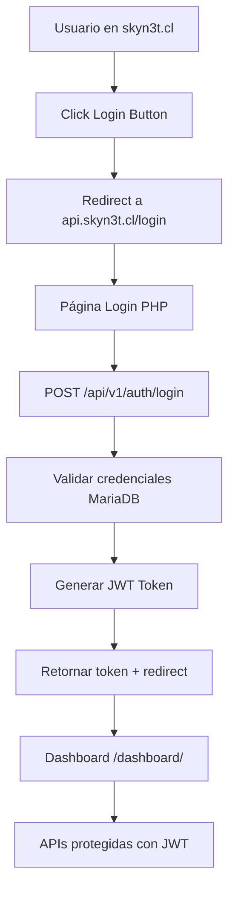

# 🚀 SKYN3T ACCESS CONTROL - GUÍA COMPLETA DE MIGRACIÓN


## 📋 **TABLA DE CONTENIDOS**

1. [Resumen Ejecutivo](#resumen-ejecutivo)
2. [Análisis del Proyecto Original](#análisis-del-proyecto-original)
3. [Estado Actual del Servidor](#estado-actual-del-servidor)
4. [Estrategias de Migración](#estrategias-de-migración)
5. [Plan de Migración Recomendado](#plan-de-migración-recomendado)
6. [Arquitectura de la Solución](#arquitectura-de-la-solución)
7. [Base de Datos Adaptada](#base-de-datos-adaptada)
8. [Implementación Backend PHP](#implementación-backend-php)
9. [Configuración Apache](#configuración-apache)
10. [APIs y Endpoints](#apis-y-endpoints)
11. [Frontend Dashboard](#frontend-dashboard)
12. [Seguridad y Autenticación](#seguridad-y-autenticación)
13. [Cronograma de Implementación](#cronograma-de-implementación)
14. [Testing y Validación](#testing-y-validación)
15. [Mantenimiento y Monitoreo](#mantenimiento-y-monitoreo)
16. [Documentación Técnica](#documentación-técnica)
17. [Próximos Pasos](#próximos-pasos)

---

## 🎯 **RESUMEN EJECUTIVO**

### **Situación Actual**
- **Frontend**: Página estática en Cloudflare Pages (skyn3t.cl)
- **Backend**: Sin implementar (botón login apunta a archivo local)
- **Servidor**: Ubuntu 22.04.5 LTS con Asterisk PBX funcionando
- **Infraestructura**: Apache2, MariaDB, 15GB RAM, 419GB disponibles

### **Objetivo**
Implementar el sistema de control de acceso SKYN3T en el servidor existente, manteniendo Asterisk PBX intacto y operativo, utilizando una arquitectura híbrida que aproveche la infraestructura actual.

### **Estrategia Seleccionada: MIGRACIÓN SIMPLIFICADA**
- **Ventajas**: Menor riesgo, implementación rápida, aprovecha infraestructura existente
- **Tiempo estimado**: 7-10 días de trabajo
- **Compatibilidad**: 80% de funcionalidades del sistema original
- **Escalabilidad**: Migración futura al sistema completo

---

## 📚 **ANÁLISIS DEL PROYECTO ORIGINAL**

### **¿Qué es SKYN3T Access Control?**

SKYN3T Access Control es una **plataforma integral enterprise** de gestión de accesos y seguridad para comunidades residenciales, condominios y edificios comerciales. **NO ES** un simple sistema de login como se asumió inicialmente.

### **Características del Sistema Original**

#### **🏗️ Arquitectura Completa**
- **7 Microservicios** independientes en Node.js + TypeScript
- **PostgreSQL 15+** como base de datos principal
- **Redis Cluster** para cache distribuido
- **RabbitMQ** para mensajería asíncrona
- **MinIO** para almacenamiento S3-compatible
- **Kubernetes** para orquestación
- **Istio Service Mesh** para comunicación

#### **🔐 Sistema Multi-tenant**
- **Aislamiento completo** por comunidades
- **150+ tablas** en base de datos
- **11 niveles de roles** jerárquicos
- **Permisos granulares** por módulo/acción
- **Row-Level Security** (RLS)

#### **🎯 Funcionalidades Enterprise**

**Control de Acceso:**
- Métodos: QR, facial, biométrico, RFID, placas vehiculares
- Anti-passback y interlock
- Emergencias y anulaciones
- Logs completos con fotos

**IoT y Dispositivos:**
- Control dispositivos en tiempo real
- MQTT para comunicación
- Monitoreo de estado
- Actualizaciones de firmware

**Gestión Financiera:**
- Integración multi-banco Chile
- Pasarelas de pago internacionales
- Reconciliación automática
- Reportes financieros

**Comunicaciones:**
- Email, SMS, WhatsApp Business
- Push notifications
- Plantillas dinámicas
- Segmentación de audiencias

**Analytics & ML:**
- Business Intelligence
- Machine Learning predictivo
- Detección de anomalías
- Reportes automatizados

### **🎯 Complejidad Real vs Estimación Inicial**

```
Estimación Original:  Simple login PHP → 3 días
Realidad Identificada: Sistema empresarial completo → 8-12 semanas
Solución Propuesta:   Migración simplificada → 1-2 semanas
```

### **📊 Tecnologías del Sistema Original**

#### **Backend Stack**
```yaml
Runtime: Node.js 20.x + TypeScript 5.x
Framework: Express.js modular
Database: PostgreSQL 15+ + Sequelize ORM
Cache: Redis 7+ con clustering
Queue: RabbitMQ para procesamiento asíncrono
WebSocket: Socket.io para tiempo real
Auth: JWT + 2FA + OAuth2
```

#### **Frontend Stack (Planificado)**
```yaml
Framework: React 18 + TypeScript
UI Library: Material-UI v5 glassmorphism
Estado: Redux Toolkit + RTK Query
Routing: React Router v6
Charts: Recharts + D3.js
Real-time: Socket.io Client
```

#### **Infraestructura Original**
```yaml
Containers: Docker + Docker Compose
Proxy: Nginx + Kong API Gateway
Monitoring: Grafana + Prometheus + InfluxDB
Logs: ELK Stack (Elasticsearch + Kibana)
Storage: MinIO (S3 compatible)
MQTT: Eclipse Mosquitto
```

### **📋 Schema Original (PostgreSQL)**

El sistema original incluye **150+ tablas** organizadas en módulos:

- **Sistema**: 12 tablas (versiones, países, localización)
- **Usuarios y Auth**: 15 tablas (usuarios, sesiones, 2FA, blacklist)
- **Roles y Permisos**: 18 tablas (roles, permisos, herencia, auditoría)
- **Comunidades**: 25 tablas (comunidades, edificios, unidades, configuración)
- **Staff y Trabajadores**: 20 tablas (personal, horarios, evaluaciones)
- **Sistema de Invitaciones**: 15 tablas (invitaciones, respuestas, límites)
- **Control de Acceso**: 30 tablas (dispositivos, logs, biometría, vehículos)
- **Financiero**: 12 tablas (bancos, pagos, reconciliación)
- **Analytics**: 10 tablas (dashboards, widgets, KPIs, reportes)
- **Comunicaciones**: 18 tablas (notificaciones, plantillas, envíos)

---

## 🖥️ **ESTADO ACTUAL DEL SERVIDOR**

### **✅ Análisis Completo del Servidor Ubuntu 22.04.5 LTS**

#### **🔧 Especificaciones Técnicas**
```yaml
Sistema Operativo: Ubuntu 22.04.5 LTS (Jammy Jellyfish)
Kernel: 5.15.0-143-generic
Arquitectura: x86_64

Recursos:
  RAM Total: 15GB
  RAM Disponible: 14GB  ✅ EXCELENTE
  Disco Total: 469GB
  Disco Libre: 419GB    ✅ ABUNDANTE
  CPU: Suficiente para múltiples servicios
```

#### **🎛️ Asterisk PBX - CRÍTICO PROTEGIDO**
```yaml
Estado: ✅ FUNCIONANDO PERFECTAMENTE
PID: 965
Memoria: 101MB
Uptime: Estable

Puertos Utilizados:
  - 5038/tcp: AMI (Manager Interface)
  - 8089/tcp: HTTP Interface
  - 5060/udp: SIP (Principal)
  - 4569/udp: IAX2
  - 4520/udp, 5000/udp: Servicios adicionales
  - 10000-20000/udp: RTP Media

Conclusión: NO CONFLICTA con web estándar (80/443)
```

#### **🌐 Infraestructura Web Existente**
```yaml
Apache2: ✅ INSTALADO Y FUNCIONANDO
  - HTTPS: Puerto 443 configurado
  - SSL: Certificados disponibles
  - Virtual Hosts: Preparado para configuración

MariaDB: ✅ INSTALADO
  - Puerto: 3306
  - Estado: Funcionando
  - Versión: Compatible

PHP: ✅ DISPONIBLE
  - Versión: Compatible para desarrollo
  - Módulos: Disponibles

Node.js/PM2: ✅ FUNCIONANDO
  - Usado para FastAGI
  - No interfiere con nueva implementación
```

#### **🛡️ Firewall UFW - BIEN CONFIGURADO**
```yaml
Puertos Abiertos:
  ✅ SSH (22): Gestión segura
  ✅ HTTPS (443): Web segura
  ✅ Asterisk (5060, 5038, 10000-20000): PBX protegido
  ⚠️ HTTP (80): FALTA (necesario para redirect)

Estado: Configuración segura, solo falta puerto 80
```

### **🎉 VENTAJAS IDENTIFICADAS**

1. **✅ Apache2 Ya Configurado**
   - HTTPS funcionando en puerto 443
   - Solo necesitamos agregar virtual host para SKYN3T

2. **✅ MariaDB Instalado**
   - Base de datos lista
   - Solo crear schema SKYN3T

3. **✅ Separación Perfecta**
   - Asterisk: Puertos 4569, 5038, 5060, 8089
   - Web: Puertos 80, 443
   - **CERO CONFLICTOS**

4. **✅ Recursos Abundantes**
   - 14GB RAM disponible
   - 419GB disco libre
   - CPU sin sobrecarga

---

## 🎯 **ESTRATEGIAS DE MIGRACIÓN**

### **OPCIÓN A: MIGRACIÓN COMPLETA** ⚡

#### **Descripción**
Implementar el sistema completo original con todos los microservicios, PostgreSQL, Redis, RabbitMQ y stack completo.

#### **✅ Ventajas**
- Funcionalidad completa del sistema enterprise
- Todas las características avanzadas (ML, Analytics, IoT)
- Escalabilidad máxima
- Compatibilidad total con documentación original

#### **⚠️ Desafíos**
- Requiere cambio completo de stack (PostgreSQL, Redis, RabbitMQ, MinIO)
- Configuración muy compleja (7 microservicios)
- 2-3 semanas de trabajo intensivo
- Mayor riesgo de conflictos
- Recursos intensivos

#### **📋 Requerimientos**
```bash
# Stack completo a instalar
sudo apt install nodejs npm postgresql-15 redis-server rabbitmq-server
sudo docker install  # Para MinIO y otros servicios
sudo kubectl install # Para orquestación

# Migración de datos
createdb skyn3t_production
psql skyn3t_production < schema_postgresql.sql

# Configuración microservicios
docker-compose up -d  # 25+ servicios
```

#### **⏱️ Cronograma Estimado**
- Semana 1-2: Instalación y configuración stack
- Semana 3: Migración de datos y servicios
- Semana 4: Testing y ajustes

---

### **OPCIÓN B: MIGRACIÓN SIMPLIFICADA** 🎯 ⭐ **RECOMENDADA**

#### **Descripción**
Crear versión adaptada que mantiene la funcionalidad core pero utiliza la infraestructura existente (Apache2 + MariaDB + PHP).

#### **✅ Ventajas**
- Aprovecha infraestructura existente (Apache2 + MariaDB)
- Mantiene Asterisk 100% intacto
- Funcionalidades core del sistema (80% del original)
- Implementación rápida (1 semana)
- Menor riesgo de fallos
- Recursos optimizados

#### **🔧 Adaptaciones Necesarias**
- **Backend**: Node.js → PHP 8.2 (compatible con Apache)
- **Base datos**: PostgreSQL → MariaDB (adaptar schema)
- **Cache**: Redis → Variables PHP/archivos temporales
- **Arquitectura**: Microservicios → Monolito modular
- **APIs**: Express.js → PHP REST APIs

#### **📋 Funcionalidades Incluidas**
```yaml
Core Features (80% del original):
  ✅ Sistema de autenticación completo (JWT + 2FA)
  ✅ Gestión de usuarios y permisos granulares
  ✅ Multi-tenant (comunidades independientes)
  ✅ Roles jerárquicos (11 niveles)
  ✅ Control de acceso básico
  ✅ Logs de auditoría completos
  ✅ Dashboard administrativo
  ✅ APIs REST documentadas
  ✅ Gestión de invitaciones
  ✅ Sistema de configuración por comunidad

Features Simplificadas:
  📊 Analytics básicos (vs ML avanzado)
  🔧 Control dispositivos simple (vs IoT complejo)
  💰 Gestión financiera básica (vs multi-banco)
  📧 Notificaciones simples (vs omnicanal)
```

#### **⏱️ Cronograma Estimado**
- Días 1-2: Setup base (DNS, SSL, DB)
- Días 3-4: Backend core (Auth, APIs)
- Días 5-6: Frontend dashboard
- Días 7: Testing y ajustes

---

### **OPCIÓN C: MIGRACIÓN HÍBRIDA** 🔄

#### **Descripción**
Usar Docker Compose en el servidor existente para mantener el sistema original pero contenerizado.

#### **✅ Ventajas**
- Sistema original sin modificaciones
- Contenedores aislados (protege Asterisk)
- Escalabilidad intermedia
- Posible migración futura a K8s

#### **⚠️ Consideraciones**
- Usa más recursos (overhead de contenedores)
- Configuración media complejidad
- 1.5-2 semanas implementación
- Requiere gestión de contenedores

#### **📋 Configuración Ejemplo**
```yaml
# docker-compose.server.yml
version: '3.8'
services:
  postgres:
    image: postgres:15-alpine
    ports: ["5433:5432"]  # Puerto diferente
    
  redis:
    image: redis:7-alpine
    ports: ["6380:6379"]
    
  skyn3t-api:
    image: skyn3t/api:latest
    ports: ["8080:8000"]  # Puerto diferente de Apache
```

---

## 🏗️ **PLAN DE MIGRACIÓN RECOMENDADO: OPCIÓN B**

### **🎯 ¿Por qué la Opción B es la mejor?**

1. **✅ Aprovecha infraestructura existente**: Apache2 + MariaDB funcionando
2. **✅ Protege Asterisk**: Cero riesgo de conflictos
3. **✅ Implementación rápida**: 1 semana vs 3 semanas
4. **✅ Funcionalidades core**: 80% de características principales
5. **✅ Escalable**: Se puede migrar al sistema completo después
6. **✅ Mantenimiento simple**: Un stack conocido (LAMP)

### **📊 Comparación de Opciones**

| Aspecto | Opción A (Completa) | Opción B (Simplificada) ⭐ | Opción C (Híbrida) |
|---------|---------------------|----------------------------|-------------------|
| **Tiempo implementación** | 3-4 semanas | 1 semana | 2 semanas |
| **Riesgo para Asterisk** | Medio | Muy bajo | Bajo |
| **Funcionalidades** | 100% | 80% | 100% |
| **Mantenimiento** | Complejo | Simple | Medio |
| **Recursos necesarios** | Altos | Bajos | Medios |
| **Escalabilidad futura** | Máxima | Alta | Máxima |

---

## 🏗️ **ARQUITECTURA DE LA SOLUCIÓN**

### **📊 Arquitectura Objetivo Final**

```
┌─────────────────────────────────────────────────────┐
│                 CLOUDFLARE CDN                      │
│  ┌─────────────────────────────────────────────────┐│
│  │           Frontend (Público)                    ││
│  │  • skyn3t.cl (GitHub → Cloudflare Pages)        ││
│  │  • Homepage estática                            ││
│  │  • Recursos CSS/JS/IMG                          ││
│  │  • DDoS protection + SSL automático             ││
│  └─────────────────────────────────────────────────┘│
└─────────────────────┬───────────────────────────────┘
                      │ HTTPS API calls
                      ▼
┌─────────────────────────────────────────────────────┐
│              SERVIDOR UBUNTU 22.04                 │
│  ┌─────────────────────────────────────────────────┐│
│  │         Backend SKYN3T (api.skyn3t.cl)         ││
│  │  • Apache2 Virtual Host (Puerto 443)           ││
│  │  • PHP 8.2 APIs REST                           ││
│  │  • JWT Authentication + 2FA                    ││
│  │  • MariaDB (Base de datos)                     ││
│  │  • Sistema multi-tenant                        ││
│  │  • Dashboard administrativo                    ││
│  └─────────────────────────────────────────────────┘│
│  ┌─────────────────────────────────────────────────┐│
│  │         PBX Asterisk (INTACTO)                  ││
│  │  • Puertos: 5060, 4569, 5038, 8089             ││
│  │  • Servicios VoIP funcionando                  ││
│  │  • Sin modificaciones                          ││
│  │  • Completamente protegido                     ││
│  └─────────────────────────────────────────────────┘│
└─────────────────────────────────────────────────────┘
```

### **🔗 Flujo de Comunicación**



### **🗂️ Estructura de Directorios Final**

```
/var/www/skyn3t/
├── api/
│   └── v1/
│       ├── auth/
│       │   ├── login.php
│       │   ├── logout.php
│       │   ├── refresh.php
│       │   ├── session.php
│       │   └── 2fa.php
│       ├── users/
│       │   ├── index.php          # CRUD usuarios
│       │   ├── permissions.php    # Gestión permisos
│       │   ├── profile.php        # Perfil usuario
│       │   └── avatar.php         # Upload avatar
│       ├── communities/
│       │   ├── index.php          # CRUD comunidades
│       │   ├── members.php        # Miembros
│       │   ├── settings.php       # Configuración
│       │   └── features.php       # Features habilitadas
│       ├── devices/
│       │   ├── index.php          # CRUD dispositivos
│       │   ├── control.php        # Control dispositivos
│       │   ├── status.php         # Estado dispositivos
│       │   └── commands.php       # Cola de comandos
│       ├── access/
│       │   ├── logs.php           # Logs acceso
│       │   ├── authorize.php      # Autorizar acceso
│       │   ├── points.php         # Puntos de acceso
│       │   └── stats.php          # Estadísticas
│       ├── invitations/
│       │   ├── index.php          # CRUD invitaciones
│       │   ├── qr.php             # Generar QR
│       │   └── validate.php       # Validar acceso
│       ├── financial/
│       │   ├── transactions.php   # Transacciones
│       │   ├── expenses.php       # Gastos comunes
│       │   └── payments.php       # Pagos
│       ├── notifications/
│       │   ├── index.php          # Notificaciones
│       │   └── send.php           # Enviar notificación
│       ├── reports/
│       │   ├── dashboard.php      # Datos dashboard
│       │   ├── generate.php       # Generar reportes
│       │   └── download.php       # Descargar reportes
│       ├── health.php             # Health check
│       └── error.php              # Manejo errores
├── includes/
│   ├── config.php                 # Configuración global
│   ├── Database.php               # Clase conexión DB
│   ├── JWT.php                    # Manejo JWT
│   ├── Auth.php                   # Sistema autenticación
│   ├── Permissions.php            # Sistema permisos
│   ├── RateLimit.php              # Control rate limiting
│   ├── Upload.php                 # Manejo uploads
│   ├── Models/
│   │   ├── User.php               # Modelo usuario
│   │   ├── Community.php          # Modelo comunidad
│   │   ├── Device.php             # Modelo dispositivo
│   │   ├── AccessLog.php          # Modelo logs acceso
│   │   └── Invitation.php         # Modelo invitaciones
│   ├── Controllers/
│   │   ├── AuthController.php     # Controlador auth
│   │   ├── UserController.php     # Controlador usuarios
│   │   ├── CommunityController.php
│   │   └── DeviceController.php
│   └── Utils/
│       ├── Validator.php          # Validaciones
│       ├── Logger.php             # Sistema logs
│       ├── QRGenerator.php        # Generador QR
│       └── EmailSender.php        # Envío emails
├── dashboard/
│   ├── index.html                 # Dashboard principal
│   ├── login.html                 # Página login
│   ├── users/
│   │   ├── index.html             # Gestión usuarios
│   │   ├── create.html            # Crear usuario
│   │   └── permissions.html       # Gestión permisos
│   ├── communities/
│   │   ├── index.html             # Gestión comunidades
│   │   ├── members.html           # Miembros
│   │   └── settings.html          # Configuración
│   ├── devices/
│   │   ├── index.html             # Gestión dispositivos
│   │   ├── control.html           # Control dispositivos
│   │   └── logs.html              # Logs dispositivos
│   ├── access/
│   │   ├── logs.html              # Logs acceso
│   │   ├── live.html              # Monitoreo tiempo real
│   │   └── reports.html           # Reportes acceso
│   ├── invitations/
│   │   ├── index.html             # Gestión invitaciones
│   │   └── create.html            # Crear invitación
│   ├── assets/
│   │   ├── css/
│   │   │   ├── dashboard.css      # Estilos dashboard
│   │   │   ├── login.css          # Estilos login
│   │   │   └── components.css     # Componentes
│   │   ├── js/
│   │   │   ├── dashboard.js       # JS principal
│   │   │   ├── api.js             # Cliente API
│   │   │   ├── auth.js            # Autenticación
│   │   │   ├── users.js           # Gestión usuarios
│   │   │   ├── devices.js         # Control dispositivos
│   │   │   └── utils.js           # Utilidades
│   │   ├── img/
│   │   │   ├── logo.png
│   │   │   └── icons/
│   │   └── vendor/
│   │       ├── jquery.min.js
│   │       ├── bootstrap.min.css
│   │       └── fontawesome/
│   └── components/
│       ├── sidebar.html           # Componente sidebar
│       ├── header.html            # Componente header
│       └── modals.html            # Modales
├── uploads/
│   ├── avatars/                   # Avatares usuarios
│   ├── documents/                 # Documentos
│   ├── photos/                    # Fotos acceso
│   ├── qr-codes/                  # Códigos QR
│   └── temp/                      # Archivos temporales
├── logs/
│   ├── api.log                    # Logs API
│   ├── auth.log                   # Logs autenticación
│   ├── errors.log                 # Logs errores
│   └── access.log                 # Logs acceso web
├── backups/
│   ├── database/                  # Backups BD
│   └── files/                     # Backups archivos
├── scripts/
│   ├── backup.sh                  # Script backup
│   ├── maintenance.sh             # Mantenimiento
│   └── health-check.sh            # Health check
└── docs/
    ├── api-documentation.md       # Documentación API
    ├── installation.md            # Guía instalación
    └── user-manual.md             # Manual usuario
```

---

## 🗄️ **BASE DE DATOS ADAPTADA**

### **📊 Schema MariaDB (Adaptado desde PostgreSQL)**

#### **🔧 Principales Adaptaciones**
- **UUIDs**: `VARCHAR(36)` con `DEFAULT (UUID())`
- **ENUM types**: Mantenidos (MariaDB los soporta)
- **JSON**: Usado en lugar de JSONB
- **Índices**: Optimizados para MariaDB
- **Foreign Keys**: Mantener integridad referencial
- **Triggers**: Para updated_at automático

#### **📋 Script de Creación Completo**

```sql
-- =====================================================
-- SKYN3T ACCESS CONTROL - MARIADB SCHEMA ADAPTADO
-- Versión: 1.0.0 (Adaptado desde PostgreSQL 15+)
-- Compatible: MariaDB 10.6+
-- =====================================================

-- Configuración inicial
SET sql_mode = 'STRICT_TRANS_TABLES,NO_ZERO_DATE,NO_ZERO_IN_DATE,ERROR_FOR_DIVISION_BY_ZERO';
SET GLOBAL log_bin_trust_function_creators = 1;

-- Crear base de datos
CREATE DATABASE IF NOT EXISTS skyn3t_production 
CHARACTER SET utf8mb4 COLLATE utf8mb4_unicode_ci;

USE skyn3t_production;

-- =====================================================
-- TABLAS SISTEMA
-- =====================================================

-- Control de versiones del schema
CREATE TABLE schema_versions (
    id VARCHAR(36) PRIMARY KEY DEFAULT (UUID()),
    version VARCHAR(20) NOT NULL,
    description TEXT,
    applied_at TIMESTAMP DEFAULT CURRENT_TIMESTAMP,
    applied_by VARCHAR(100)
);

-- Países soportados
CREATE TABLE countries (
    id VARCHAR(36) PRIMARY KEY DEFAULT (UUID()),
    code CHAR(2) UNIQUE NOT NULL,
    code3 CHAR(3) UNIQUE NOT NULL,
    name VARCHAR(100) NOT NULL,
    phone_code VARCHAR(10),
    currency_code CHAR(3),
    timezone VARCHAR(50),
    locale VARCHAR(10),
    is_active BOOLEAN DEFAULT true,
    created_at TIMESTAMP DEFAULT CURRENT_TIMESTAMP,
    updated_at TIMESTAMP DEFAULT CURRENT_TIMESTAMP ON UPDATE CURRENT_TIMESTAMP
);

-- Configuración regional
CREATE TABLE regional_settings (
    id VARCHAR(36) PRIMARY KEY DEFAULT (UUID()),
    country_id VARCHAR(36),
    date_format VARCHAR(20),
    time_format VARCHAR(20),
    currency_format VARCHAR(50),
    decimal_separator CHAR(1),
    thousand_separator CHAR(1),
    first_day_of_week TINYINT DEFAULT 1,
    created_at TIMESTAMP DEFAULT CURRENT_TIMESTAMP,
    updated_at TIMESTAMP DEFAULT CURRENT_TIMESTAMP ON UPDATE CURRENT_TIMESTAMP,
    FOREIGN KEY (country_id) REFERENCES countries(id)
);

-- =====================================================
-- USUARIOS Y AUTENTICACIÓN
-- =====================================================

-- Tabla principal de usuarios
CREATE TABLE users (
    id VARCHAR(36) PRIMARY KEY DEFAULT (UUID()),
    email VARCHAR(255) UNIQUE NOT NULL,
    username VARCHAR(100) UNIQUE,
    password_hash VARCHAR(255) NOT NULL,
    first_name VARCHAR(100) NOT NULL,
    last_name VARCHAR(100) NOT NULL,
    middle_name VARCHAR(100),
    phone VARCHAR(20),
    phone_verified BOOLEAN DEFAULT false,
    email_verified BOOLEAN DEFAULT false,
    document_type ENUM('id', 'passport', 'driver_license', 'residence_permit', 'other'),
    document_number VARCHAR(50),
    birth_date DATE,
    nationality_id VARCHAR(36),
    profile_photo_url VARCHAR(500),
    status ENUM('active', 'inactive', 'suspended', 'deleted') DEFAULT 'active',
    is_system_user BOOLEAN DEFAULT false,
    last_login_at TIMESTAMP NULL,
    password_changed_at TIMESTAMP DEFAULT CURRENT_TIMESTAMP,
    failed_login_attempts INT DEFAULT 0,
    locked_until TIMESTAMP NULL,
    created_at TIMESTAMP DEFAULT CURRENT_TIMESTAMP,
    updated_at TIMESTAMP DEFAULT CURRENT_TIMESTAMP ON UPDATE CURRENT_TIMESTAMP,
    deleted_at TIMESTAMP NULL,
    
    FOREIGN KEY (nationality_id) REFERENCES countries(id),
    
    INDEX idx_email (email),
    INDEX idx_username (username),
    INDEX idx_status (status),
    INDEX idx_document (document_type, document_number),
    INDEX idx_active_users (status, deleted_at)
);

-- Sesiones de usuario
CREATE TABLE user_sessions (
    id VARCHAR(36) PRIMARY KEY DEFAULT (UUID()),
    user_id VARCHAR(36) NOT NULL,
    token_hash VARCHAR(255) UNIQUE NOT NULL,
    refresh_token_hash VARCHAR(255) UNIQUE,
    ip_address VARCHAR(45),
    user_agent TEXT,
    device_fingerprint VARCHAR(255),
    location JSON,
    expires_at TIMESTAMP NOT NULL,
    refresh_expires_at TIMESTAMP,
    is_active BOOLEAN DEFAULT true,
    created_at TIMESTAMP DEFAULT CURRENT_TIMESTAMP,
    last_activity TIMESTAMP DEFAULT CURRENT_TIMESTAMP,
    
    FOREIGN KEY (user_id) REFERENCES users(id) ON DELETE CASCADE,
    
    INDEX idx_token (token_hash),
    INDEX idx_user_active (user_id, is_active),
    INDEX idx_expires (expires_at),
    INDEX idx_user_activity (user_id, last_activity DESC)
);

-- Autenticación de dos factores
CREATE TABLE two_factor_auth (
    id VARCHAR(36) PRIMARY KEY DEFAULT (UUID()),
    user_id VARCHAR(36) NOT NULL,
    method VARCHAR(20) NOT NULL, -- totp, sms, email
    secret VARCHAR(255),
    backup_codes JSON,
    is_enabled BOOLEAN DEFAULT false,
    verified_at TIMESTAMP NULL,
    created_at TIMESTAMP DEFAULT CURRENT_TIMESTAMP,
    updated_at TIMESTAMP DEFAULT CURRENT_TIMESTAMP ON UPDATE CURRENT_TIMESTAMP,
    
    FOREIGN KEY (user_id) REFERENCES users(id) ON DELETE CASCADE,
    
    INDEX idx_user_method (user_id, method),
    INDEX idx_enabled (user_id, is_enabled)
);

-- Intentos de login fallidos
CREATE TABLE failed_login_attempts (
    id VARCHAR(36) PRIMARY KEY DEFAULT (UUID()),
    email VARCHAR(255),
    ip_address VARCHAR(45),
    user_agent TEXT,
    reason VARCHAR(100),
    attempted_at TIMESTAMP DEFAULT CURRENT_TIMESTAMP,
    
    INDEX idx_email_time (email, attempted_at DESC),
    INDEX idx_ip_time (ip_address, attempted_at DESC)
);

-- Lista blanca de IPs
CREATE TABLE ip_whitelist (
    id VARCHAR(36) PRIMARY KEY DEFAULT (UUID()),
    ip_address VARCHAR(45) NOT NULL,
    cidr_mask TINYINT DEFAULT 32,
    description TEXT,
    is_active BOOLEAN DEFAULT true,
    created_at TIMESTAMP DEFAULT CURRENT_TIMESTAMP,
    created_by VARCHAR(36),
    
    FOREIGN KEY (created_by) REFERENCES users(id),
    
    INDEX idx_ip (ip_address),
    INDEX idx_active (is_active)
);

-- Lista negra de IPs
CREATE TABLE ip_blacklist (
    id VARCHAR(36) PRIMARY KEY DEFAULT (UUID()),
    ip_address VARCHAR(45) NOT NULL,
    cidr_mask TINYINT DEFAULT 32,
    reason TEXT,
    is_active BOOLEAN DEFAULT true,
    expires_at TIMESTAMP NULL,
    created_at TIMESTAMP DEFAULT CURRENT_TIMESTAMP,
    created_by VARCHAR(36),
    
    FOREIGN KEY (created_by) REFERENCES users(id),
    
    INDEX idx_ip (ip_address),
    INDEX idx_active_expires (is_active, expires_at)
);

-- =====================================================
-- ROLES Y PERMISOS
-- =====================================================

-- Roles del sistema (11 niveles)
CREATE TABLE roles (
    id VARCHAR(36) PRIMARY KEY DEFAULT (UUID()),
    code VARCHAR(50) UNIQUE NOT NULL,
    name VARCHAR(100) NOT NULL,
    description TEXT,
    level INT NOT NULL CHECK (level BETWEEN 1 AND 11),
    is_system_role BOOLEAN DEFAULT false,
    is_community_role BOOLEAN DEFAULT false,
    is_active BOOLEAN DEFAULT true,
    created_at TIMESTAMP DEFAULT CURRENT_TIMESTAMP,
    updated_at TIMESTAMP DEFAULT CURRENT_TIMESTAMP ON UPDATE CURRENT_TIMESTAMP,
    
    INDEX idx_code (code),
    INDEX idx_level (level),
    INDEX idx_type (is_system_role, is_community_role)
);

-- Permisos granulares
CREATE TABLE permissions (
    id VARCHAR(36) PRIMARY KEY DEFAULT (UUID()),
    code VARCHAR(100) UNIQUE NOT NULL,
    module VARCHAR(50) NOT NULL,
    action VARCHAR(50) NOT NULL,
    name VARCHAR(200) NOT NULL,
    description TEXT,
    risk_level ENUM('low', 'medium', 'high', 'critical') DEFAULT 'low',
    ui_elements JSON,
    api_endpoints JSON,
    dependencies JSON,
    incompatible_with JSON,
    is_active BOOLEAN DEFAULT true,
    created_at TIMESTAMP DEFAULT CURRENT_TIMESTAMP,
    updated_at TIMESTAMP DEFAULT CURRENT_TIMESTAMP ON UPDATE CURRENT_TIMESTAMP,
    
    INDEX idx_code (code),
    INDEX idx_module_action (module, action),
    INDEX idx_risk_level (risk_level),
    INDEX idx_active (is_active)
);

-- Permisos de roles
CREATE TABLE role_permissions (
    id VARCHAR(36) PRIMARY KEY DEFAULT (UUID()),
    role_id VARCHAR(36) NOT NULL,
    permission_id VARCHAR(36) NOT NULL,
    granted_at TIMESTAMP DEFAULT CURRENT_TIMESTAMP,
    granted_by VARCHAR(36),
    
    FOREIGN KEY (role_id) REFERENCES roles(id) ON DELETE CASCADE,
    FOREIGN KEY (permission_id) REFERENCES permissions(id) ON DELETE CASCADE,
    FOREIGN KEY (granted_by) REFERENCES users(id),
    
    UNIQUE KEY unique_role_permission (role_id, permission_id),
    INDEX idx_role (role_id),
    INDEX idx_permission (permission_id)
);

-- Roles de usuarios
CREATE TABLE user_roles (
    id VARCHAR(36) PRIMARY KEY DEFAULT (UUID()),
    user_id VARCHAR(36) NOT NULL,
    role_id VARCHAR(36) NOT NULL,
    community_id VARCHAR(36), -- Will reference communities table
    building_id VARCHAR(36), -- Will reference buildings table
    assigned_at TIMESTAMP DEFAULT CURRENT_TIMESTAMP,
    assigned_by VARCHAR(36),
    expires_at TIMESTAMP NULL,
    is_active BOOLEAN DEFAULT true,
    
    FOREIGN KEY (user_id) REFERENCES users(id) ON DELETE CASCADE,
    FOREIGN KEY (role_id) REFERENCES roles(id) ON DELETE CASCADE,
    FOREIGN KEY (assigned_by) REFERENCES users(id),
    
    UNIQUE KEY unique_user_role_community (user_id, role_id, community_id, building_id),
    INDEX idx_user (user_id),
    INDEX idx_role (role_id),
    INDEX idx_community (community_id),
    INDEX idx_active (is_active)
);

-- Permisos específicos de usuarios (override roles)
CREATE TABLE user_permissions (
    id VARCHAR(36) PRIMARY KEY DEFAULT (UUID()),
    user_id VARCHAR(36) NOT NULL,
    permission_id VARCHAR(36) NOT NULL,
    community_id VARCHAR(36),
    building_id VARCHAR(36),
    granted BOOLEAN DEFAULT true, -- true = grant, false = revoke
    reason TEXT,
    granted_at TIMESTAMP DEFAULT CURRENT_TIMESTAMP,
    granted_by VARCHAR(36),
    expires_at TIMESTAMP NULL,
    
    FOREIGN KEY (user_id) REFERENCES users(id) ON DELETE CASCADE,
    FOREIGN KEY (permission_id) REFERENCES permissions(id) ON DELETE CASCADE,
    FOREIGN KEY (granted_by) REFERENCES users(id),
    
    UNIQUE KEY unique_user_permission_community (user_id, permission_id, community_id, building_id),
    INDEX idx_user (user_id),
    INDEX idx_permission (permission_id),
    INDEX idx_community (community_id)
);

-- =====================================================
-- COMUNIDADES Y EDIFICIOS
-- =====================================================

-- Comunidades principales (multi-tenant)
CREATE TABLE communities (
    id VARCHAR(36) PRIMARY KEY DEFAULT (UUID()),
    code VARCHAR(50) UNIQUE NOT NULL,
    name VARCHAR(200) NOT NULL,
    legal_name VARCHAR(300),
    tax_id VARCHAR(50),
    type VARCHAR(50), -- residential, commercial, mixed
    address TEXT,
    city VARCHAR(100),
    state VARCHAR(100),
    postal_code VARCHAR(20),
    country_id VARCHAR(36),
    phone VARCHAR(20),
    email VARCHAR(255),
    website VARCHAR(255),
    logo_url VARCHAR(500),
    primary_color VARCHAR(7),
    secondary_color VARCHAR(7),
    timezone VARCHAR(50),
    locale VARCHAR(10),
    currency_code CHAR(3),
    subscription_status VARCHAR(20) DEFAULT 'trial',
    subscription_expires_at TIMESTAMP NULL,
    max_users INT DEFAULT 100,
    max_buildings INT DEFAULT 1,
    max_units INT DEFAULT 100,
    max_devices INT DEFAULT 10,
    storage_quota_gb INT DEFAULT 10,
    is_active BOOLEAN DEFAULT true,
    created_at TIMESTAMP DEFAULT CURRENT_TIMESTAMP,
    updated_at TIMESTAMP DEFAULT CURRENT_TIMESTAMP ON UPDATE CURRENT_TIMESTAMP,
    deleted_at TIMESTAMP NULL,
    
    FOREIGN KEY (country_id) REFERENCES countries(id),
    
    INDEX idx_code (code),
    INDEX idx_active (is_active),
    INDEX idx_subscription (subscription_status),
    INDEX idx_country (country_id)
);

-- Configuración de comunidades
CREATE TABLE community_settings (
    id VARCHAR(36) PRIMARY KEY DEFAULT (UUID()),
    community_id VARCHAR(36) NOT NULL,
    setting_key VARCHAR(100) NOT NULL,
    setting_value JSON,
    setting_type VARCHAR(50),
    is_encrypted BOOLEAN DEFAULT false,
    created_at TIMESTAMP DEFAULT CURRENT_TIMESTAMP,
    updated_at TIMESTAMP DEFAULT CURRENT_TIMESTAMP ON UPDATE CURRENT_TIMESTAMP,
    
    FOREIGN KEY (community_id) REFERENCES communities(id) ON DELETE CASCADE,
    
    UNIQUE KEY unique_community_setting (community_id, setting_key),
    INDEX idx_community_key (community_id, setting_key)
);

-- Edificios
CREATE TABLE buildings (
    id VARCHAR(36) PRIMARY KEY DEFAULT (UUID()),
    community_id VARCHAR(36) NOT NULL,
    code VARCHAR(50) NOT NULL,
    name VARCHAR(200) NOT NULL,
    address TEXT,
    floors_count INT DEFAULT 1,
    units_count INT DEFAULT 0,
    construction_year INT,
    building_type VARCHAR(50),
    amenities JSON,
    emergency_contact_name VARCHAR(200),
    emergency_contact_phone VARCHAR(20),
    is_active BOOLEAN DEFAULT true,
    created_at TIMESTAMP DEFAULT CURRENT_TIMESTAMP,
    updated_at TIMESTAMP DEFAULT CURRENT_TIMESTAMP ON UPDATE CURRENT_TIMESTAMP,
    
    FOREIGN KEY (community_id) REFERENCES communities(id) ON DELETE CASCADE,
    
    UNIQUE KEY unique_community_building (community_id, code),
    INDEX idx_community (community_id),
    INDEX idx_active (is_active)
);

-- Pisos
CREATE TABLE floors (
    id VARCHAR(36) PRIMARY KEY DEFAULT (UUID()),
    building_id VARCHAR(36) NOT NULL,
    floor_number INT NOT NULL,
    name VARCHAR(100),
    units_count INT DEFAULT 0,
    layout_image_url VARCHAR(500),
    created_at TIMESTAMP DEFAULT CURRENT_TIMESTAMP,
    
    FOREIGN KEY (building_id) REFERENCES buildings(id) ON DELETE CASCADE,
    
    UNIQUE KEY unique_building_floor (building_id, floor_number),
    INDEX idx_building (building_id)
);

-- Unidades (departamentos/oficinas)
CREATE TABLE units (
    id VARCHAR(36) PRIMARY KEY DEFAULT (UUID()),
    building_id VARCHAR(36) NOT NULL,
    floor_id VARCHAR(36),
    unit_number VARCHAR(20) NOT NULL,
    unit_type VARCHAR(50), -- apartment, office, commercial, storage
    area_sqm DECIMAL(10,2),
    bedrooms INT,
    bathrooms INT,
    parking_spaces INT DEFAULT 0,
    storage_units INT DEFAULT 0,
    ownership_type VARCHAR(20), -- owned, rented
    is_occupied BOOLEAN DEFAULT false,
    created_at TIMESTAMP DEFAULT CURRENT_TIMESTAMP,
    updated_at TIMESTAMP DEFAULT CURRENT_TIMESTAMP ON UPDATE CURRENT_TIMESTAMP,
    
    FOREIGN KEY (building_id) REFERENCES buildings(id) ON DELETE CASCADE,
    FOREIGN KEY (floor_id) REFERENCES floors(id),
    
    UNIQUE KEY unique_building_unit (building_id, unit_number),
    INDEX idx_building (building_id),
    INDEX idx_floor (floor_id),
    INDEX idx_unit_type (unit_type)
);

-- Miembros de comunidad
CREATE TABLE community_members (
    id VARCHAR(36) PRIMARY KEY DEFAULT (UUID()),
    community_id VARCHAR(36) NOT NULL,
    user_id VARCHAR(36) NOT NULL,
    unit_id VARCHAR(36),
    member_type VARCHAR(50), -- owner, tenant, family, staff
    relationship VARCHAR(50), -- spouse, child, parent, etc
    move_in_date DATE,
    move_out_date DATE,
    is_primary_resident BOOLEAN DEFAULT false,
    emergency_contact BOOLEAN DEFAULT false,
    vehicle_limit INT DEFAULT 2,
    guest_limit_per_day INT DEFAULT 5,
    is_active BOOLEAN DEFAULT true,
    created_at TIMESTAMP DEFAULT CURRENT_TIMESTAMP,
    updated_at TIMESTAMP DEFAULT CURRENT_TIMESTAMP ON UPDATE CURRENT_TIMESTAMP,
    
    FOREIGN KEY (community_id) REFERENCES communities(id) ON DELETE CASCADE,
    FOREIGN KEY (user_id) REFERENCES users(id) ON DELETE CASCADE,
    FOREIGN KEY (unit_id) REFERENCES units(id),
    
    UNIQUE KEY unique_community_user (community_id, user_id),
    INDEX idx_community (community_id),
    INDEX idx_user (user_id),
    INDEX idx_unit (unit_id),
    INDEX idx_member_type (member_type),
    INDEX idx_active (is_active)
);

-- =====================================================
-- DISPOSITIVOS Y CONTROL DE ACCESO
-- =====================================================

-- Tipos de dispositivos
CREATE TABLE device_types (
    id VARCHAR(36) PRIMARY KEY DEFAULT (UUID()),
    code VARCHAR(50) UNIQUE NOT NULL,
    name VARCHAR(100) NOT NULL,
    category VARCHAR(50), -- access, camera, sensor, alarm
    manufacturer VARCHAR(100),
    model VARCHAR(100),
    communication_protocol VARCHAR(50),
    supported_features JSON,
    created_at TIMESTAMP DEFAULT CURRENT_TIMESTAMP
);

-- Dispositivos IoT
CREATE TABLE devices (
    id VARCHAR(36) PRIMARY KEY DEFAULT (UUID()),
    community_id VARCHAR(36) NOT NULL,
    device_type_id VARCHAR(36),
    serial_number VARCHAR(100) UNIQUE NOT NULL,
    name VARCHAR(200) NOT NULL,
    location VARCHAR(500),
    building_id VARCHAR(36),
    floor_id VARCHAR(36),
    ip_address VARCHAR(45),
    mac_address VARCHAR(17),
    firmware_version VARCHAR(50),
    last_heartbeat TIMESTAMP NULL,
    status ENUM('online', 'offline', 'error', 'maintenance') DEFAULT 'offline',
    config JSON,
    is_active BOOLEAN DEFAULT true,
    installed_at TIMESTAMP NULL,
    installed_by VARCHAR(36),
    created_at TIMESTAMP DEFAULT CURRENT_TIMESTAMP,
    
    FOREIGN KEY (community_id) REFERENCES communities(id) ON DELETE CASCADE,
    FOREIGN KEY (device_type_id) REFERENCES device_types(id),
    FOREIGN KEY (building_id) REFERENCES buildings(id),
    FOREIGN KEY (floor_id) REFERENCES floors(id),
    FOREIGN KEY (installed_by) REFERENCES users(id),
    
    INDEX idx_community (community_id),
    INDEX idx_serial (serial_number),
    INDEX idx_status (status),
    INDEX idx_building (building_id),
    INDEX idx_active (is_active)
);

-- Puntos de acceso
CREATE TABLE access_points (
    id VARCHAR(36) PRIMARY KEY DEFAULT (UUID()),
    community_id VARCHAR(36) NOT NULL,
    building_id VARCHAR(36),
    device_id VARCHAR(36),
    name VARCHAR(200) NOT NULL,
    type VARCHAR(50), -- door, gate, barrier, elevator
    direction VARCHAR(20), -- in, out, both
    location VARCHAR(500),
    floor_id VARCHAR(36),
    is_emergency_exit BOOLEAN DEFAULT false,
    anti_passback_enabled BOOLEAN DEFAULT false,
    interlock_group VARCHAR(50),
    is_active BOOLEAN DEFAULT true,
    created_at TIMESTAMP DEFAULT CURRENT_TIMESTAMP,
    
    FOREIGN KEY (community_id) REFERENCES communities(id) ON DELETE CASCADE,
    FOREIGN KEY (building_id) REFERENCES buildings(id),
    FOREIGN KEY (device_id) REFERENCES devices(id),
    FOREIGN KEY (floor_id) REFERENCES floors(id),
    
    INDEX idx_community (community_id),
    INDEX idx_building (building_id),
    INDEX idx_device (device_id),
    INDEX idx_active (is_active)
);

-- Logs de acceso
CREATE TABLE access_logs (
    id VARCHAR(36) PRIMARY KEY DEFAULT (UUID()),
    access_point_id VARCHAR(36),
    user_id VARCHAR(36),
    community_id VARCHAR(36),
    access_time TIMESTAMP DEFAULT CURRENT_TIMESTAMP,
    access_method ENUM('app', 'card', 'fingerprint', 'facial', 'plate', 'qr', 'pin') NOT NULL,
    direction VARCHAR(10), -- in, out
    granted BOOLEAN NOT NULL,
    denial_reason VARCHAR(100),
    operator_id VARCHAR(36),
    vehicle_plate VARCHAR(20),
    photo_url VARCHAR(500),
    facial_match_score DECIMAL(3,2),
    temperature DECIMAL(4,1),
    device_id VARCHAR(36),
    response_time_ms INT,
    
    FOREIGN KEY (access_point_id) REFERENCES access_points(id),
    FOREIGN KEY (user_id) REFERENCES users(id),
    FOREIGN KEY (community_id) REFERENCES communities(id),
    FOREIGN KEY (operator_id) REFERENCES users(id),
    FOREIGN KEY (device_id) REFERENCES devices(id),
    
    INDEX idx_access_time (access_time DESC),
    INDEX idx_user_time (user_id, access_time DESC),
    INDEX idx_community_time (community_id, access_time DESC),
    INDEX idx_access_point_time (access_point_id, access_time DESC),
    INDEX idx_granted (granted),
    INDEX idx_method (access_method)
);

-- =====================================================
-- INVITACIONES
-- =====================================================

-- Invitaciones principales
CREATE TABLE invitations (
    id VARCHAR(36) PRIMARY KEY DEFAULT (UUID()),
    inviter_id VARCHAR(36),
    community_id VARCHAR(36),
    unit_id VARCHAR(36),
    guest_name VARCHAR(200) NOT NULL,
    guest_email VARCHAR(255),
    guest_phone VARCHAR(20),
    guest_document_number VARCHAR(50),
    invitation_type VARCHAR(50), -- single, recurring, event
    valid_from TIMESTAMP NOT NULL,
    valid_until TIMESTAMP NOT NULL,
    access_code VARCHAR(20) UNIQUE,
    qr_code_url VARCHAR(500),
    status VARCHAR(20) DEFAULT 'pending',
    max_uses INT DEFAULT 1,
    current_uses INT DEFAULT 0,
    notes TEXT,
    created_at TIMESTAMP DEFAULT CURRENT_TIMESTAMP,
    cancelled_at TIMESTAMP NULL,
    cancelled_by VARCHAR(36),
    
    FOREIGN KEY (inviter_id) REFERENCES users(id),
    FOREIGN KEY (community_id) REFERENCES communities(id),
    FOREIGN KEY (unit_id) REFERENCES units(id),
    FOREIGN KEY (cancelled_by) REFERENCES users(id),
    
    INDEX idx_community (community_id),
    INDEX idx_inviter (inviter_id),
    INDEX idx_status (status),
    INDEX idx_valid_period (valid_from, valid_until),
    INDEX idx_access_code (access_code)
);

-- Vehículos de invitaciones
CREATE TABLE invitation_vehicles (
    id VARCHAR(36) PRIMARY KEY DEFAULT (UUID()),
    invitation_id VARCHAR(36) NOT NULL,
    plate_number VARCHAR(20) NOT NULL,
    vehicle_brand VARCHAR(50),
    vehicle_model VARCHAR(50),
    vehicle_color VARCHAR(30),
    vehicle_type VARCHAR(30),
    photo_url VARCHAR(500),
    created_at TIMESTAMP DEFAULT CURRENT_TIMESTAMP,
    
    FOREIGN KEY (invitation_id) REFERENCES invitations(id) ON DELETE CASCADE,
    
    INDEX idx_invitation (invitation_id),
    INDEX idx_plate (plate_number)
);

-- =====================================================
-- SISTEMA FINANCIERO BÁSICO
-- =====================================================

-- Transacciones financieras
CREATE TABLE financial_transactions (
    id VARCHAR(36) PRIMARY KEY DEFAULT (UUID()),
    community_id VARCHAR(36) NOT NULL,
    user_id VARCHAR(36),
    transaction_type VARCHAR(50), -- expense, payment, fee
    category VARCHAR(50),
    description TEXT,
    amount DECIMAL(15,2) NOT NULL,
    currency_code CHAR(3) DEFAULT 'CLP',
    status ENUM('pending', 'processing', 'completed', 'failed', 'refunded') DEFAULT 'pending',
    payment_method VARCHAR(50),
    reference_number VARCHAR(100),
    due_date DATE,
    paid_date DATE,
    notes TEXT,
    created_at TIMESTAMP DEFAULT CURRENT_TIMESTAMP,
    updated_at TIMESTAMP DEFAULT CURRENT_TIMESTAMP ON UPDATE CURRENT_TIMESTAMP,
    
    FOREIGN KEY (community_id) REFERENCES communities(id) ON DELETE CASCADE,
    FOREIGN KEY (user_id) REFERENCES users(id),
    
    INDEX idx_community (community_id),
    INDEX idx_user (user_id),
    INDEX idx_status (status),
    INDEX idx_type (transaction_type),
    INDEX idx_due_date (due_date),
    INDEX idx_created (created_at DESC)
);

-- =====================================================
-- NOTIFICACIONES
-- =====================================================

-- Notificaciones a usuarios
CREATE TABLE notifications (
    id VARCHAR(36) PRIMARY KEY DEFAULT (UUID()),
    user_id VARCHAR(36),
    community_id VARCHAR(36),
    type VARCHAR(50) NOT NULL,
    title VARCHAR(300),
    message TEXT,
    data JSON,
    channel ENUM('email', 'sms', 'whatsapp', 'push', 'in_app') DEFAULT 'in_app',
    priority VARCHAR(20) DEFAULT 'normal',
    read_at TIMESTAMP NULL,
    sent_at TIMESTAMP NULL,
    created_at TIMESTAMP DEFAULT CURRENT_TIMESTAMP,
    
    FOREIGN KEY (user_id) REFERENCES users(id),
    FOREIGN KEY (community_id) REFERENCES communities(id),
    
    INDEX idx_user_time (user_id, created_at DESC),
    INDEX idx_community_time (community_id, created_at DESC),
    INDEX idx_unread (user_id, read_at),
    INDEX idx_type (type)
);

-- =====================================================
-- AUDITORÍA Y LOGS
-- =====================================================

-- Log de auditoría completo
CREATE TABLE audit_log (
    id VARCHAR(36) PRIMARY KEY DEFAULT (UUID()),
    entity_type VARCHAR(50) NOT NULL,
    entity_id VARCHAR(36) NOT NULL,
    action VARCHAR(50) NOT NULL,
    old_values JSON,
    new_values JSON,
    user_id VARCHAR(36),
    community_id VARCHAR(36),
    ip_address VARCHAR(45),
    user_agent TEXT,
    session_id VARCHAR(36),
    created_at TIMESTAMP DEFAULT CURRENT_TIMESTAMP,
    
    FOREIGN KEY (user_id) REFERENCES users(id),
    FOREIGN KEY (community_id) REFERENCES communities(id),
    
    INDEX idx_entity (entity_type, entity_id, created_at DESC),
    INDEX idx_user_time (user_id, created_at DESC),
    INDEX idx_community_time (community_id, created_at DESC),
    INDEX idx_action (action),
    INDEX idx_created (created_at DESC)
);

-- =====================================================
-- DATOS INICIALES
-- =====================================================

-- Insertar países por defecto
INSERT INTO countries (code, code3, name, phone_code, currency_code, timezone, locale) VALUES
('CL', 'CHL', 'Chile', '+56', 'CLP', 'America/Santiago', 'es_CL'),
('US', 'USA', 'United States', '+1', 'USD', 'America/New_York', 'en_US'),
('MX', 'MEX', 'Mexico', '+52', 'MXN', 'America/Mexico_City', 'es_MX'),
('AR', 'ARG', 'Argentina', '+54', 'ARS', 'America/Buenos_Aires', 'es_AR'),
('CO', 'COL', 'Colombia', '+57', 'COP', 'America/Bogota', 'es_CO'),
('PE', 'PER', 'Peru', '+51', 'PEN', 'America/Lima', 'es_PE'),
('EC', 'ECU', 'Ecuador', '+593', 'USD', 'America/Guayaquil', 'es_EC'),
('UY', 'URY', 'Uruguay', '+598', 'UYU', 'America/Montevideo', 'es_UY'),
('PY', 'PRY', 'Paraguay', '+595', 'PYG', 'America/Asuncion', 'es_PY'),
('BO', 'BOL', 'Bolivia', '+591', 'BOB', 'America/La_Paz', 'es_BO');

-- Insertar roles del sistema (11 niveles)
INSERT INTO roles (code, name, description, level, is_system_role) VALUES
('SUPER_ADMIN', 'Super Administrator', 'Administrador supremo del sistema', 1, true),
('SYSTEM_ADMIN', 'System Administrator', 'Administrador del sistema', 2, true),
('FINANCIAL_ADMIN', 'Financial Administrator', 'Administrador financiero', 3, true),
('HARDWARE_ADMIN', 'Hardware Administrator', 'Administrador de hardware', 4, true),
('SECURITY_ADMIN', 'Security Administrator', 'Administrador de seguridad', 5, true),
('AUDIT_ADMIN', 'Audit Administrator', 'Administrador de auditoría', 6, true),
('OPERATIONS_MANAGER', 'Operations Manager', 'Gerente de operaciones', 7, true),
('COMMUNITY_MANAGER', 'Community Manager', 'Gerente de comunidad', 8, true),
('SUPPORT_SUPERVISOR', 'Support Supervisor', 'Supervisor de soporte', 9, true),
('SUPPORT_AGENT', 'Support Agent', 'Agente de soporte', 10, true),
('REPORT_VIEWER', 'Report Viewer', 'Visualizador de reportes', 11, true);

-- Insertar roles de comunidad (11 niveles)
INSERT INTO roles (code, name, description, level, is_community_role) VALUES
('COMMUNITY_ADMIN', 'Community Administrator', 'Administrador de comunidad', 1, true),
('BOARD_PRESIDENT', 'Board President', 'Presidente del directorio', 2, true),
('TREASURER', 'Treasurer', 'Tesorero', 3, true),
('BOARD_MEMBER', 'Board Member', 'Miembro del directorio', 4, true),
('SECURITY_CHIEF', 'Security Chief', 'Jefe de seguridad', 5, true),
('SECURITY_GUARD', 'Security Guard', 'Guardia de seguridad', 6, true),
('MAINTENANCE_CHIEF', 'Maintenance Chief', 'Jefe de mantenimiento', 7, true),
('STAFF', 'Staff Member', 'Personal', 8, true),
('OWNER', 'Property Owner', 'Propietario', 9, true),
('TENANT', 'Tenant', 'Arrendatario', 10, true),
('AUTHORIZED_PERSON', 'Authorized Person', 'Persona autorizada', 11, true);

-- Insertar permisos base
INSERT INTO permissions (code, module, action, name, description, risk_level) VALUES
-- Permisos de acceso
('access.doors.open', 'access', 'doors.open', 'Abrir Puertas', 'Permitir abrir puertas de acceso', 'low'),
('access.doors.emergency', 'access', 'doors.emergency', 'Anulación de Emergencia', 'Anular controles en emergencias', 'critical'),
('access.visitors.authorize', 'access', 'visitors.authorize', 'Autorizar Visitantes', 'Autorizar acceso de visitantes', 'medium'),
('access.visitors.blacklist', 'access', 'visitors.blacklist', 'Lista Negra Visitantes', 'Gestionar lista negra de visitantes', 'high'),
('access.logs.view', 'access', 'logs.view', 'Ver Logs de Acceso', 'Visualizar registros de acceso', 'low'),
('access.logs.export', 'access', 'logs.export', 'Exportar Logs', 'Exportar registros de acceso', 'medium'),

-- Permisos de gestión de usuarios
('users.create', 'users', 'create', 'Crear Usuarios', 'Crear nuevos usuarios en el sistema', 'high'),
('users.update', 'users', 'update', 'Actualizar Usuarios', 'Modificar información de usuarios', 'high'),
('users.delete', 'users', 'delete', 'Eliminar Usuarios', 'Eliminar usuarios del sistema', 'critical'),
('users.view', 'users', 'view', 'Ver Usuarios', 'Visualizar información de usuarios', 'low'),
('users.permissions.manage', 'users', 'permissions.manage', 'Gestionar Permisos', 'Asignar y modificar permisos de usuarios', 'critical'),

-- Permisos financieros
('financial.view', 'financial', 'view', 'Ver Datos Financieros', 'Visualizar información financiera', 'medium'),
('financial.pay', 'financial', 'pay', 'Realizar Pagos', 'Procesar pagos en el sistema', 'high'),
('financial.reports', 'financial', 'reports', 'Reportes Financieros', 'Generar reportes financieros', 'medium'),
('financial.approve', 'financial', 'approve', 'Aprobar Transacciones', 'Aprobar transacciones financieras', 'critical'),

-- Permisos de dispositivos
('devices.view', 'devices', 'view', 'Ver Dispositivos', 'Visualizar dispositivos del sistema', 'low'),
('devices.control', 'devices', 'control', 'Controlar Dispositivos', 'Enviar comandos a dispositivos', 'high'),
('devices.configure', 'devices', 'configure', 'Configurar Dispositivos', 'Modificar configuración de dispositivos', 'critical'),
('devices.maintenance', 'devices', 'maintenance', 'Mantenimiento Dispositivos', 'Realizar mantenimiento de dispositivos', 'high'),

-- Permisos de comunidades
('communities.create', 'communities', 'create', 'Crear Comunidades', 'Crear nuevas comunidades', 'critical'),
('communities.update', 'communities', 'update', 'Actualizar Comunidades', 'Modificar información de comunidades', 'high'),
('communities.delete', 'communities', 'delete', 'Eliminar Comunidades', 'Eliminar comunidades', 'critical'),
('communities.view', 'communities', 'view', 'Ver Comunidades', 'Visualizar información de comunidades', 'low'),
('communities.settings', 'communities', 'settings', 'Configurar Comunidades', 'Modificar configuraciones de comunidades', 'high'),

-- Permisos de invitaciones
('invitations.create', 'invitations', 'create', 'Crear Invitaciones', 'Crear invitaciones para visitantes', 'medium'),
('invitations.update', 'invitations', 'update', 'Actualizar Invitaciones', 'Modificar invitaciones existentes', 'medium'),
('invitations.delete', 'invitations', 'delete', 'Eliminar Invitaciones', 'Cancelar invitaciones', 'medium'),
('invitations.view', 'invitations', 'view', 'Ver Invitaciones', 'Visualizar invitaciones', 'low'),

-- Permisos de reportes
('reports.view', 'reports', 'view', 'Ver Reportes', 'Visualizar reportes del sistema', 'low'),
('reports.generate', 'reports', 'generate', 'Generar Reportes', 'Crear reportes personalizados', 'medium'),
('reports.export', 'reports', 'export', 'Exportar Reportes', 'Exportar reportes en diferentes formatos', 'medium'),

-- Permisos de sistema
('system.backup', 'system', 'backup', 'Backup Sistema', 'Realizar backups del sistema', 'critical'),
('system.restore', 'system', 'restore', 'Restaurar Sistema', 'Restaurar backups del sistema', 'critical'),
('system.logs', 'system', 'logs', 'Ver Logs Sistema', 'Visualizar logs del sistema', 'medium'),
('system.maintenance', 'system', 'maintenance', 'Mantenimiento Sistema', 'Realizar mantenimiento del sistema', 'critical');

-- Tipos de dispositivos base
INSERT INTO device_types (code, name, category, manufacturer, communication_protocol, supported_features) VALUES
('DOOR_CONTROLLER', 'Controlador de Puerta', 'access', 'Generic', 'TCP/IP', JSON_OBJECT('door_control', true, 'card_reader', true)),
('CAMERA_IP', 'Cámara IP', 'camera', 'Generic', 'RTSP', JSON_OBJECT('video_stream', true, 'motion_detection', true)),
('FACIAL_READER', 'Lector Facial', 'access', 'Generic', 'TCP/IP', JSON_OBJECT('facial_recognition', true, 'temperature_check', true)),
('CARD_READER', 'Lector de Tarjetas', 'access', 'Generic', 'Wiegand', JSON_OBJECT('rfid_read', true, 'proximity_cards', true)),
('BARRIER_GATE', 'Barrera Vehicular', 'access', 'Generic', 'TCP/IP', JSON_OBJECT('barrier_control', true, 'plate_recognition', false));

-- Usuario administrador por defecto
INSERT INTO users (email, username, password_hash, first_name, last_name, status, is_system_user, email_verified) VALUES
('admin@skyn3t.local', 'admin', '$2y$12$92IXUNpkjO0rOQ5byMi.Ye4oKoEa3Ro9llC/.og/at2.uheWG/igi', 'System', 'Administrator', 'active', true, true);

-- Asignar rol de super admin al usuario por defecto
INSERT INTO user_roles (user_id, role_id, assigned_at) 
SELECT u.id, r.id, NOW() 
FROM users u, roles r 
WHERE u.username = 'admin' AND r.code = 'SUPER_ADMIN';

-- Versión del schema
INSERT INTO schema_versions (version, description, applied_by) VALUES
('1.0.0', 'Schema inicial SKYN3T adaptado para MariaDB', 'System');

-- =====================================================
-- TRIGGERS PARA UPDATED_AT
-- =====================================================

DELIMITER $$

CREATE TRIGGER users_updated_at 
    BEFORE UPDATE ON users 
    FOR EACH ROW 
BEGIN 
    SET NEW.updated_at = CURRENT_TIMESTAMP; 
END$$

CREATE TRIGGER communities_updated_at 
    BEFORE UPDATE ON communities 
    FOR EACH ROW 
BEGIN 
    SET NEW.updated_at = CURRENT_TIMESTAMP; 
END$$

CREATE TRIGGER buildings_updated_at 
    BEFORE UPDATE ON buildings 
    FOR EACH ROW 
BEGIN 
    SET NEW.updated_at = CURRENT_TIMESTAMP; 
END$$

CREATE TRIGGER units_updated_at 
    BEFORE UPDATE ON units 
    FOR EACH ROW 
BEGIN 
    SET NEW.updated_at = CURRENT_TIMESTAMP; 
END$$

CREATE TRIGGER community_members_updated_at 
    BEFORE UPDATE ON community_members 
    FOR EACH ROW 
BEGIN 
    SET NEW.updated_at = CURRENT_TIMESTAMP; 
END$$

CREATE TRIGGER roles_updated_at 
    BEFORE UPDATE ON roles 
    FOR EACH ROW 
BEGIN 
    SET NEW.updated_at = CURRENT_TIMESTAMP; 
END$$

CREATE TRIGGER permissions_updated_at 
    BEFORE UPDATE ON permissions 
    FOR EACH ROW 
BEGIN 
    SET NEW.updated_at = CURRENT_TIMESTAMP; 
END$$

CREATE TRIGGER financial_transactions_updated_at 
    BEFORE UPDATE ON financial_transactions 
    FOR EACH ROW 
BEGIN 
    SET NEW.updated_at = CURRENT_TIMESTAMP; 
END$$

CREATE TRIGGER community_settings_updated_at 
    BEFORE UPDATE ON community_settings 
    FOR EACH ROW 
BEGIN 
    SET NEW.updated_at = CURRENT_TIMESTAMP; 
END$$

CREATE TRIGGER two_factor_auth_updated_at 
    BEFORE UPDATE ON two_factor_auth 
    FOR EACH ROW 
BEGIN 
    SET NEW.updated_at = CURRENT_TIMESTAMP; 
END$$

CREATE TRIGGER regional_settings_updated_at 
    BEFORE UPDATE ON regional_settings 
    FOR EACH ROW 
BEGIN 
    SET NEW.updated_at = CURRENT_TIMESTAMP; 
END$$

DELIMITER ;

-- =====================================================
-- COMENTARIOS PARA DOCUMENTACIÓN
-- =====================================================

ALTER TABLE users COMMENT = 'Usuarios del sistema incluyendo residentes, personal y administradores';
ALTER TABLE communities COMMENT = 'Comunidades multi-tenant principales';
ALTER TABLE permissions COMMENT = 'Permisos granulares para acciones del sistema';
ALTER TABLE devices COMMENT = 'Dispositivos IoT para control de acceso';
ALTER TABLE access_logs COMMENT = 'Registro completo de auditoría de todos los eventos de acceso';
ALTER TABLE invitations COMMENT = 'Sistema de invitaciones para visitantes';
ALTER TABLE audit_log COMMENT = 'Log de auditoría completo de todas las acciones del sistema';

-- =====================================================
-- CONSULTAS DE VERIFICACIÓN
-- =====================================================

-- Verificar estructura creada
SELECT 
    TABLE_NAME,
    TABLE_ROWS,
    ROUND(((DATA_LENGTH + INDEX_LENGTH) / 1024 / 1024), 2) AS 'DB Size in MB'
FROM information_schema.TABLES 
WHERE TABLE_SCHEMA = 'skyn3t_production'
ORDER BY TABLE_NAME;

-- Verificar datos iniciales
SELECT 'Countries' as table_name, COUNT(*) as records FROM countries
UNION ALL
SELECT 'Roles', COUNT(*) FROM roles
UNION ALL
SELECT 'Permissions', COUNT(*) FROM permissions
UNION ALL
SELECT 'Device Types', COUNT(*) FROM device_types
UNION ALL
SELECT 'Users', COUNT(*) FROM users;

-- Verificar usuario administrador
SELECT 
    u.username, 
    u.email, 
    r.name as role_name,
    r.level as role_level
FROM users u
JOIN user_roles ur ON u.id = ur.user_id
JOIN roles r ON ur.role_id = r.id
WHERE u.username = 'admin';

SELECT 'Schema SKYN3T creado exitosamente' as status;
```

### **🔧 Optimizaciones Realizadas**

1. **UUIDs**: Implementados con `VARCHAR(36)` y `DEFAULT (UUID())`
2. **JSON**: Utilizado en lugar de JSONB de PostgreSQL
3. **Índices**: Optimizados para consultas frecuentes
4. **Foreign Keys**: Mantenida integridad referencial
5. **Triggers**: Para actualización automática de timestamps
6. **Particiones**: No implementadas inicialmente (se puede agregar después)

---

## 💻 **IMPLEMENTACIÓN BACKEND PHP**

### **🗂️ Estructura de Clases PHP**

#### **config.php - Configuración Global**

```php
<?php
/**
 * SKYN3T Access Control - Configuración Principal
 * Versión: 1.0.0
 * Compatible: PHP 8.2+, MariaDB 10.6+
 */

// Configuración de la base de datos
define('DB_HOST', 'localhost');
define('DB_NAME', 'skyn3t_production');
define('DB_USER', 'skyn3t_app');
define('DB_PASS', 'Skyn3t2025!SecurePass');
define('DB_CHARSET', 'utf8mb4');

// Configuración JWT
define('JWT_SECRET', 'tu-jwt-secret-super-seguro-de-64-caracteres-o-mas-aqui-skyn3t');
define('JWT_ALGORITHM', 'HS256');
define('JWT_EXPIRY', 900); // 15 minutos
define('JWT_REFRESH_EXPIRY', 604800); // 7 días

// Configuración de la aplicación
define('APP_NAME', 'SKYN3T Access Control System');
define('APP_VERSION', '1.0.0');
define('APP_ENV', 'production'); // development, staging, production
define('BASE_URL', 'https://api.skyn3t.cl');
define('FRONTEND_URL', 'https://skyn3t.cl');

// Configuración de seguridad
define('SESSION_LIFETIME', 3600 * 8); // 8 horas
define('MAX_LOGIN_ATTEMPTS', 5);
define('LOCKOUT_DURATION', 300); // 5 minutos en segundos
define('BCRYPT_COST', 12);
define('CSRF_TOKEN_LIFETIME', 3600); // 1 hora

// CORS - Dominios permitidos
define('ALLOWED_ORIGINS', [
    'https://skyn3t.cl',
    'https://www.skyn3t.cl',
    'https://api.skyn3t.cl'
]);

// Rate Limiting
define('API_RATE_LIMIT', 100); // requests por minuto por IP
define('LOGIN_RATE_LIMIT', 10); // intentos de login por minuto por IP

// Configuración de archivos
define('UPLOAD_MAX_SIZE', 10 * 1024 * 1024); // 10MB
define('UPLOAD_PATH', '/var/www/skyn3t/uploads/');
define('ALLOWED_EXTENSIONS', ['jpg', 'jpeg', 'png', 'gif', 'pdf', 'doc', 'docx']);

// Logs
define('LOG_PATH', '/var/www/skyn3t/logs/');
define('LOG_LEVEL', 'INFO'); // DEBUG, INFO, WARN, ERROR

// Configuración regional
define('DEFAULT_TIMEZONE', 'America/Santiago');
define('DEFAULT_LOCALE', 'es_CL');
define('DEFAULT_CURRENCY', 'CLP');

// Configuración de sesiones PHP
ini_set('session.cookie_httponly', 1);
ini_set('session.cookie_secure', 1);
ini_set('session.cookie_samesite', 'Strict');
ini_set('session.use_only_cookies', 1);
ini_set('session.gc_maxlifetime', SESSION_LIFETIME);
ini_set('session.cookie_lifetime', SESSION_LIFETIME);

// Timezone por defecto
date_default_timezone_set(DEFAULT_TIMEZONE);

// Configuración de errores según entorno
if (APP_ENV === 'production') {
    error_reporting(0);
    ini_set('display_errors', 0);
    ini_set('log_errors', 1);
    ini_set('error_log', LOG_PATH . 'php_errors.log');
} else {
    error_reporting(E_ALL);
    ini_set('display_errors', 1);
}

// Headers de seguridad por defecto
if (!headers_sent()) {
    header('X-Content-Type-Options: nosniff');
    header('X-Frame-Options: DENY');
    header('X-XSS-Protection: 1; mode=block');
    header('Referrer-Policy: strict-origin-when-cross-origin');
    
    if (APP_ENV === 'production') {
        header('Strict-Transport-Security: max-age=31536000; includeSubDomains');
    }
}

// Autoloader simple
spl_autoload_register(function ($class) {
    $base_dir = __DIR__ . '/';
    
    // Mapeo de namespaces a directorios
    $namespace_map = [
        'Models\\' => 'Models/',
        'Controllers\\' => 'Controllers/',
        'Utils\\' => 'Utils/',
        '' => '' // Para clases sin namespace en el directorio raíz
    ];
    
    foreach ($namespace_map as $namespace => $dir) {
        if (strpos($class, $namespace) === 0) {
            $relative_class = substr($class, strlen($namespace));
            $file = $base_dir . $dir . str_replace('\\', '/', $relative_class) . '.php';
            
            if (file_exists($file)) {
                require_once $file;
                return;
            }
        }
    }
});

// Constantes de respuesta API
define('HTTP_OK', 200);
define('HTTP_CREATED', 201);
define('HTTP_BAD_REQUEST', 400);
define('HTTP_UNAUTHORIZED', 401);
define('HTTP_FORBIDDEN', 403);
define('HTTP_NOT_FOUND', 404);
define('HTTP_METHOD_NOT_ALLOWED', 405);
define('HTTP_CONFLICT', 409);
define('HTTP_UNPROCESSABLE_ENTITY', 422);
define('HTTP_TOO_MANY_REQUESTS', 429);
define('HTTP_INTERNAL_SERVER_ERROR', 500);

// Códigos de error personalizados
define('ERROR_CODES', [
    'INVALID_CREDENTIALS' => 'Credenciales inválidas',
    'ACCOUNT_LOCKED' => 'Cuenta bloqueada temporalmente',
    'ACCOUNT_INACTIVE' => 'Cuenta inactiva',
    'INSUFFICIENT_PERMISSIONS' => 'Permisos insuficientes',
    'COMMUNITY_NOT_FOUND' => 'Comunidad no encontrada',
    'USER_ALREADY_EXISTS' => 'Usuario ya existe',
    'DEVICE_OFFLINE' => 'Dispositivo no disponible',
    'FEATURE_NOT_ENABLED' => 'Funcionalidad no habilitada',
    'RATE_LIMIT_EXCEEDED' => 'Límite de requests excedido',
    'VALIDATION_ERROR' => 'Error de validación',
    'PAYMENT_FAILED' => 'Pago fallido',
    'SESSION_EXPIRED' => 'Sesión expirada',
    'INVALID_TOKEN' => 'Token inválido',
    'MISSING_REQUIRED_FIELD' => 'Campo requerido faltante',
    'INVALID_FILE_TYPE' => 'Tipo de archivo no válido',
    'FILE_TOO_LARGE' => 'Archivo demasiado grande',
    'DATABASE_ERROR' => 'Error de base de datos',
    'PERMISSION_DENIED' => 'Permiso denegado'
]);

// Configuración de logs por defecto
if (!file_exists(LOG_PATH)) {
    mkdir(LOG_PATH, 0755, true);
}

// Verificar permisos de directorios
$required_dirs = [
    LOG_PATH,
    UPLOAD_PATH,
    UPLOAD_PATH . 'avatars/',
    UPLOAD_PATH . 'documents/',
    UPLOAD_PATH . 'photos/',
    UPLOAD_PATH . 'qr-codes/',
    UPLOAD_PATH . 'temp/'
];

foreach ($required_dirs as $dir) {
    if (!file_exists($dir)) {
        mkdir($dir, 0755, true);
    }
    
    if (!is_writable($dir)) {
        error_log("SKYN3T: Directory not writable: $dir");
    }
}

// Función global para logging
function writeLog($level, $message, $context = []) {
    $levels = ['DEBUG' => 1, 'INFO' => 2, 'WARN' => 3, 'ERROR' => 4];
    $min_level = $levels[LOG_LEVEL] ?? 2;
    
    if ($levels[$level] >= $min_level) {
        $timestamp = date('Y-m-d H:i:s');
        $context_str = !empty($context) ? ' ' . json_encode($context) : '';
        $log_line = "[$timestamp] [$level] $message$context_str" . PHP_EOL;
        
        $log_file = LOG_PATH . strtolower($level) . '.log';
        file_put_contents($log_file, $log_line, FILE_APPEND | LOCK_EX);
    }
}

// Función para respuestas API estandarizadas
function apiResponse($success, $data = null, $message = '', $error_code = '', $http_code = 200) {
    http_response_code($http_code);
    
    $response = [
        'success' => $success,
        'timestamp' => date('c'),
        'version' => APP_VERSION
    ];
    
    if ($success) {
        if ($message) $response['message'] = $message;
        if ($data !== null) $response['data'] = $data;
    } else {
        $response['error'] = $error_code ?: 'UNKNOWN_ERROR';
        $response['message'] = $message ?: (ERROR_CODES[$error_code] ?? 'Error desconocido');
    }
    
    header('Content-Type: application/json; charset=utf-8');
    echo json_encode($response, JSON_UNESCAPED_UNICODE | JSON_UNESCAPED_SLASHES);
    exit;
}

// Función para validar origen CORS
function validateCORS() {
    $origin = $_SERVER['HTTP_ORIGIN'] ?? '';
    
    if (in_array($origin, ALLOWED_ORIGINS)) {
        header("Access-Control-Allow-Origin: $origin");
    } else {
        header('Access-Control-Allow-Origin: ' . ALLOWED_ORIGINS[0]);
    }
    
    header('Access-Control-Allow-Credentials: true');
    header('Access-Control-Allow-Methods: GET, POST, PUT, DELETE, OPTIONS');
    header('Access-Control-Allow-Headers: Content-Type, Authorization, X-Requested-With, X-Community-ID');
    
    if ($_SERVER['REQUEST_METHOD'] === 'OPTIONS') {
        http_response_code(200);
        exit;
    }
}

// Validar CORS en cada request
validateCORS();

writeLog('INFO', 'SKYN3T System initialized', [
    'version' => APP_VERSION,
    'environment' => APP_ENV,
    'php_version' => PHP_VERSION,
    'memory_limit' => ini_get('memory_limit')
]);
?>
```

#### **Database.php - Gestión de Base de Datos**

```php
<?php
/**
 * SKYN3T Access Control - Clase Database
 * Singleton pattern para conexión MariaDB
 */

class Database {
    private static $instance = null;
    private $pdo;
    private $transaction_level = 0;
    
    private function __construct() {
        try {
            $dsn = "mysql:host=" . DB_HOST . ";dbname=" . DB_NAME . ";charset=" . DB_CHARSET;
            $options = [
                PDO::ATTR_ERRMODE => PDO::ERRMODE_EXCEPTION,
                PDO::ATTR_DEFAULT_FETCH_MODE => PDO::FETCH_ASSOC,
                PDO::ATTR_EMULATE_PREPARES => false,
                PDO::ATTR_PERSISTENT => false,
                PDO::MYSQL_ATTR_INIT_COMMAND => "SET NAMES " . DB_CHARSET . ", sql_mode='STRICT_TRANS_TABLES'",
                PDO::MYSQL_ATTR_FOUND_ROWS => true
            ];
            
            $this->pdo = new PDO($dsn, DB_USER, DB_PASS, $options);
            
            writeLog('INFO', 'Database connection established');
            
        } catch (PDOException $e) {
            writeLog('ERROR', 'Database connection failed: ' . $e->getMessage());
            throw new Exception('Database connection failed');
        }
    }
    
    public static function getInstance() {
        if (self::$instance === null) {
            self::$instance = new self();
        }
        return self::$instance;
    }
    
    public function getConnection() {
        return $this->pdo;
    }
    
    /**
     * Ejecutar query preparada
     */
    public function query($sql, $params = []) {
        try {
            $stmt = $this->pdo->prepare($sql);
            $stmt->execute($params);
            
            writeLog('DEBUG', 'Query executed', [
                'sql' => $sql,
                'params' => $params,
                'rows_affected' => $stmt->rowCount()
            ]);
            
            return $stmt;
        } catch (PDOException $e) {
            writeLog('ERROR', 'Database query failed', [
                'sql' => $sql,
                'params' => $params,
                'error' => $e->getMessage()
            ]);
            throw new Exception('Database query failed: ' . $e->getMessage());
        }
    }
    
    /**
     * Obtener un solo registro
     */
    public function fetch($sql, $params = []) {
        return $this->query($sql, $params)->fetch();
    }
    
    /**
     * Obtener múltiples registros
     */
    public function fetchAll($sql, $params = []) {
        return $this->query($sql, $params)->fetchAll();
    }
    
    /**
     * Obtener valor de una sola columna
     */
    public function fetchColumn($sql, $params = [], $column = 0) {
        return $this->query($sql, $params)->fetchColumn($column);
    }
    
    /**
     * Insertar registro y obtener ID
     */
    public function insert($table, $data) {
        $columns = array_keys($data);
        $placeholders = array_map(function($col) { return ":$col"; }, $columns);
        
        $sql = "INSERT INTO $table (" . implode(', ', $columns) . ") VALUES (" . implode(', ', $placeholders) . ")";
        
        $stmt = $this->query($sql, $data);
        
        return $this->pdo->lastInsertId();
    }
    
    /**
     * Actualizar registros
     */
    public function update($table, $data, $where, $where_params = []) {
        $sets = array_map(function($col) { return "$col = :$col"; }, array_keys($data));
        $sql = "UPDATE $table SET " . implode(', ', $sets) . " WHERE $where";
        
        $params = array_merge($data, $where_params);
        
        return $this->query($sql, $params)->rowCount();
    }
    
    /**
     * Eliminar registros
     */
    public function delete($table, $where, $params = []) {
        $sql = "DELETE FROM $table WHERE $where";
        return $this->query($sql, $params)->rowCount();
    }
    
    /**
     * Contar registros
     */
    public function count($table, $where = '1=1', $params = []) {
        $sql = "SELECT COUNT(*) FROM $table WHERE $where";
        return $this->fetchColumn($sql, $params);
    }
    
    /**
     * Verificar si existe un registro
     */
    public function exists($table, $where, $params = []) {
        $sql = "SELECT 1 FROM $table WHERE $where LIMIT 1";
        return $this->fetch($sql, $params) !== false;
    }
    
    /**
     * Obtener último ID insertado
     */
    public function lastInsertId() {
        return $this->pdo->lastInsertId();
    }
    
    /**
     * Iniciar transacción
     */
    public function beginTransaction() {
        if ($this->transaction_level === 0) {
            $result = $this->pdo->beginTransaction();
            writeLog('DEBUG', 'Transaction started');
        } else {
            $result = true; // Nested transaction simulation
        }
        
        $this->transaction_level++;
        return $result;
    }
    
    /**
     * Confirmar transacción
     */
    public function commit() {
        $this->transaction_level--;
        
        if ($this->transaction_level === 0) {
            $result = $this->pdo->commit();
            writeLog('DEBUG', 'Transaction committed');
            return $result;
        }
        
        return true;
    }
    
    /**
     * Revertir transacción
     */
    public function rollback() {
        if ($this->transaction_level > 0) {
            $this->transaction_level = 0;
            $result = $this->pdo->rollback();
            writeLog('DEBUG', 'Transaction rolled back');
            return $result;
        }
        
        return false;
    }
    
    /**
     * Obtener información de la conexión
     */
    public function getConnectionInfo() {
        return [
            'server_version' => $this->pdo->getAttribute(PDO::ATTR_SERVER_VERSION),
            'client_version' => $this->pdo->getAttribute(PDO::ATTR_CLIENT_VERSION),
            'connection_status' => $this->pdo->getAttribute(PDO::ATTR_CONNECTION_STATUS),
            'driver_name' => $this->pdo->getAttribute(PDO::ATTR_DRIVER_NAME),
            'server_info' => $this->pdo->getAttribute(PDO::ATTR_SERVER_INFO)
        ];
    }
    
    /**
     * Health check de la base de datos
     */
    public function healthCheck() {
        try {
            $result = $this->fetchColumn("SELECT 1");
            return $result === '1';
        } catch (Exception $e) {
            writeLog('ERROR', 'Database health check failed', ['error' => $e->getMessage()]);
            return false;
        }
    }
    
    /**
     * Estadísticas de la base de datos
     */
    public function getStats() {
        try {
            return [
                'total_tables' => $this->fetchColumn("
                    SELECT COUNT(*) 
                    FROM information_schema.TABLES 
                    WHERE TABLE_SCHEMA = ?
                ", [DB_NAME]),
                
                'database_size_mb' => $this->fetchColumn("
                    SELECT ROUND(SUM(DATA_LENGTH + INDEX_LENGTH) / 1024 / 1024, 2) 
                    FROM information_schema.TABLES 
                    WHERE TABLE_SCHEMA = ?
                ", [DB_NAME]),
                
                'total_users' => $this->count('users', 'deleted_at IS NULL'),
                'active_users' => $this->count('users', 'status = ? AND deleted_at IS NULL', ['active']),
                'total_communities' => $this->count('communities', 'is_active = 1'),
                'total_devices' => $this->count('devices', 'is_active = 1'),
                'access_logs_today' => $this->count('access_logs', 'DATE(access_time) = CURDATE()'),
                'active_sessions' => $this->count('user_sessions', 'is_active = 1 AND expires_at > NOW()')
            ];
        } catch (Exception $e) {
            writeLog('ERROR', 'Failed to get database stats', ['error' => $e->getMessage()]);
            return null;
        }
    }
    
    /**
     * Ejecutar múltiples queries en una transacción
     */
    public function transaction($callback) {
        $this->beginTransaction();
        
        try {
            $result = $callback($this);
            $this->commit();
            return $result;
        } catch (Exception $e) {
            $this->rollback();
            throw $e;
        }
    }
    
    /**
     * Sanitizar valor para usar en LIKE
     */
    public function escapeLike($value) {
        return str_replace(['%', '_', '\\'], ['\\%', '\\_', '\\\\'], $value);
    }
    
    /**
     * Construir cláusula WHERE dinámicamente
     */
    public function buildWhere($conditions) {
        if (empty($conditions)) {
            return ['1=1', []];
        }
        
        $where_parts = [];
        $params = [];
        
        foreach ($conditions as $field => $value) {
            if (is_array($value)) {
                $placeholders = array_fill(0, count($value), '?');
                $where_parts[] = "$field IN (" . implode(',', $placeholders) . ")";
                $params = array_merge($params, $value);
            } elseif (is_null($value)) {
                $where_parts[] = "$field IS NULL";
            } else {
                $where_parts[] = "$field = ?";
                $params[] = $value;
            }
        }
        
        return [implode(' AND ', $where_parts), $params];
    }
    
    /**
     * Paginación helper
     */
    public function paginate($sql, $params, $page = 1, $limit = 20) {
        $page = max(1, (int)$page);
        $limit = max(1, min(100, (int)$limit));
        $offset = ($page - 1) * $limit;
        
        // Contar total de registros
        $count_sql = "SELECT COUNT(*) FROM ($sql) as count_query";
        $total = $this->fetchColumn($count_sql, $params);
        
        // Obtener registros paginados
        $paginated_sql = "$sql LIMIT $limit OFFSET $offset";
        $data = $this->fetchAll($paginated_sql, $params);
        
        return [
            'data' => $data,
            'pagination' => [
                'page' => $page,
                'limit' => $limit,
                'total' => (int)$total,
                'pages' => ceil($total / $limit),
                'has_next' => ($page * $limit) < $total,
                'has_prev' => $page > 1
            ]
        ];
    }
    
    public function __destruct() {
        $this->pdo = null;
    }
}
?>
```

#### **JWT.php - Manejo de JSON Web Tokens**

```php
<?php
/**
 * SKYN3T Access Control - Manejo JWT
 * Implementación JWT sin dependencias externas
 */

class JWT {
    
    /**
     * Codificar JWT
     */
    public static function encode($payload, $secret = null) {
        $secret = $secret ?: JWT_SECRET;
        
        $header = [
            'typ' => 'JWT',
            'alg' => JWT_ALGORITHM
        ];
        
        $payload['iat'] = time();
        $payload['exp'] = time() + JWT_EXPIRY;
        $payload['iss'] = BASE_URL;
        $payload['jti'] = self::generateJTI();
        
        $headerEncoded = self::base64UrlEncode(json_encode($header));
        $payloadEncoded = self::base64UrlEncode(json_encode($payload));
        
        $signature = hash_hmac('sha256', $headerEncoded . '.' . $payloadEncoded, $secret, true);
        $signatureEncoded = self::base64UrlEncode($signature);
        
        return $headerEncoded . '.' . $payloadEncoded . '.' . $signatureEncoded;
    }
    
    /**
     * Decodificar JWT
     */
    public static function decode($jwt, $secret = null) {
        $secret = $secret ?: JWT_SECRET;
        
        $parts = explode('.', $jwt);
        if (count($parts) !== 3) {
            throw new Exception('Invalid JWT format');
        }
        
        list($headerEncoded, $payloadEncoded, $signatureEncoded) = $parts;
        
        $header = json_decode(self::base64UrlDecode($headerEncoded), true);
        $payload = json_decode(self::base64UrlDecode($payloadEncoded), true);
        
        if (!$header || !$payload) {
            throw new Exception('Invalid JWT payload');
        }
        
        // Verificar algoritmo
        if (!isset($header['alg']) || $header['alg'] !== JWT_ALGORITHM) {
            throw new Exception('Invalid JWT algorithm');
        }
        
        // Verificar firma
        $signature = self::base64UrlDecode($signatureEncoded);
        $expectedSignature = hash_hmac('sha256', $headerEncoded . '.' . $payloadEncoded, $secret, true);
        
        if (!hash_equals($signature, $expectedSignature)) {
            throw new Exception('Invalid JWT signature');
        }
        
        // Verificar expiración
        if (isset($payload['exp']) && $payload['exp'] < time()) {
            throw new Exception('JWT token expired');
        }
        
        // Verificar emisor
        if (isset($payload['iss']) && $payload['iss'] !== BASE_URL) {
            throw new Exception('Invalid JWT issuer');
        }
        
        return $payload;
    }
    
    /**
     * Crear refresh token
     */
    public static function createRefreshToken($userId, $sessionId = null) {
        $payload = [
            'user_id' => $userId,
            'session_id' => $sessionId,
            'type' => 'refresh',
            'iat' => time(),
            'exp' => time() + JWT_REFRESH_EXPIRY,
            'iss' => BASE_URL
        ];
        
        return self::encode($payload);
    }
    
    /**
     * Validar token sin lanzar excepciones
     */
    public static function validate($jwt, $secret = null) {
        try {
            $payload = self::decode($jwt, $secret);
            return ['valid' => true, 'payload' => $payload];
        } catch (Exception $e) {
            return ['valid' => false, 'error' => $e->getMessage()];
        }
    }
    
    /**
     * Extraer payload sin verificar (para debugging)
     */
    public static function getPayload($jwt) {
        $parts = explode('.', $jwt);
        if (count($parts) !== 3) {
            return null;
        }
        
        try {
            return json_decode(self::base64UrlDecode($parts[1]), true);
        } catch (Exception $e) {
            return null;
        }
    }
    
    /**
     * Verificar si el token está expirado
     */
    public static function isExpired($jwt) {
        $payload = self::getPayload($jwt);
        if (!$payload || !isset($payload['exp'])) {
            return true;
        }
        
        return $payload['exp'] < time();
    }
    
    /**
     * Obtener tiempo restante del token
     */
    public static function getTimeToExpiry($jwt) {
        $payload = self::getPayload($jwt);
        if (!$payload || !isset($payload['exp'])) {
            return 0;
        }
        
        return max(0, $payload['exp'] - time());
    }
    
    /**
     * Crear access token con información del usuario
     */
    public static function createAccessToken($user, $permissions = [], $communityId = null) {
        $payload = [
            'user_id' => $user['id'],
            'username' => $user['username'],
            'email' => $user['email'],
            'full_name' => trim($user['first_name'] . ' ' . $user['last_name']),
            'status' => $user['status'],
            'type' => 'access',
            'permissions' => $permissions,
            'community_id' => $communityId
        ];
        
        return self::encode($payload);
    }
    
    /**
     * Revocar token (agregar a blacklist)
     */
    public static function revokeToken($jwt) {
        $payload = self::getPayload($jwt);
        if (!$payload || !isset($payload['jti'])) {
            return false;
        }
        
        // En una implementación completa, se agregaría el JTI a una blacklist
        // Por ahora, simplemente invalidamos la sesión en la base de datos
        try {
            $db = Database::getInstance();
            if (isset($payload['user_id'])) {
                $db->query(
                    "UPDATE user_sessions SET is_active = 0 WHERE user_id = ?",
                    [$payload['user_id']]
                );
            }
            return true;
        } catch (Exception $e) {
            writeLog('ERROR', 'Failed to revoke token', ['error' => $e->getMessage()]);
            return false;
        }
    }
    
    /**
     * Generar JWT ID único
     */
    private static function generateJTI() {
        return bin2hex(random_bytes(16));
    }
    
    /**
     * Base64 URL encoding
     */
    private static function base64UrlEncode($data) {
        return rtrim(strtr(base64_encode($data), '+/', '-_'), '=');
    }
    
    /**
     * Base64 URL decoding
     */
    private static function base64UrlDecode($data) {
        return base64_decode(str_pad(strtr($data, '-_', '+/'), strlen($data) % 4, '=', STR_PAD_RIGHT));
    }
    
    /**
     * Generar secret seguro
     */
    public static function generateSecret($length = 64) {
        return bin2hex(random_bytes($length / 2));
    }
    
    /**
     * Información sobre el token
     */
    public static function getTokenInfo($jwt) {
        $payload = self::getPayload($jwt);
        if (!$payload) {
            return null;
        }
        
        return [
            'type' => $payload['type'] ?? 'unknown',
            'user_id' => $payload['user_id'] ?? null,
            'issued_at' => $payload['iat'] ?? null,
            'expires_at' => $payload['exp'] ?? null,
            'issuer' => $payload['iss'] ?? null,
            'jti' => $payload['jti'] ?? null,
            'is_expired' => isset($payload['exp']) ? $payload['exp'] < time() : true,
            'time_to_expiry' => isset($payload['exp']) ? max(0, $payload['exp'] - time()) : 0
        ];
    }
}
?>
```

#### **Auth.php - Sistema de Autenticación**

```php
<?php
/**
 * SKYN3T Access Control - Sistema de Autenticación
 * Gestión completa de login, logout, sesiones y permisos
 */

require_once 'Database.php';
require_once 'JWT.php';

class Auth {
    private $db;
    
    public function __construct() {
        $this->db = Database::getInstance();
    }
    
    /**
     * Autenticar usuario
     */
    public function login($username, $password, $remember = false, $twoFactorCode = null) {
        // Verificar rate limiting
        $this->checkRateLimit();
        
        // Buscar usuario
        $user = $this->findUser($username);
        if (!$user) {
            $this->logFailedAttempt($username, 'User not found');
            throw new Exception('Invalid credentials', HTTP_UNAUTHORIZED);
        }
        
        // Verificar estado de cuenta
        $this->validateUserStatus($user);
        
        // Verificar contraseña
        if (!password_verify($password, $user['password_hash'])) {
            $this->handleFailedLogin($user['id'], $username);
            throw new Exception('Invalid credentials', HTTP_UNAUTHORIZED);
        }
        
        // Verificar 2FA si está habilitado
        if ($this->is2FAEnabled($user['id'])) {
            if (!$twoFactorCode) {
                throw new Exception('Two-factor authentication required', 422);
            }
            
            if (!$this->verify2FA($user['id'], $twoFactorCode)) {
                $this->logFailedAttempt($username, '2FA verification failed');
                throw new Exception('Invalid two-factor code', HTTP_UNAUTHORIZED);
            }
        }
        
        // Login exitoso
        return $this->handleSuccessfulLogin($user, $remember);
    }
    
    /**
     * Cerrar sesión
     */
    public function logout($token) {
        try {
            $payload = JWT::decode($token);
            
            // Desactivar sesión
            $this->db->query(
                "UPDATE user_sessions SET is_active = 0 WHERE user_id = ?",
                [$payload['user_id']]
            );
            
            // Revocar token
            JWT::revokeToken($token);
            
            // Log de logout
            $this->logAuditAction($payload['user_id'], 'logout', 'User logged out');
            
            writeLog('INFO', 'User logged out', ['user_id' => $payload['user_id']]);
            
            return true;
        } catch (Exception $e) {
            writeLog('ERROR', 'Logout failed', ['error' => $e->getMessage()]);
            return false;
        }
    }
    
    /**
     * Refrescar token de acceso
     */
    public function refreshToken($refreshToken) {
        try {
            $payload = JWT::decode($refreshToken);
            
            if ($payload['type'] !== 'refresh') {
                throw new Exception('Invalid refresh token');
            }
            
            // Verificar sesión activa
            $session = $this->db->fetch(
                "SELECT s.*, u.* FROM user_sessions s 
                 JOIN users u ON s.user_id = u.id 
                 WHERE s.user_id = ? AND s.is_active = 1 AND s.expires_at > NOW()
                 AND u.status = 'active' AND u.deleted_at IS NULL",
                [$payload['user_id']]
            );
            
            if (!$session) {
                throw new Exception('Session not found or expired');
            }
            
            // Obtener permisos actualizados
            $permissions = $this->getUserPermissions($payload['user_id']);
            
            // Crear nuevo access token
            $newAccessToken = JWT::createAccessToken($session, $permissions);
            
            // Actualizar última actividad
            $this->updateSessionActivity($payload['user_id']);
            
            return [
                'access_token' => $newAccessToken,
                'expires_in' => JWT_EXPIRY,
                'token_type' => 'Bearer'
            ];
            
        } catch (Exception $e) {
            writeLog('ERROR', 'Token refresh failed', ['error' => $e->getMessage()]);
            throw new Exception('Invalid refresh token', HTTP_UNAUTHORIZED);
        }
    }
    
    /**
     * Verificar token y retornar información del usuario
     */
    public function verifyToken($token) {
        try {
            $payload = JWT::decode($token);
            
            // Verificar sesión activa
            $session = $this->db->fetch(
                "SELECT s.*, u.* FROM user_sessions s 
                 JOIN users u ON s.user_id = u.id 
                 WHERE s.user_id = ? AND s.is_active = 1 AND s.expires_at > NOW()
                 AND u.status = 'active' AND u.deleted_at IS NULL",
                [$payload['user_id']]
            );
            
            if (!$session) {
                throw new Exception('Session not found or user inactive');
            }
            
            // Actualizar última actividad
            $this->updateSessionActivity($payload['user_id']);
            
            return $payload;
            
        } catch (Exception $e) {
            writeLog('DEBUG', 'Token verification failed', ['error' => $e->getMessage()]);
            throw new Exception('Invalid or expired token', HTTP_UNAUTHORIZED);
        }
    }
    
    /**
     * Obtener información de la sesión actual
     */
    public function getSessionInfo($token) {
        try {
            $payload = $this->verifyToken($token);
            
            $user = $this->db->fetch(
                "SELECT id, username, email, first_name, last_name, status, 
                        email_verified, last_login_at, created_at 
                 FROM users WHERE id = ?",
                [$payload['user_id']]
            );
            
            if (!$user) {
                throw new Exception('User not found');
            }
            
            $permissions = $this->getUserPermissions($user['id']);
            $roles = $this->getUserRoles($user['id']);
            $communities = $this->getUserCommunities($user['id']);
            
            return [
                'authenticated' => true,
                'user' => [
                    'id' => $user['id'],
                    'username' => $user['username'],
                    'email' => $user['email'],
                    'full_name' => trim($user['first_name'] . ' ' . $user['last_name']),
                    'status' => $user['status'],
                    'email_verified' => (bool)$user['email_verified'],
                    'last_login' => $user['last_login_at']
                ],
                'roles' => $roles,
                'permissions' => array_column($permissions, 'code'),
                'communities' => $communities,
                'session' => [
                    'expires_at' => $payload['exp'],
                    'time_remaining' => $payload['exp'] - time()
                ]
            ];
            
        } catch (Exception $e) {
            return ['authenticated' => false, 'error' => $e->getMessage()];
        }
    }
    
    /**
     * Habilitar autenticación de dos factores
     */
    public function enable2FA($userId) {
        // Generar secret
        $secret = $this->generate2FASecret();
        
        // Guardar en base de datos (no habilitado hasta confirmar)
        $this->db->query(
            "INSERT INTO two_factor_auth (user_id, method, secret, is_enabled) 
             VALUES (?, 'totp', ?, 0)
             ON DUPLICATE KEY UPDATE secret = VALUES(secret), is_enabled = 0",
            [$userId, $secret]
        );
        
        // Generar QR code URL
        $user = $this->db->fetch("SELECT email FROM users WHERE id = ?", [$userId]);
        $qrCodeUrl = $this->generate2FAQRCode($secret, $user['email']);
        
        return [
            'secret' => $secret,
            'qr_code' => $qrCodeUrl,
            'backup_codes' => $this->generateBackupCodes($userId)
        ];
    }
    
    /**
     * Confirmar y activar 2FA
     */
    public function confirm2FA($userId, $code) {
        if (!$this->verify2FA($userId, $code)) {
            throw new Exception('Invalid verification code');
        }
        
        $this->db->query(
            "UPDATE two_factor_auth SET is_enabled = 1, verified_at = NOW() WHERE user_id = ?",
            [$userId]
        );
        
        $this->logAuditAction($userId, '2fa_enabled', '2FA authentication enabled');
        
        return true;
    }
    
    /**
     * Cambiar contraseña
     */
    public function changePassword($userId, $currentPassword, $newPassword) {
        // Verificar contraseña actual
        $user = $this->db->fetch("SELECT password_hash FROM users WHERE id = ?", [$userId]);
        
        if (!password_verify($currentPassword, $user['password_hash'])) {
            throw new Exception('Current password is incorrect', HTTP_UNAUTHORIZED);
        }
        
        // Validar nueva contraseña
        $this->validatePassword($newPassword);
        
        // Actualizar contraseña
        $newHash = password_hash($newPassword, PASSWORD_DEFAULT, ['cost' => BCRYPT_COST]);
        
        $this->db->query(
            "UPDATE users SET password_hash = ?, password_changed_at = NOW() WHERE id = ?",
            [$newHash, $userId]
        );
        
        // Invalidar todas las sesiones (forzar re-login)
        $this->db->query(
            "UPDATE user_sessions SET is_active = 0 WHERE user_id = ?",
            [$userId]
        );
        
        $this->logAuditAction($userId, 'password_changed', 'User password changed');
        
        return true;
    }
    
    /**
     * Solicitar reset de contraseña
     */
    public function requestPasswordReset($email) {
        $user = $this->db->fetch("SELECT id, email, first_name FROM users WHERE email = ?", [$email]);
        
        if (!$user) {
            // No revelar si el email existe o no
            writeLog('INFO', 'Password reset requested for non-existent email', ['email' => $email]);
            return true;
        }
        
        // Generar token de reset
        $resetToken = bin2hex(random_bytes(32));
        $expiresAt = date('Y-m-d H:i:s', time() + 3600); // 1 hora
        
        // Guardar token en base de datos (en una tabla separada en implementación completa)
        // Por ahora usar audit_log para tracking
        $this->logAuditAction($user['id'], 'password_reset_requested', 'Password reset requested', [
            'reset_token' => hash('sha256', $resetToken),
            'expires_at' => $expiresAt
        ]);
        
        // En implementación completa, enviar email aquí
        writeLog('INFO', 'Password reset token generated', [
            'user_id' => $user['id'],
            'email' => $email,
            'expires_at' => $expiresAt
        ]);
        
        return true;
    }
    
    // ==================== MÉTODOS PRIVADOS ====================
    
    private function findUser($username) {
        return $this->db->fetch(
            "SELECT * FROM users 
             WHERE (username = ? OR email = ?) AND deleted_at IS NULL",
            [$username, $username]
        );
    }
    
    private function validateUserStatus($user) {
        if ($user['status'] !== 'active') {
            throw new Exception('Account is inactive', HTTP_FORBIDDEN);
        }
        
        if ($user['locked_until'] && strtotime($user['locked_until']) > time()) {
            $unlockTime = date('Y-m-d H:i:s', strtotime($user['locked_until']));
            throw new Exception("Account temporarily locked until $unlockTime", 423);
        }
    }
    
    private function handleSuccessfulLogin($user, $remember) {
        // Limpiar intentos fallidos
        $this->db->query(
            "UPDATE users SET 
             last_login_at = NOW(), 
             failed_login_attempts = 0, 
             locked_until = NULL 
             WHERE id = ?",
            [$user['id']]
        );
        
        // Crear sesión
        $sessionData = $this->createSession($user['id'], $remember);
        
        // Obtener permisos y roles
        $permissions = $this->getUserPermissions($user['id']);
        $roles = $this->getUserRoles($user['id']);
        $communities = $this->getUserCommunities($user['id']);
        
        // Crear tokens
        $accessToken = JWT::createAccessToken($user, array_column($permissions, 'code'));
        $refreshToken = JWT::createRefreshToken($user['id'], $sessionData['session_id']);
        
        // Log de login exitoso
        $this->logSuccessfulLogin($user['id']);
        
        return [
            'user' => [
                'id' => $user['id'],
                'username' => $user['username'],
                'email' => $user['email'],
                'full_name' => trim($user['first_name'] . ' ' . $user['last_name']),
                'email_verified' => (bool)$user['email_verified'],
                'status' => $user['status']
            ],
            'roles' => $roles,
            'permissions' => array_column($permissions, 'code'),
            'communities' => $communities,
            'access_token' => $accessToken,
            'refresh_token' => $refreshToken,
            'token_type' => 'Bearer',
            'expires_in' => JWT_EXPIRY,
            'session_id' => $sessionData['session_id']
        ];
    }
    
    private function createSession($userId, $remember) {
        $sessionId = $this->generateUUID();
        $expiresAt = date('Y-m-d H:i:s', time() + SESSION_LIFETIME);
        
        if ($remember) {
            // Extender sesión para "recordar"
            $expiresAt = date('Y-m-d H:i:s', time() + (30 * 24 * 3600)); // 30 días
        }
        
        // Limpiar sesiones antiguas del usuario
        $this->db->query(
            "UPDATE user_sessions SET is_active = 0 WHERE user_id = ?",
            [$userId]
        );
        
        // Crear nueva sesión
        $this->db->insert('user_sessions', [
            'id' => $sessionId,
            'user_id' => $userId,
            'token_hash' => hash('sha256', $sessionId),
            'refresh_token_hash' => hash('sha256', $sessionId . '_refresh'),
            'ip_address' => $_SERVER['REMOTE_ADDR'] ?? '0.0.0.0',
            'user_agent' => $_SERVER['HTTP_USER_AGENT'] ?? 'Unknown',
            'device_fingerprint' => $this->generateDeviceFingerprint(),
            'expires_at' => $expiresAt,
            'is_active' => 1
        ]);
        
        return [
            'session_id' => $sessionId,
            'expires_at' => $expiresAt
        ];
    }
    
    private function handleFailedLogin($userId, $username) {
        $attempts = $this->db->fetchColumn(
            "SELECT failed_login_attempts FROM users WHERE id = ?",
            [$userId]
        ) + 1;
        
        $lockedUntil = null;
        if ($attempts >= MAX_LOGIN_ATTEMPTS) {
            $lockedUntil = date('Y-m-d H:i:s', time() + LOCKOUT_DURATION);
        }
        
        $this->db->query(
            "UPDATE users SET 
             failed_login_attempts = ?, 
             locked_until = ? 
             WHERE id = ?",
            [$attempts, $lockedUntil, $userId]
        );
        
        $this->logFailedAttempt($username, 'Invalid password', $attempts, $lockedUntil);
    }
    
    private function checkRateLimit() {
        $ip = $_SERVER['REMOTE_ADDR'] ?? '0.0.0.0';
        
        $attempts = $this->db->fetchColumn(
            "SELECT COUNT(*) FROM failed_login_attempts 
             WHERE ip_address = ? AND attempted_at > DATE_SUB(NOW(), INTERVAL 15 MINUTE)",
            [$ip]
        );
        
        if ($attempts >= LOGIN_RATE_LIMIT) {
            throw new Exception('Too many login attempts. Please try again later.', HTTP_TOO_MANY_REQUESTS);
        }
    }
    
    private function getUserPermissions($userId, $communityId = null) {
        $sql = "
            SELECT DISTINCT p.code, p.name, p.module, p.action, p.risk_level,
                   'role' as source, r.name as source_name
            FROM permissions p
            JOIN role_permissions rp ON p.id = rp.permission_id
            JOIN user_roles ur ON rp.role_id = ur.role_id
            JOIN roles r ON ur.role_id = r.id
            WHERE ur.user_id = ? AND ur.is_active = 1 AND p.is_active = 1
              AND (ur.expires_at IS NULL OR ur.expires_at > NOW())
        ";
        
        $params = [$userId];
        
        if ($communityId) {
            $sql .= " AND (ur.community_id IS NULL OR ur.community_id = ?)";
            $params[] = $communityId;
        }
        
        $sql .= "
            UNION
            
            SELECT DISTINCT p.code, p.name, p.module, p.action, p.risk_level,
                   CASE WHEN up.granted = 1 THEN 'granted' ELSE 'revoked' END as source,
                   'direct' as source_name
            FROM permissions p
            JOIN user_permissions up ON p.id = up.permission_id
            WHERE up.user_id = ? AND p.is_active = 1
              AND (up.expires_at IS NULL OR up.expires_at > NOW())
        ";
        
        $params[] = $userId;
        
        if ($communityId) {
            $sql .= " AND (up.community_id IS NULL OR up.community_id = ?)";
            $params[] = $communityId;
        }
        
        return $this->db->fetchAll($sql, $params);
    }
    
    private function getUserRoles($userId, $communityId = null) {
        $sql = "
            SELECT r.code, r.name, r.level, r.is_system_role, r.is_community_role,
                   ur.community_id, c.name as community_name
            FROM roles r
            JOIN user_roles ur ON r.id = ur.role_id
            LEFT JOIN communities c ON ur.community_id = c.id
            WHERE ur.user_id = ? AND ur.is_active = 1
              AND (ur.expires_at IS NULL OR ur.expires_at > NOW())
        ";
        
        $params = [$userId];
        
        if ($communityId) {
            $sql .= " AND (ur.community_id IS NULL OR ur.community_id = ?)";
            $params[] = $communityId;
        }
        
        $sql .= " ORDER BY r.level";
        
        return $this->db->fetchAll($sql, $params);
    }
    
    private function getUserCommunities($userId) {
        return $this->db->fetchAll(
            "SELECT c.id, c.name, c.code, cm.member_type, cm.is_primary_resident
             FROM communities c
             JOIN community_members cm ON c.id = cm.community_id
             WHERE cm.user_id = ? AND cm.is_active = 1 AND c.is_active = 1",
            [$userId]
        );
    }
    
    private function updateSessionActivity($userId) {
        $this->db->query(
            "UPDATE user_sessions SET last_activity = NOW() WHERE user_id = ? AND is_active = 1",
            [$userId]
        );
    }
    
    private function is2FAEnabled($userId) {
        return $this->db->fetchColumn(
            "SELECT is_enabled FROM two_factor_auth WHERE user_id = ?",
            [$userId]
        ) == 1;
    }
    
    private function verify2FA($userId, $code) {
        $secret = $this->db->fetchColumn(
            "SELECT secret FROM two_factor_auth WHERE user_id = ? AND is_enabled = 1",
            [$userId]
        );
        
        if (!$secret) {
            return false;
        }
        
        // Implementación básica de TOTP (en implementación completa usar librerías)
        return $this->verifyTOTP($secret, $code);
    }
    
    private function verifyTOTP($secret, $code) {
        // Implementación simplificada - en producción usar google2fa o similar
        $timeSlice = floor(time() / 30);
        $hash = hash_hmac('sha1', pack('N*', 0) . pack('N*', $timeSlice), base32_decode($secret), true);
        $offset = ord($hash[19]) & 0xf;
        $otp = (
            ((ord($hash[$offset+0]) & 0x7f) << 24) |
            ((ord($hash[$offset+1]) & 0xff) << 16) |
            ((ord($hash[$offset+2]) & 0xff) << 8) |
            (ord($hash[$offset+3]) & 0xff)
        ) % pow(10, 6);
        
        return str_pad($otp, 6, '0', STR_PAD_LEFT) === $code;
    }
    
    private function generate2FASecret() {
        return base32_encode(random_bytes(20));
    }
    
    private function generate2FAQRCode($secret, $email) {
        $issuer = APP_NAME;
        $label = "$issuer:$email";
        return "otpauth://totp/$label?secret=$secret&issuer=$issuer";
    }
    
    private function generateBackupCodes($userId) {
        $codes = [];
        for ($i = 0; $i < 10; $i++) {
            $codes[] = substr(str_shuffle('ABCDEFGHIJKLMNOPQRSTUVWXYZ0123456789'), 0, 8);
        }
        
        $this->db->query(
            "UPDATE two_factor_auth SET backup_codes = ? WHERE user_id = ?",
            [json_encode($codes), $userId]
        );
        
        return $codes;
    }
    
    private function validatePassword($password) {
        if (strlen($password) < 8) {
            throw new Exception('Password must be at least 8 characters long');
        }
        
        if (!preg_match('/[A-Z]/', $password)) {
            throw new Exception('Password must contain at least one uppercase letter');
        }
        
        if (!preg_match('/[a-z]/', $password)) {
            throw new Exception('Password must contain at least one lowercase letter');
        }
        
        if (!preg_match('/[0-9]/', $password)) {
            throw new Exception('Password must contain at least one number');
        }
        
        if (!preg_match('/[^A-Za-z0-9]/', $password)) {
            throw new Exception('Password must contain at least one special character');
        }
    }
    
    private function logFailedAttempt($username, $reason, $attempts = null, $lockedUntil = null) {
        $this->db->insert('failed_login_attempts', [
            'email' => $username,
            'ip_address' => $_SERVER['REMOTE_ADDR'] ?? '0.0.0.0',
            'user_agent' => $_SERVER['HTTP_USER_AGENT'] ?? 'Unknown',
            'reason' => $reason
        ]);
        
        writeLog('WARN', 'Failed login attempt', [
            'username' => $username,
            'reason' => $reason,
            'attempts' => $attempts,
            'locked_until' => $lockedUntil,
            'ip' => $_SERVER['REMOTE_ADDR'] ?? '0.0.0.0'
        ]);
    }
    
    private function logSuccessfulLogin($userId) {
        $this->logAuditAction($userId, 'login_success', 'User successfully logged in');
        
        writeLog('INFO', 'Successful login', [
            'user_id' => $userId,
            'ip' => $_SERVER['REMOTE_ADDR'] ?? '0.0.0.0',
            'user_agent' => $_SERVER['HTTP_USER_AGENT'] ?? 'Unknown'
        ]);
    }
    
    private function logAuditAction($userId, $action, $details, $additionalData = []) {
        $this->db->insert('audit_log', [
            'entity_type' => 'user',
            'entity_id' => $userId,
            'action' => $action,
            'new_values' => json_encode(array_merge(['details' => $details], $additionalData)),
            'user_id' => $userId,
            'ip_address' => $_SERVER['REMOTE_ADDR'] ?? '0.0.0.0',
            'user_agent' => $_SERVER['HTTP_USER_AGENT'] ?? 'Unknown'
        ]);
    }
    
    private function generateUUID() {
        return sprintf('%04x%04x-%04x-%04x-%04x-%04x%04x%04x',
            mt_rand(0, 0xffff), mt_rand(0, 0xffff),
            mt_rand(0, 0xffff),
            mt_rand(0, 0x0fff) | 0x4000,
            mt_rand(0, 0x3fff) | 0x8000,
            mt_rand(0, 0xffff), mt_rand(0, 0xffff), mt_rand(0, 0xffff)
        );
    }
    
    private function generateDeviceFingerprint() {
        $data = [
            $_SERVER['HTTP_USER_AGENT'] ?? '',
            $_SERVER['HTTP_ACCEPT_LANGUAGE'] ?? '',
            $_SERVER['HTTP_ACCEPT_ENCODING'] ?? ''
        ];
        
        return hash('sha256', implode('|', $data));
    }
}

// Función helper para base32
function base32_encode($data) {
    $alphabet = 'ABCDEFGHIJKLMNOPQRSTUVWXYZ234567';
    $output = '';
    $v = 0;
    $vbits = 0;
    
    for ($i = 0, $j = strlen($data); $i < $j; $i++) {
        $v <<= 8;
        $v += ord($data[$i]);
        $vbits += 8;
        
        while ($vbits >= 5) {
            $vbits -= 5;
            $output .= $alphabet[$v >> $vbits];
            $v &= ((1 << $vbits) - 1);
        }
    }
    
    if ($vbits > 0) {
        $v <<= (5 - $vbits);
        $output .= $alphabet[$v];
    }
    
    return $output;
}

function base32_decode($data) {
    $alphabet = 'ABCDEFGHIJKLMNOPQRSTUVWXYZ234567';
    $data = strtoupper($data);
    $output = '';
    $v = 0;
    $vbits = 0;
    
    for ($i = 0, $j = strlen($data); $i < $j; $i++) {
        $v <<= 5;
        $v += strpos($alphabet, $data[$i]);
        $vbits += 5;
        
        if ($vbits >= 8) {
            $vbits -= 8;
            $output .= chr($v >> $vbits);
            $v &= ((1 << $vbits) - 1);
        }
    }
    
    return $output;
}
?>
```

---

## 🌐 **CONFIGURACIÓN APACHE**

### **📋 Virtual Host Principal (SIN .htaccess)**

**Archivo:** `/etc/apache2/sites-available/skyn3t-api.conf`

```apache
# =====================================================
# SKYN3T Access Control - Apache Virtual Host
# Configuración completa sin uso de .htaccess
# Compatible: Apache 2.4+
# =====================================================

# HTTP Virtual Host - Redirect to HTTPS
<VirtualHost *:80>
    ServerName api.skyn3t.cl
    DocumentRoot /var/www/skyn3t
    
    # Security headers básicos
    Header always set X-Frame-Options "DENY"
    Header always set X-Content-Type-Options "nosniff"
    Header always set X-XSS-Protection "1; mode=block"
    
    # Redirect completo a HTTPS
    RewriteEngine On
    RewriteRule ^(.*)$ https://%{HTTP_HOST}%{REQUEST_URI} [L,R=301]
    
    # Logs
    ErrorLog ${APACHE_LOG_DIR}/skyn3t-api-error.log
    CustomLog ${APACHE_LOG_DIR}/skyn3t-api-access.log combined
</VirtualHost>

# HTTPS Virtual Host - Configuración principal
<VirtualHost *:443>
    ServerName api.skyn3t.cl
    DocumentRoot /var/www/skyn3t
    DirectoryIndex index.html index.php
    
    # ===== CONFIGURACIÓN SSL =====
    SSLEngine on
    SSLCertificateFile /etc/letsencrypt/live/api.skyn3t.cl/fullchain.pem
    SSLCertificateKeyFile /etc/letsencrypt/live/api.skyn3t.cl/privkey.pem
    Include /etc/letsencrypt/options-ssl-apache.conf
    SSLCertificateChainFile /etc/letsencrypt/live/api.skyn3t.cl/chain.pem
    
    # ===== HEADERS DE SEGURIDAD =====
    Header always set Strict-Transport-Security "max-age=31536000; includeSubDomains"
    Header always set X-Frame-Options "DENY"
    Header always set X-Content-Type-Options "nosniff"
    Header always set X-XSS-Protection "1; mode=block"
    Header always set Referrer-Policy "strict-origin-when-cross-origin"
    Header always set Permissions-Policy "geolocation=(), microphone=(), camera=()"
    
    # ===== CONFIGURACIÓN CORS =====
    Header always set Access-Control-Allow-Origin "https://skyn3t.cl"
    Header always set Access-Control-Allow-Methods "GET, POST, PUT, DELETE, OPTIONS"
    Header always set Access-Control-Allow-Headers "Content-Type, Authorization, X-Requested-With, X-Community-ID"
    Header always set Access-Control-Allow-Credentials "true"
    Header always set Access-Control-Max-Age "86400"
    
    # ===== DIRECTORIO PRINCIPAL =====
    <Directory "/var/www/skyn3t">
        Options -Indexes +FollowSymLinks -ExecCGI
        AllowOverride None
        Require all granted
        
        # Configuración PHP
        php_value upload_max_filesize "10M"
        php_value post_max_size "10M"
        php_value max_execution_time "30"
        php_value memory_limit "256M"
        php_value expose_php "Off"
        
        # Deshabilitar ejecución de scripts en uploads
        <FilesMatch "\.(php|php3|php4|php5|phtml|pl|py|jsp|asp|sh|cgi)$">
            Require all denied
        </FilesMatch>
    </Directory>
    
    # ===== CONFIGURACIÓN API REST =====
    # Todas las rutas API manejadas por un solo archivo
    <Directory "/var/www/skyn3t/api">
        Options -Indexes
        AllowOverride None
        Require all granted
        
        # Manejar OPTIONS para CORS preflight
        RewriteEngine On
        RewriteCond %{REQUEST_METHOD} OPTIONS
        RewriteRule ^(.*)$ $1 [R=200,L]
        
        # ===== RUTAS AUTH =====
        RewriteRule ^v1/auth/login/?$ v1/auth/login.php [L,QSA]
        RewriteRule ^v1/auth/logout/?$ v1/auth/logout.php [L,QSA]
        RewriteRule ^v1/auth/refresh/?$ v1/auth/refresh.php [L,QSA]
        RewriteRule ^v1/auth/session/?$ v1/auth/session.php [L,QSA]
        RewriteRule ^v1/auth/2fa/enable/?$ v1/auth/2fa.php [L,QSA]
        RewriteRule ^v1/auth/2fa/confirm/?$ v1/auth/2fa.php [L,QSA]
        RewriteRule ^v1/auth/password/reset/?$ v1/auth/password-reset.php [L,QSA]
        
        # ===== RUTAS USUARIOS =====
        RewriteRule ^v1/users/?$ v1/users/index.php [L,QSA]
        RewriteRule ^v1/users/([a-f0-9-]{36})/?$ v1/users/index.php?id=$1 [L,QSA]
        RewriteRule ^v1/users/([a-f0-9-]{36})/permissions/?$ v1/users/permissions.php?id=$1 [L,QSA]
        RewriteRule ^v1/users/([a-f0-9-]{36})/profile/?$ v1/users/profile.php?id=$1 [L,QSA]
        RewriteRule ^v1/users/([a-f0-9-]{36})/avatar/?$ v1/users/avatar.php?id=$1 [L,QSA]
        RewriteRule ^v1/users/([a-f0-9-]{36})/password/?$ v1/users/password.php?id=$1 [L,QSA]
        
        # ===== RUTAS COMUNIDADES =====
        RewriteRule ^v1/communities/?$ v1/communities/index.php [L,QSA]
        RewriteRule ^v1/communities/([a-f0-9-]{36})/?$ v1/communities/index.php?id=$1 [L,QSA]
        RewriteRule ^v1/communities/([a-f0-9-]{36})/members/?$ v1/communities/members.php?id=$1 [L,QSA]
        RewriteRule ^v1/communities/([a-f0-9-]{36})/settings/?$ v1/communities/settings.php?id=$1 [L,QSA]
        RewriteRule ^v1/communities/([a-f0-9-]{36})/features/?$ v1/communities/features.php?id=$1 [L,QSA]
        
        # ===== RUTAS DISPOSITIVOS =====
        RewriteRule ^v1/devices/?$ v1/devices/index.php [L,QSA]
        RewriteRule ^v1/devices/([a-f0-9-]{36})/?$ v1/devices/index.php?id=$1 [L,QSA]
        RewriteRule ^v1/devices/([a-f0-9-]{36})/control/?$ v1/devices/control.php?id=$1 [L,QSA]
        RewriteRule ^v1/devices/([a-f0-9-]{36})/status/?$ v1/devices/status.php?id=$1 [L,QSA]
        RewriteRule ^v1/devices/([a-f0-9-]{36})/commands/?$ v1/devices/commands.php?id=$1 [L,QSA]
        
        # ===== RUTAS ACCESO =====
        RewriteRule ^v1/access/logs/?$ v1/access/logs.php [L,QSA]
        RewriteRule ^v1/access/authorize/?$ v1/access/authorize.php [L,QSA]
        RewriteRule ^v1/access/points/?$ v1/access/points.php [L,QSA]
        RewriteRule ^v1/access/stats/?$ v1/access/stats.php [L,QSA]
        
        # ===== RUTAS INVITACIONES =====
        RewriteRule ^v1/invitations/?$ v1/invitations/index.php [L,QSA]
        RewriteRule ^v1/invitations/([a-f0-9-]{36})/?$ v1/invitations/index.php?id=$1 [L,QSA]
        RewriteRule ^v1/invitations/([a-f0-9-]{36})/qr/?$ v1/invitations/qr.php?id=$1 [L,QSA]
        RewriteRule ^v1/invitations/validate/([a-zA-Z0-9]+)/?$ v1/invitations/validate.php?code=$1 [L,QSA]
        
        # ===== RUTAS FINANCIERO =====
        RewriteRule ^v1/financial/transactions/?$ v1/financial/transactions.php [L,QSA]
        RewriteRule ^v1/financial/expenses/?$ v1/financial/expenses.php [L,QSA]
        RewriteRule ^v1/financial/payments/?$ v1/financial/payments.php [L,QSA]
        
        # ===== RUTAS NOTIFICACIONES =====
        RewriteRule ^v1/notifications/?$ v1/notifications/index.php [L,QSA]
        RewriteRule ^v1/notifications/([a-f0-9-]{36})/?$ v1/notifications/index.php?id=$1 [L,QSA]
        RewriteRule ^v1/notifications/send/?$ v1/notifications/send.php [L,QSA]
        
        # ===== RUTAS REPORTES =====
        RewriteRule ^v1/reports/dashboard/?$ v1/reports/dashboard.php [L,QSA]
        RewriteRule ^v1/reports/generate/?$ v1/reports/generate.php [L,QSA]
        RewriteRule ^v1/reports/([a-f0-9-]{36})/download/?$ v1/reports/download.php?id=$1 [L,QSA]
        
        # ===== RUTAS SISTEMA =====
        RewriteRule ^v1/health/?$ v1/health.php [L,QSA]
        RewriteRule ^v1/version/?$ v1/version.php [L,QSA]
        
        # Cache control para APIs
        <FilesMatch "\.(php)$">
            Header set Cache-Control "no-cache, no-store, must-revalidate"
            Header set Pragma "no-cache"
            Header set Expires "0"
        </FilesMatch>
    </Directory>
    
    # ===== DASHBOARD WEB =====
    <Directory "/var/www/skyn3t/dashboard">
        Options -Indexes
        AllowOverride None
        Require all granted
        DirectoryIndex index.html
        
        # Configuración para SPA
        RewriteEngine On
        RewriteCond %{REQUEST_FILENAME} !-f
        RewriteCond %{REQUEST_FILENAME} !-d
        RewriteRule . /dashboard/index.html [L]
        
        # Cache para assets estáticos
        <FilesMatch "\.(css|js|png|jpg|jpeg|gif|ico|svg|woff|woff2|ttf|eot)$">
            Header set Cache-Control "public, max-age=31536000"
            ExpiresActive On
            ExpiresDefault "access plus 1 year"
        </FilesMatch>
        
        # No cache para HTML
        <FilesMatch "\.(html|htm)$">
            Header set Cache-Control "no-cache, no-store, must-revalidate"
            Header set Pragma "no-cache"
            Header set Expires "0"
        </FilesMatch>
    </Directory>
    
    # ===== PÁGINA DE LOGIN =====
    <Directory "/var/www/skyn3t/login">
        Options -Indexes
        AllowOverride None
        Require all granted
        DirectoryIndex index.html
    </Directory>
    
    # ===== PROTECCIÓN DE DIRECTORIOS SENSIBLES =====
    
    # Directorio includes - Totalmente bloqueado
    <Directory "/var/www/skyn3t/includes">
        Require all denied
    </Directory>
    
    # Directorio logs - Solo lectura interna
    <Directory "/var/www/skyn3t/logs">
        Require all denied
    </Directory>
    
    # Directorio backups - Bloqueado
    <Directory "/var/www/skyn3t/backups">
        Require all denied
    </Directory>
    
    # Scripts - Solo ejecución interna
    <Directory "/var/www/skyn3t/scripts">
        Require all denied
    </Directory>
    
    # ===== UPLOADS CON SEGURIDAD =====
    <Directory "/var/www/skyn3t/uploads">
        Options -Indexes -ExecCGI
        AllowOverride None
        Require all granted
        
        # Permitir solo tipos específicos de archivo
        <FilesMatch "\.(jpg|jpeg|png|gif|pdf|doc|docx|xls|xlsx|txt)$">
            Require all granted
        </FilesMatch>
        
        # Bloquear completamente scripts
        <FilesMatch "\.(php|php3|php4|php5|phtml|pl|py|jsp|asp|sh|cgi|exe|bat|com)$">
            Require all denied
        </FilesMatch>
        
        # Headers de seguridad para archivos
        Header set X-Content-Type-Options "nosniff"
        Header set Content-Disposition "attachment"
        
        # Límite de tamaño (10MB)
        LimitRequestBody 10485760
    </Directory>
    
    # Subdirectorios de uploads con configuración específica
    <Directory "/var/www/skyn3t/uploads/avatars">
        <FilesMatch "\.(jpg|jpeg|png|gif)$">
            Header unset Content-Disposition
            Header set Cache-Control "public, max-age=86400"
        </FilesMatch>
    </Directory>
    
    <Directory "/var/www/skyn3t/uploads/qr-codes">
        <FilesMatch "\.(png|svg)$">
            Header unset Content-Disposition
            Header set Cache-Control "private, max-age=3600"
        </FilesMatch>
    </Directory>
    
    # ===== CONFIGURACIÓN DE RATE LIMITING =====
    # Requiere mod_evasive o mod_security
    # <IfModule mod_evasive24.c>
    #     DOSHashTableSize    2048
    #     DOSPageCount        10
    #     DOSPageInterval     1
    #     DOSSiteCount        50
    #     DOSSiteInterval     1
    #     DOSBlockingPeriod   300
    # </IfModule>
    
    # ===== CONFIGURACIÓN DE COMPRESIÓN =====
    <IfModule mod_deflate.c>
        AddOutputFilterByType DEFLATE text/html text/plain text/xml text/css text/javascript
        AddOutputFilterByType DEFLATE application/javascript application/json application/xml
        AddOutputFilterByType DEFLATE image/svg+xml
        
        # No comprimir imágenes ya comprimidas
        SetEnvIfNoCase Request_URI \
            \.(?:gif|jpe?g|png|ico)$ no-gzip dont-vary
        SetEnvIfNoCase Request_URI \
            \.(?:exe|t?gz|zip|bz2|sit|rar)$ no-gzip dont-vary
    </IfModule>
    
    # ===== LOGS DETALLADOS =====
    ErrorLog ${APACHE_LOG_DIR}/skyn3t-api-ssl-error.log
    CustomLog ${APACHE_LOG_DIR}/skyn3t-api-ssl-access.log combined
    
    # Log personalizado para API
    LogFormat "%h %l %u %t \"%r\" %>s %O \"%{Referer}i\" \"%{User-Agent}i\" %D %{X-Forwarded-For}i" skyn3t_api
    CustomLog ${APACHE_LOG_DIR}/skyn3t-api-custom.log skyn3t_api
    
    # ===== PÁGINAS DE ERROR PERSONALIZADAS =====
    ErrorDocument 400 /api/v1/error.php?code=400
    ErrorDocument 401 /api/v1/error.php?code=401
    ErrorDocument 403 /api/v1/error.php?code=403
    ErrorDocument 404 /api/v1/error.php?code=404
    ErrorDocument 405 /api/v1/error.php?code=405
    ErrorDocument 429 /api/v1/error.php?code=429
    ErrorDocument 500 /api/v1/error.php?code=500
    ErrorDocument 502 /api/v1/error.php?code=502
    ErrorDocument 503 /api/v1/error.php?code=503
    
    # ===== CONFIGURACIÓN DE TIMEOUTS =====
    Timeout 30
    KeepAliveTimeout 5
    
</VirtualHost>

# ===== CONFIGURACIÓN GLOBAL DE SEGURIDAD =====
# Ocultar versión de Apache
ServerTokens Prod
ServerSignature Off

# Prevenir ataques de path traversal
<DirectoryMatch "/\.|CVS|\.svn">
    Require all denied
</DirectoryMatch>

# Bloquear acceso a archivos de configuración
<FilesMatch "^(\.htaccess|\.htpasswd|\.env|config\.php|\.git.*|composer\.(json|lock)|package\.(json|lock))$">
    Require all denied
</FilesMatch>

# Límites de tamaño de request
LimitRequestBody 10485760
LimitRequestFields 100
LimitRequestFieldSize 1024
LimitRequestLine 2048
```

### **🔧 Comandos de Configuración Apache**

```bash
# 1. Habilitar módulos necesarios
sudo a2enmod ssl rewrite headers deflate expires
sudo a2enmod http2  # Para HTTP/2

# 2. Crear sitio SKYN3T
sudo a2ensite skyn3t-api.conf

# 3. Deshabilitar sitio por defecto si está activo
sudo a2dissite 000-default

# 4. Verificar configuración
sudo apache2ctl configtest

# 5. Si todo está OK, recargar Apache
sudo systemctl reload apache2

# 6. Verificar estado
sudo systemctl status apache2
sudo ss -tulpn | grep :443

# 7. Verificar logs en tiempo real
sudo tail -f /var/log/apache2/skyn3t-api-ssl-error.log
sudo tail -f /var/log/apache2/skyn3t-api-ssl-access.log
```

---

## 🌐 **APIS Y ENDPOINTS**

### **📋 Estructura Completa de APIs**

#### **Health Check - /api/v1/health.php**

```php
<?php
/**
 * SKYN3T API - Health Check
 * Verifica el estado del sistema
 */

require_once '../../includes/config.php';
require_once '../../includes/Database.php';

header('Content-Type: application/json; charset=utf-8');

try {
    $db = Database::getInstance();
    
    // Verificar conexión base de datos
    $dbHealth = $db->healthCheck();
    $dbStats = $db->getStats();
    
    // Verificar espacio en disco
    $diskTotal = disk_total_space('/var/www/skyn3t');
    $diskFree = disk_free_space('/var/www/skyn3t');
    $diskUsedPercent = round((($diskTotal - $diskFree) / $diskTotal) * 100, 2);
    
    // Verificar memoria
    $memoryUsage = memory_get_usage(true);
    $memoryLimit = ini_get('memory_limit');
    
    // Verificar servicios
    $services = [
        'apache' => exec('systemctl is-active apache2') === 'active',
        'mariadb' => exec('systemctl is-active mariadb') === 'active',
        'asterisk' => exec('systemctl is-active asterisk') === 'active'
    ];
    
    $health = [
        'status' => 'healthy',
        'timestamp' => date('c'),
        'version' => APP_VERSION,
        'environment' => APP_ENV,
        'uptime' => file_get_contents('/proc/uptime'),
        'database' => [
            'status' => $dbHealth ? 'healthy' : 'unhealthy',
            'stats' => $dbStats
        ],
        'system' => [
            'disk_usage_percent' => $diskUsedPercent,
            'memory_usage_mb' => round($memoryUsage / 1024 / 1024, 2),
            'memory_limit' => $memoryLimit,
            'php_version' => PHP_VERSION,
            'load_average' => sys_getloadavg()
        ],
        'services' => $services
    ];
    
    // Determinar estado general
    if (!$dbHealth || $diskUsedPercent > 90 || !$services['apache'] || !$services['mariadb']) {
        $health['status'] = 'unhealthy';
        http_response_code(503);
    }
    
    echo json_encode($health, JSON_PRETTY_PRINT | JSON_UNESCAPED_UNICODE);
    
} catch (Exception $e) {
    http_response_code(503);
    echo json_encode([
        'status' => 'unhealthy',
        'error' => $e->getMessage(),
        'timestamp' => date('c')
    ], JSON_PRETTY_PRINT);
}
?>
```

#### **Login API - /api/v1/auth/login.php**

```php
<?php
/**
 * SKYN3T API - Login Endpoint
 * Autenticación de usuarios con JWT
 */

require_once '../../../includes/config.php';
require_once '../../../includes/Auth.php';

// Validar CORS
validateCORS();

// Solo aceptar POST
if ($_SERVER['REQUEST_METHOD'] !== 'POST') {
    apiResponse(false, null, 'Method not allowed', 'METHOD_NOT_ALLOWED', HTTP_METHOD_NOT_ALLOWED);
}

try {
    // Obtener datos del request
    $input = json_decode(file_get_contents('php://input'), true);
    
    if (!$input) {
        $input = $_POST; // Fallback para form-data
    }
    
    // Validar campos requeridos
    $username = trim($input['username'] ?? '');
    $password = $input['password'] ?? '';
    $remember = ($input['remember'] ?? false) == true;
    $twoFactorCode = $input['two_factor_code'] ?? null;
    
    if (empty($username) || empty($password)) {
        apiResponse(false, null, 'Username and password are required', 'MISSING_CREDENTIALS', HTTP_BAD_REQUEST);
    }
    
    // Validar longitud
    if (strlen($username) > 255 || strlen($password) > 255) {
        apiResponse(false, null, 'Invalid input length', 'INVALID_INPUT_LENGTH', HTTP_BAD_REQUEST);
    }
    
    // Intentar login
    $auth = new Auth();
    $result = $auth->login($username, $password, $remember, $twoFactorCode);
    
    // Determinar URL de redirección
    $redirectUrl = '/dashboard/';
    if (!empty($result['roles'])) {
        $topRole = $result['roles'][0];
        if (in_array($topRole['code'], ['SUPER_ADMIN', 'SYSTEM_ADMIN', 'COMMUNITY_ADMIN'])) {
            $redirectUrl = '/dashboard/admin.html';
        } elseif (in_array($topRole['code'], ['SECURITY_ADMIN', 'SECURITY_CHIEF'])) {
            $redirectUrl = '/dashboard/security.html';
        } elseif (in_array($topRole['code'], ['OWNER', 'TENANT'])) {
            $redirectUrl = '/dashboard/resident.html';
        }
    }
    
    $result['redirect'] = $redirectUrl;
    
    // Log exitoso
    writeLog('INFO', 'Successful login', [
        'user_id' => $result['user']['id'],
        'username' => $result['user']['username'],
        'ip' => $_SERVER['REMOTE_ADDR'] ?? '0.0.0.0'
    ]);
    
    // Respuesta exitosa
    apiResponse(true, $result, 'Login successful');
    
} catch (Exception $e) {
    // Mapear códigos de error
    $errorCode = 'LOGIN_FAILED';
    $httpCode = HTTP_UNAUTHORIZED;
    
    if (strpos($e->getMessage(), 'locked') !== false) {
        $errorCode = 'ACCOUNT_LOCKED';
        $httpCode = 423;
    } elseif (strpos($e->getMessage(), 'inactive') !== false) {
        $errorCode = 'ACCOUNT_INACTIVE';
        $httpCode = HTTP_FORBIDDEN;
    } elseif (strpos($e->getMessage(), 'too many') !== false) {
        $errorCode = 'RATE_LIMITED';
        $httpCode = HTTP_TOO_MANY_REQUESTS;
    } elseif (strpos($e->getMessage(), 'two-factor') !== false) {
        $errorCode = 'TWO_FACTOR_REQUIRED';
        $httpCode = 422;
    }
    
    writeLog('WARN', 'Login failed', [
        'username' => $username ?? 'unknown',
        'error' => $e->getMessage(),
        'ip' => $_SERVER['REMOTE_ADDR'] ?? '0.0.0.0'
    ]);
    
    apiResponse(false, null, $e->getMessage(), $errorCode, $httpCode);
}
?>
```

#### **Middleware de Autenticación**

```php
<?php
/**
 * SKYN3T - Middleware de Autenticación
 * Archivo: /var/www/skyn3t/includes/AuthMiddleware.php
 */

class AuthMiddleware {
    
    /**
     * Verificar autenticación requerida
     */
    public static function requireAuth() {
        $token = self::extractToken();
        
        if (!$token) {
            apiResponse(false, null, 'Authentication required', 'AUTHENTICATION_REQUIRED', HTTP_UNAUTHORIZED);
        }
        
        try {
            $auth = new Auth();
            $payload = $auth->verifyToken($token);
            
            // Agregar información del usuario al request global
            $GLOBALS['current_user'] = $payload;
            
            return $payload;
            
        } catch (Exception $e) {
            apiResponse(false, null, 'Invalid or expired token', 'INVALID_TOKEN', HTTP_UNAUTHORIZED);
        }
    }
    
    /**
     * Verificar permisos específicos
     */
    public static function requirePermission($permission, $communityId = null) {
        $user = self::requireAuth();
        
        if (self::hasPermission($user['user_id'], $permission, $communityId)) {
            return true;
        }
        
        writeLog('WARN', 'Permission denied', [
            'user_id' => $user['user_id'],
            'permission' => $permission,
            'community_id' => $communityId
        ]);
        
        apiResponse(false, null, 'Insufficient permissions', 'INSUFFICIENT_PERMISSIONS', HTTP_FORBIDDEN);
    }
    
    /**
     * Verificar múltiples permisos (OR logic)
     */
    public static function requireAnyPermission($permissions, $communityId = null) {
        $user = self::requireAuth();
        
        foreach ($permissions as $permission) {
            if (self::hasPermission($user['user_id'], $permission, $communityId)) {
                return true;
            }
        }
        
        apiResponse(false, null, 'Insufficient permissions', 'INSUFFICIENT_PERMISSIONS', HTTP_FORBIDDEN);
    }
    
    /**
     * Verificar rol específico
     */
    public static function requireRole($role, $communityId = null) {
        $user = self::requireAuth();
        
        if (self::hasRole($user['user_id'], $role, $communityId)) {
            return true;
        }
        
        apiResponse(false, null, 'Insufficient role', 'INSUFFICIENT_ROLE', HTTP_FORBIDDEN);
    }
    
    /**
     * Verificar si es el mismo usuario o admin
     */
    public static function requireSelfOrAdmin($userId) {
        $user = self::requireAuth();
        
        // Es el mismo usuario
        if ($user['user_id'] === $userId) {
            return true;
        }
        
        // Es administrador
        if (self::hasPermission($user['user_id'], 'users.manage')) {
            return true;
        }
        
        apiResponse(false, null, 'Access denied', 'ACCESS_DENIED', HTTP_FORBIDDEN);
    }
    
    /**
     * Verificar acceso a comunidad
     */
    public static function requireCommunityAccess($communityId) {
        $user = self::requireAuth();
        
        $db = Database::getInstance();
        $access = $db->exists(
            'community_members', 
            'user_id = ? AND community_id = ? AND is_active = 1',
            [$user['user_id'], $communityId]
        );
        
        if (!$access) {
            // Verificar si es admin global
            if (!self::hasPermission($user['user_id'], 'communities.manage')) {
                apiResponse(false, null, 'Community access denied', 'COMMUNITY_ACCESS_DENIED', HTTP_FORBIDDEN);
            }
        }
        
        return true;
    }
    
    // =============== MÉTODOS PRIVADOS ===============
    
    private static function extractToken() {
        $headers = getallheaders();
        $authHeader = $headers['Authorization'] ?? $headers['authorization'] ?? '';
        
        if (preg_match('/Bearer\s+(.*)$/i', $authHeader, $matches)) {
            return $matches[1];
        }
        
        // Fallback a query parameter (no recomendado en producción)
        return $_GET['token'] ?? null;
    }
    
    private static function hasPermission($userId, $permission, $communityId = null) {
        $db = Database::getInstance();
        
        // Verificar permiso directo
        $sql = "
            SELECT 1 FROM user_permissions up
            JOIN permissions p ON up.permission_id = p.id
            WHERE up.user_id = ? AND p.code = ? AND up.granted = 1
              AND (up.expires_at IS NULL OR up.expires_at > NOW())
        ";
        $params = [$userId, $permission];
        
        if ($communityId) {
            $sql .= " AND (up.community_id IS NULL OR up.community_id = ?)";
            $params[] = $communityId;
        }
        
        if ($db->fetch($sql, $params)) {
            return true;
        }
        
        // Verificar permiso por rol
        $sql = "
            SELECT 1 FROM permissions p
            JOIN role_permissions rp ON p.id = rp.permission_id
            JOIN user_roles ur ON rp.role_id = ur.role_id
            WHERE ur.user_id = ? AND p.code = ? AND ur.is_active = 1
              AND (ur.expires_at IS NULL OR ur.expires_at > NOW())
        ";
        $params = [$userId, $permission];
        
        if ($communityId) {
            $sql .= " AND (ur.community_id IS NULL OR ur.community_id = ?)";
            $params[] = $communityId;
        }
        
        return $db->fetch($sql, $params) !== false;
    }
    
    private static function hasRole($userId, $role, $communityId = null) {
        $db = Database::getInstance();
        
        $sql = "
            SELECT 1 FROM user_roles ur
            JOIN roles r ON ur.role_id = r.id
            WHERE ur.user_id = ? AND r.code = ? AND ur.is_active = 1
              AND (ur.expires_at IS NULL OR ur.expires_at > NOW())
        ";
        $params = [$userId, $role];
        
        if ($communityId) {
            $sql .= " AND (ur.community_id IS NULL OR ur.community_id = ?)";
            $params[] = $communityId;
        }
        
        return $db->fetch($sql, $params) !== false;
    }
    
    /**
     * Obtener usuario actual autenticado
     */
    public static function getCurrentUser() {
        return $GLOBALS['current_user'] ?? null;
    }
    
    /**
     * Obtener ID del usuario actual
     */
    public static function getCurrentUserId() {
        $user = self::getCurrentUser();
        return $user['user_id'] ?? null;
    }
    
    /**
     * Verificar si el usuario actual es admin del sistema
     */
    public static function isSystemAdmin() {
        $userId = self::getCurrentUserId();
        if (!$userId) return false;
        
        return self::hasRole($userId, 'SUPER_ADMIN') || 
               self::hasRole($userId, 'SYSTEM_ADMIN');
    }
    
    /**
     * Verificar rate limiting
     */
    public static function checkRateLimit($endpoint, $limit = 100, $window = 60) {
        $userId = self::getCurrentUserId();
        $ip = $_SERVER['REMOTE_ADDR'] ?? '0.0.0.0';
        $key = $userId ? "user_$userId" : "ip_$ip";
        
        // En implementación completa usar Redis
        // Por ahora usar simple file-based cache
        $cacheFile = "/tmp/rate_limit_{$key}_{$endpoint}";
        $now = time();
        
        if (file_exists($cacheFile)) {
            $data = json_decode(file_get_contents($cacheFile), true);
            $windowStart = $now - $window;
            
            // Limpiar requests antiguos
            $data['requests'] = array_filter($data['requests'], function($timestamp) use ($windowStart) {
                return $timestamp > $windowStart;
            });
            
            if (count($data['requests']) >= $limit) {
                apiResponse(false, null, 'Rate limit exceeded', 'RATE_LIMITED', HTTP_TOO_MANY_REQUESTS);
            }
            
            $data['requests'][] = $now;
        } else {
            $data = ['requests' => [$now]];
        }
        
        file_put_contents($cacheFile, json_encode($data));
    }
}
?>
```

---

## 🎨 **FRONTEND DASHBOARD**

### **📋 Dashboard Principal - index.html**

```html
<!DOCTYPE html>
<html lang="es">
<head>
    <meta charset="UTF-8">
    <meta name="viewport" content="width=device-width, initial-scale=1.0">
    <title>SKYN3T - Panel de Control</title>
    
    <!-- Meta tags de seguridad -->
    <meta http-equiv="Content-Security-Policy" content="default-src 'self'; script-src 'self' 'unsafe-inline'; style-src 'self' 'unsafe-inline'; img-src 'self' data: https:; font-src 'self' https://fonts.gstatic.com; connect-src 'self' https://api.skyn3t.cl;">
    <meta http-equiv="X-Content-Type-Options" content="nosniff">
    <meta http-equiv="X-Frame-Options" content="DENY">
    
    <!-- Favicons -->
    <link rel="icon" type="image/x-icon" href="/dashboard/assets/img/favicon.ico">
    <link rel="apple-touch-icon" href="/dashboard/assets/img/apple-touch-icon.png">
    
    <!-- CSS Framework -->
    <link href="https://cdn.jsdelivr.net/npm/bootstrap@5.3.0/dist/css/bootstrap.min.css" rel="stylesheet">
    <link href="https://cdnjs.cloudflare.com/ajax/libs/font-awesome/6.4.0/css/all.min.css" rel="stylesheet">
    
    <!-- CSS Personalizado -->
    <link href="/dashboard/assets/css/dashboard.css" rel="stylesheet">
    <link href="/dashboard/assets/css/components.css" rel="stylesheet">
</head>
<body class="bg-light">
    
    <!-- Loading Spinner -->
    <div id="globalLoader" class="global-loader">
        <div class="spinner-border text-primary" role="status">
            <span class="visually-hidden">Cargando...</span>
        </div>
        <p class="mt-3">Cargando SKYN3T...</p>
    </div>
    
    <!-- Header -->
    <nav class="navbar navbar-expand-lg navbar-dark bg-primary fixed-top">
        <div class="container-fluid">
            <!-- Logo y Título -->
            <a class="navbar-brand d-flex align-items-center" href="/dashboard/">
                
                <span class="fw-bold">SKYN3T</span>
            </a>
            
            <!-- Toggle para móvil -->
            <button class="navbar-toggler" type="button" data-bs-toggle="collapse" data-bs-target="#navbarNav">
                <span class="navbar-toggler-icon"></span>
            </button>
            
            <!-- Navegación -->
            <div class="collapse navbar-collapse" id="navbarNav">
                <ul class="navbar-nav me-auto">
                    <li class="nav-item">
                        <a class="nav-link active" href="#" onclick="loadModule('dashboard')">
                            <i class="fas fa-home me-1"></i> Dashboard
                        </a>
                    </li>
                    <li class="nav-item" id="nav-users" style="display:none;">
                        <a class="nav-link" href="#" onclick="loadModule('users')">
                            <i class="fas fa-users me-1"></i> Usuarios
                        </a>
                    </li>
                    <li class="nav-item" id="nav-communities" style="display:none;">
                        <a class="nav-link" href="#" onclick="loadModule('communities')">
                            <i class="fas fa-building me-1"></i> Comunidades
                        </a>
                    </li>
                    <li class="nav-item" id="nav-devices" style="display:none;">
                        <a class="nav-link" href="#" onclick="loadModule('devices')">
                            <i class="fas fa-microchip me-1"></i> Dispositivos
                        </a>
                    </li>
                    <li class="nav-item" id="nav-access" style="display:none;">
                        <a class="nav-link" href="#" onclick="loadModule('access')">
                            <i class="fas fa-key me-1"></i> Control Acceso
                        </a>
                    </li>
                    <li class="nav-item" id="nav-invitations">
                        <a class="nav-link" href="#" onclick="loadModule('invitations')">
                            <i class="fas fa-envelope me-1"></i> Invitaciones
                        </a>
                    </li>
                    <li class="nav-item" id="nav-reports" style="display:none;">
                        <a class="nav-link" href="#" onclick="loadModule('reports')">
                            <i class="fas fa-chart-bar me-1"></i> Reportes
                        </a>
                    </li>
                </ul>
                
                <!-- Usuario y notificaciones -->
                <ul class="navbar-nav">
                    <!-- Notificaciones -->
                    <li class="nav-item dropdown">
                        <a class="nav-link position-relative" href="#" data-bs-toggle="dropdown">
                            <i class="fas fa-bell"></i>
                            <span id="notificationBadge" class="position-absolute top-0 start-100 translate-middle badge rounded-pill bg-danger" style="display:none;">
                                0
                            </span>
                        </a>
                        <ul class="dropdown-menu dropdown-menu-end notification-dropdown">
                            <li><h6 class="dropdown-header">Notificaciones</h6></li>
                            <li><hr class="dropdown-divider"></li>
                            <div id="notificationList">
                                <li><span class="dropdown-item-text text-muted">No hay notificaciones</span></li>
                            </div>
                            <li><hr class="dropdown-divider"></li>
                            <li><a class="dropdown-item text-center" href="#" onclick="loadModule('notifications')">Ver todas</a></li>
                        </ul>
                    </li>
                    
                    <!-- Selector de Comunidad -->
                    <li class="nav-item dropdown" id="communitySelector" style="display:none;">
                        <a class="nav-link dropdown-toggle" href="#" data-bs-toggle="dropdown">
                            <i class="fas fa-building me-1"></i>
                            <span id="currentCommunityName">Seleccionar Comunidad</span>
                        </a>
                        <ul class="dropdown-menu dropdown-menu-end" id="communityList">
                            <li><span class="dropdown-item-text text-muted">Cargando...</span></li>
                        </ul>
                    </li>
                    
                    <!-- Usuario -->
                    <li class="nav-item dropdown">
                        <a class="nav-link dropdown-toggle d-flex align-items-center" href="#" data-bs-toggle="dropdown">
                            
                            <span id="userFullName">Usuario</span>
                        </a>
                        <ul class="dropdown-menu dropdown-menu-end">
                            <li><h6 class="dropdown-header" id="userEmail">email@ejemplo.com</h6></li>
                            <li><hr class="dropdown-divider"></li>
                            <li><a class="dropdown-item" href="#" onclick="loadModule('profile')">
                                <i class="fas fa-user me-2"></i> Mi Perfil
                            </a></li>
                            <li><a class="dropdown-item" href="#" onclick="loadModule('settings')">
                                <i class="fas fa-cog me-2"></i> Configuración
                            </a></li>
                            <li><hr class="dropdown-divider"></li>
                            <li><a class="dropdown-item text-danger" href="#" onclick="logout()">
                                <i class="fas fa-sign-out-alt me-2"></i> Cerrar Sesión
                            </a></li>
                        </ul>
                    </li>
                </ul>
            </div>
        </div>
    </nav>
    
    <!-- Sidebar -->
    <div class="sidebar" id="sidebar">
        <div class="sidebar-header">
            <h5 class="mb-0">Menú Principal</h5>
        </div>
        
        <nav class="sidebar-nav">
            <ul class="nav flex-column">
                <li class="nav-item">
                    <a class="nav-link active" href="#" onclick="loadModule('dashboard')" data-module="dashboard">
                        <i class="fas fa-tachometer-alt me-2"></i> Dashboard
                    </a>
                </li>
                
                <!-- Gestión de Usuarios -->
                <li class="nav-item" id="sidebar-users" style="display:none;">
                    <a class="nav-link" href="#" data-bs-toggle="collapse" data-bs-target="#usersSubmenu">
                        <i class="fas fa-users me-2"></i> Gestión de Usuarios
                        <i class="fas fa-chevron-down ms-auto"></i>
                    </a>
                    <div class="collapse" id="usersSubmenu">
                        <ul class="nav flex-column ms-3">
                            <li class="nav-item">
                                <a class="nav-link" href="#" onclick="loadModule('users', 'list')">
                                    <i class="fas fa-list me-2"></i> Lista de Usuarios
                                </a>
                            </li>
                            <li class="nav-item">
                                <a class="nav-link" href="#" onclick="loadModule('users', 'create')">
                                    <i class="fas fa-plus me-2"></i> Crear Usuario
                                </a>
                            </li>
                            <li class="nav-item" id="sidebar-permissions" style="display:none;">
                                <a class="nav-link" href="#" onclick="loadModule('permissions')">
                                    <i class="fas fa-shield-alt me-2"></i> Permisos
                                </a>
                            </li>
                        </ul>
                    </div>
                </li>
                
                <!-- Control de Acceso -->
                <li class="nav-item">
                    <a class="nav-link" href="#" data-bs-toggle="collapse" data-bs-target="#accessSubmenu">
                        <i class="fas fa-key me-2"></i> Control de Acceso
                        <i class="fas fa-chevron-down ms-auto"></i>
                    </a>
                    <div class="collapse" id="accessSubmenu">
                        <ul class="nav flex-column ms-3">
                            <li class="nav-item">
                                <a class="nav-link" href="#" onclick="loadModule('access', 'live')">
                                    <i class="fas fa-broadcast-tower me-2"></i> Monitoreo en Vivo
                                </a>
                            </li>
                            <li class="nav-item">
                                <a class="nav-link" href="#" onclick="loadModule('access', 'logs')">
                                    <i class="fas fa-history me-2"></i> Historial de Acceso
                                </a>
                            </li>
                            <li class="nav-item">
                                <a class="nav-link" href="#" onclick="loadModule('invitations')">
                                    <i class="fas fa-envelope me-2"></i> Invitaciones
                                </a>
                            </li>
                        </ul>
                    </div>
                </li>
                
                <!-- Dispositivos -->
                <li class="nav-item" id="sidebar-devices" style="display:none;">
                    <a class="nav-link" href="#" data-bs-toggle="collapse" data-bs-target="#devicesSubmenu">
                        <i class="fas fa-microchip me-2"></i> Dispositivos IoT
                        <i class="fas fa-chevron-down ms-auto"></i>
                    </a>
                    <div class="collapse" id="devicesSubmenu">
                        <ul class="nav flex-column ms-3">
                            <li class="nav-item">
                                <a class="nav-link" href="#" onclick="loadModule('devices', 'list')">
                                    <i class="fas fa-list me-2"></i> Lista Dispositivos
                                </a>
                            </li>
                            <li class="nav-item">
                                <a class="nav-link" href="#" onclick="loadModule('devices', 'control')">
                                    <i class="fas fa-gamepad me-2"></i> Control Remoto
                                </a>
                            </li>
                            <li class="nav-item">
                                <a class="nav-link" href="#" onclick="loadModule('devices', 'status')">
                                    <i class="fas fa-heartbeat me-2"></i> Estado Dispositivos
                                </a>
                            </li>
                        </ul>
                    </div>
                </li>
                
                <!-- Comunidades -->
                <li class="nav-item" id="sidebar-communities" style="display:none;">
                    <a class="nav-link" href="#" onclick="loadModule('communities')" data-module="communities">
                        <i class="fas fa-building me-2"></i> Comunidades
                    </a>
                </li>
                
                <!-- Reportes -->
                <li class="nav-item" id="sidebar-reports" style="display:none;">
                    <a class="nav-link" href="#" data-bs-toggle="collapse" data-bs-target="#reportsSubmenu">
                        <i class="fas fa-chart-bar me-2"></i> Reportes
                        <i class="fas fa-chevron-down ms-auto"></i>
                    </a>
                    <div class="collapse" id="reportsSubmenu">
                        <ul class="nav flex-column ms-3">
                            <li class="nav-item">
                                <a class="nav-link" href="#" onclick="loadModule('reports', 'dashboard')">
                                    <i class="fas fa-chart-line me-2"></i> Dashboard Analítico
                                </a>
                            </li>
                            <li class="nav-item">
                                <a class="nav-link" href="#" onclick="loadModule('reports', 'access')">
                                    <i class="fas fa-door-open me-2"></i> Reporte de Accesos
                                </a>
                            </li>
                            <li class="nav-item">
                                <a class="nav-link" href="#" onclick="loadModule('reports', 'financial')">
                                    <i class="fas fa-dollar-sign me-2"></i> Reporte Financiero
                                </a>
                            </li>
                        </ul>
                    </div>
                </li>
            </ul>
        </nav>
        
        <!-- Información del Sistema -->
        <div class="sidebar-footer">
            <div class="system-info">
                <small class="text-muted d-block">SKYN3T v1.0.0</small>
                <small class="text-muted d-block">Sistema: <span id="systemStatus" class="text-success">Online</span></small>
                <small class="text-muted d-block">Última actualización: <span id="lastUpdate">--:--</span></small>
            </div>
        </div>
    </div>
    
    <!-- Contenido Principal -->
    <main class="main-content" id="mainContent">
        <div class="container-fluid py-4">
            
            <!-- Breadcrumb -->
            <nav aria-label="breadcrumb">
                <ol class="breadcrumb" id="breadcrumb">
                    <li class="breadcrumb-item"><a href="#" onclick="loadModule('dashboard')">Dashboard</a></li>
                </ol>
            </nav>
            
            <!-- Título de Página -->
            <div class="d-flex justify-content-between align-items-center mb-4">
                <h1 class="h3 mb-0" id="pageTitle">Dashboard</h1>
                <div id="pageActions">
                    <!-- Botones de acción específicos de cada página -->
                </div>
            </div>
            
            <!-- Alertas Globales -->
            <div id="globalAlerts"></div>
            
            <!-- Contenido Dinámico -->
            <div id="dynamicContent">
                <!-- El contenido se carga dinámicamente aquí -->
                <div class="text-center py-5">
                    <div class="spinner-border text-primary mb-3" role="status">
                        <span class="visually-hidden">Cargando...</span>
                    </div>
                    <p class="text-muted">Cargando dashboard...</p>
                </div>
            </div>
        </div>
    </main>
    
    <!-- Toast Container -->
    <div class="toast-container position-fixed top-0 end-0 p-3" id="toastContainer">
        <!-- Los toasts se agregan dinámicamente aquí -->
    </div>
    
    <!-- Modal Container -->
    <div id="modalContainer">
        <!-- Los modales se agregan dinámicamente aquí -->
    </div>
    
    <!-- JavaScript Libraries -->
    <script src="https://cdn.jsdelivr.net/npm/bootstrap@5.3.0/dist/js/bootstrap.bundle.min.js"></script>
    <script src="https://cdn.jsdelivr.net/npm/chart.js"></script>
    <script src="https://code.jquery.com/jquery-3.7.0.min.js"></script>
    
    <!-- JavaScript Personalizado -->
    <script src="/dashboard/assets/js/config.js"></script>
    <script src="/dashboard/assets/js/api.js"></script>
    <script src="/dashboard/assets/js/auth.js"></script>
    <script src="/dashboard/assets/js/utils.js"></script>
    <script src="/dashboard/assets/js/dashboard.js"></script>
    
    <!-- Módulos específicos -->
    <script src="/dashboard/assets/js/modules/users.js"></script>
    <script src="/dashboard/assets/js/modules/communities.js"></script>
    <script src="/dashboard/assets/js/modules/devices.js"></script>
    <script src="/dashboard/assets/js/modules/access.js"></script>
    <script src="/dashboard/assets/js/modules/invitations.js"></script>
    <script src="/dashboard/assets/js/modules/reports.js"></script>
    
    <script>
        // Inicializar aplicación cuando el DOM esté listo
        document.addEventListener('DOMContentLoaded', function() {
            console.log('🚀 SKYN3T Dashboard initializing...');
            
            // Verificar autenticación e inicializar
            initializeApp();
        });
        
        // Manejar errores globales
        window.addEventListener('error', function(e) {
            console.error('Global error:', e.error);
            showToast('Error del sistema', 'Ha ocurrido un error inesperado', 'error');
        });
        
        // Manejar promesas rechazadas
        window.addEventListener('unhandledrejection', function(e) {
            console.error('Unhandled promise rejection:', e.reason);
            showToast('Error de conexión', 'Error al comunicarse con el servidor', 'error');
        });
    </script>
</body>
</html>
```

### **🎨 CSS Principal - dashboard.css**

```css
/* =====================================================
 * SKYN3T Dashboard - Estilos Principales
 * Compatible: Bootstrap 5.3+
 * ===================================================== */

:root {
    --skyn3t-primary: #2c3e50;
    --skyn3t-secondary: #3498db;
    --skyn3t-success: #27ae60;
    --skyn3t-danger: #e74c3c;
    --skyn3t-warning: #f39c12;
    --skyn3t-info: #17a2b8;
    --skyn3t-light: #f8f9fa;
    --skyn3t-dark: #343a40;
    
    --sidebar-width: 260px;
    --navbar-height: 60px;
    --border-radius: 8px;
    --box-shadow: 0 2px 4px rgba(0,0,0,0.1);
    --transition: all 0.3s ease;
}

/* Reset y configuración base */
* {
    box-sizing: border-box;
}

body {
    font-family: -apple-system, BlinkMacSystemFont, 'Segoe UI', Roboto, 'Helvetica Neue', Arial, sans-serif;
    background-color: var(--skyn3t-light);
    padding-top: var(--navbar-height);
    margin: 0;
    overflow-x: hidden;
}

/* ===== LOADER GLOBAL ===== */
.global-loader {
    position: fixed;
    top: 0;
    left: 0;
    width: 100%;
    height: 100%;
    background: rgba(255, 255, 255, 0.95);
    display: flex;
    flex-direction: column;
    justify-content: center;
    align-items: center;
    z-index: 9999;
    transition: opacity 0.3s ease;
}

.global-loader.fade-out {
    opacity: 0;
    pointer-events: none;
}

/* ===== NAVBAR PERSONALIZADO ===== */
.navbar {
    height: var(--navbar-height);
    box-shadow: var(--box-shadow);
    z-index: 1050;
}

.navbar-brand img {
    filter: brightness(0) invert(1);
}

.navbar-nav .nav-link {
    transition: var(--transition);
    border-radius: var(--border-radius);
    margin: 0 2px;
}

.navbar-nav .nav-link:hover {
    background-color: rgba(255, 255, 255, 0.1);
}

.navbar-nav .nav-link.active {
    background-color: rgba(255, 255, 255, 0.2);
    font-weight: 500;
}

/* ===== SIDEBAR ===== */
.sidebar {
    position: fixed;
    top: var(--navbar-height);
    left: 0;
    width: var(--sidebar-width);
    height: calc(100vh - var(--navbar-height));
    background: linear-gradient(135deg, var(--skyn3t-primary) 0%, var(--skyn3t-dark) 100%);
    color: white;
    z-index: 1040;
    overflow-y: auto;
    transition: var(--transition);
    box-shadow: 2px 0 5px rgba(0,0,0,0.1);
}

.sidebar-header {
    padding: 1.5rem 1rem;
    border-bottom: 1px solid rgba(255, 255, 255, 0.1);
    background: rgba(0, 0, 0, 0.1);
}

.sidebar-nav {
    padding: 1rem 0;
}

.sidebar-nav .nav-link {
    color: rgba(255, 255, 255, 0.8);
    padding: 0.75rem 1rem;
    margin: 0.25rem 1rem;
    border-radius: var(--border-radius);
    transition: var(--transition);
    display: flex;
    align-items: center;
    text-decoration: none;
}

.sidebar-nav .nav-link:hover {
    color: white;
    background-color: rgba(255, 255, 255, 0.1);
    transform: translateX(5px);
}

.sidebar-nav .nav-link.active {
    color: white;
    background: linear-gradient(135deg, var(--skyn3t-secondary), var(--skyn3t-info));
    box-shadow: 0 2px 8px rgba(52, 152, 219, 0.3);
    font-weight: 500;
}

.sidebar-nav .nav-link i {
    width: 20px;
    text-align: center;
}

.sidebar-footer {
    position: absolute;
    bottom: 0;
    left: 0;
    right: 0;
    padding: 1rem;
    border-top: 1px solid rgba(255, 255, 255, 0.1);
    background: rgba(0, 0, 0, 0.1);
}

.system-info {
    text-align: center;
}

/* ===== CONTENIDO PRINCIPAL ===== */
.main-content {
    margin-left: var(--sidebar-width);
    min-height: calc(100vh - var(--navbar-height));
    transition: var(--transition);
}

/* ===== CARDS PERSONALIZADAS ===== */
.card {
    border: none;
    border-radius: var(--border-radius);
    box-shadow: var(--box-shadow);
    transition: var(--transition);
    margin-bottom: 1.5rem;
}

.card:hover {
    box-shadow: 0 4px 12px rgba(0,0,0,0.15);
    transform: translateY(-2px);
}

.card-header {
    background: linear-gradient(135deg, var(--skyn3t-primary), var(--skyn3t-secondary));
    color: white;
    border-bottom: none;
    border-radius: var(--border-radius) var(--border-radius) 0 0 !important;
    font-weight: 500;
}

/* ===== ESTATÍSTICAS DASHBOARD ===== */
.stats-card {
    background: linear-gradient(135deg, var(--color-start), var(--color-end));
    color: white;
    border-radius: var(--border-radius);
    padding: 1.5rem;
    position: relative;
    overflow: hidden;
}

.stats-card::before {
    content: '';
    position: absolute;
    top: 0;
    right: 0;
    width: 100px;
    height: 100px;
    background: rgba(255, 255, 255, 0.1);
    border-radius: 50%;
    transform: translate(30px, -30px);
}

.stats-card .icon {
    font-size: 2.5rem;
    opacity: 0.8;
}

.stats-card .number {
    font-size: 2rem;
    font-weight: bold;
    margin: 0.5rem 0;
}

.stats-card .label {
    font-size: 0.9rem;
    opacity: 0.9;
}

.stats-card.primary {
    --color-start: var(--skyn3t-primary);
    --color-end: var(--skyn3t-secondary);
}

.stats-card.success {
    --color-start: var(--skyn3t-success);
    --color-end: #2ecc71;
}

.stats-card.warning {
    --color-start: var(--skyn3t-warning);
    --color-end: #e67e22;
}

.stats-card.danger {
    --color-start: var(--skyn3t-danger);
    --color-end: #c0392b;
}

/* ===== TABLAS MEJORADAS ===== */
.table-container {
    background: white;
    border-radius: var(--border-radius);
    box-shadow: var(--box-shadow);
    overflow: hidden;
}

.table {
    margin-bottom: 0;
}

.table thead th {
    background: var(--skyn3t-light);
    border-bottom: 2px solid var(--skyn3t-primary);
    font-weight: 600;
    color: var(--skyn3t-primary);
    padding: 1rem 0.75rem;
}

.table tbody tr {
    transition: var(--transition);
}

.table tbody tr:hover {
    background-color: rgba(52, 152, 219, 0.05);
}

.table-actions {
    white-space: nowrap;
}

.table-actions .btn {
    padding: 0.25rem 0.5rem;
    margin: 0 0.125rem;
    font-size: 0.875rem;
}

/* ===== FORMULARIOS MEJORADOS ===== */
.form-control:focus {
    border-color: var(--skyn3t-secondary);
    box-shadow: 0 0 0 0.2rem rgba(52, 152, 219, 0.25);
}

.form-select:focus {
    border-color: var(--skyn3t-secondary);
    box-shadow: 0 0 0 0.2rem rgba(52, 152, 219, 0.25);
}

.input-group-text {
    background-color: var(--skyn3t-light);
    border-color: #ced4da;
}

/* ===== BOTONES PERSONALIZADOS ===== */
.btn {
    border-radius: var(--border-radius);
    font-weight: 500;
    transition: var(--transition);
}

.btn-primary {
    background: linear-gradient(135deg, var(--skyn3t-primary), var(--skyn3t-secondary));
    border: none;
}

.btn-primary:hover {
    background: linear-gradient(135deg, var(--skyn3t-secondary), var(--skyn3t-primary));
    transform: translateY(-1px);
    box-shadow: 0 4px 8px rgba(52, 152, 219, 0.3);
}

.btn-outline-primary {
    border-color: var(--skyn3t-primary);
    color: var(--skyn3t-primary);
}

.btn-outline-primary:hover {
    background-color: var(--skyn3t-primary);
    border-color: var(--skyn3t-primary);
}

/* ===== BADGES PERSONALIZADOS ===== */
.badge {
    border-radius: var(--border-radius);
    font-weight: 500;
}

.status-badge {
    padding: 0.4rem 0.8rem;
    font-size: 0.75rem;
    text-transform: uppercase;
    letter-spacing: 0.5px;
}

.status-badge.online {
    background: linear-gradient(135deg, var(--skyn3t-success), #2ecc71);
}

.status-badge.offline {
    background: linear-gradient(135deg, var(--skyn3t-danger), #c0392b);
}

.status-badge.warning {
    background: linear-gradient(135deg, var(--skyn3t-warning), #e67e22);
}

/* ===== NOTIFICATIONS ===== */
.notification-dropdown {
    width: 350px;
    max-height: 400px;
    overflow-y: auto;
}

.notification-item {
    padding: 0.75rem;
    border-bottom: 1px solid var(--skyn3t-light);
    transition: var(--transition);
}

.notification-item:hover {
    background-color: var(--skyn3t-light);
}

.notification-item.unread {
    background-color: rgba(52, 152, 219, 0.05);
    border-left: 3px solid var(--skyn3t-secondary);
}

/* ===== TOASTS ===== */
.toast {
    border-radius: var(--border-radius);
    box-shadow: var(--box-shadow);
}

.toast-header {
    border-bottom: 1px solid rgba(0,0,0,0.05);
}

.toast.success .toast-header {
    background-color: var(--skyn3t-success);
    color: white;
}

.toast.error .toast-header {
    background-color: var(--skyn3t-danger);
    color: white;
}

.toast.warning .toast-header {
    background-color: var(--skyn3t-warning);
    color: white;
}

.toast.info .toast-header {
    background-color: var(--skyn3t-info);
    color: white;
}

/* ===== MODALES ===== */
.modal-content {
    border: none;
    border-radius: var(--border-radius);
    box-shadow: 0 10px 30px rgba(0,0,0,0.3);
}

.modal-header {
    border-bottom: 1px solid var(--skyn3t-light);
    background: linear-gradient(135deg, var(--skyn3t-primary), var(--skyn3t-secondary));
    color: white;
}

.modal-header .btn-close {
    filter: invert(1);
}

/* ===== PROGRESS BARS ===== */
.progress {
    border-radius: var(--border-radius);
    background-color: var(--skyn3t-light);
}

.progress-bar {
    background: linear-gradient(90deg, var(--skyn3t-secondary), var(--skyn3t-info));
}

/* ===== DROPDOWNS ===== */
.dropdown-menu {
    border: none;
    box-shadow: 0 4px 12px rgba(0,0,0,0.15);
    border-radius: var(--border-radius);
}

.dropdown-item:hover {
    background-color: var(--skyn3t-light);
}

.dropdown-item.active {
    background: linear-gradient(135deg, var(--skyn3t-primary), var(--skyn3t-secondary));
}

/* ===== BREADCRUMB ===== */
.breadcrumb {
    background-color: transparent;
    margin-bottom: 0;
}

.breadcrumb-item a {
    color: var(--skyn3t-secondary);
    text-decoration: none;
}

.breadcrumb-item a:hover {
    color: var(--skyn3t-primary);
}

/* ===== RESPONSIVE DESIGN ===== */
@media (max-width: 768px) {
    .sidebar {
        transform: translateX(-100%);
    }
    
    .sidebar.show {
        transform: translateX(0);
    }
    
    .main-content {
        margin-left: 0;
    }
    
    .navbar-nav .nav-link {
        margin: 0;
        border-radius: 0;
    }
    
    .stats-card {
        margin-bottom: 1rem;
    }
    
    .table-responsive {
        font-size: 0.875rem;
    }
}

@media (max-width: 576px) {
    .container-fluid {
        padding-left: 1rem;
        padding-right: 1rem;
    }
    
    .card {
        margin-bottom: 1rem;
    }
    
    .btn {
        padding: 0.5rem 1rem;
        font-size: 0.875rem;
    }
    
    .modal-dialog {
        margin: 0.5rem;
    }
}

/* ===== ANIMACIONES ===== */
@keyframes fadeIn {
    from { opacity: 0; transform: translateY(20px); }
    to { opacity: 1; transform: translateY(0); }
}

@keyframes slideIn {
    from { transform: translateX(-100%); }
    to { transform: translateX(0); }
}

.fade-in {
    animation: fadeIn 0.5s ease;
}

.slide-in {
    animation: slideIn 0.3s ease;
}

/* ===== UTILITIES ===== */
.text-skyn3t-primary { color: var(--skyn3t-primary) !important; }
.text-skyn3t-secondary { color: var(--skyn3t-secondary) !important; }

.bg-skyn3t-primary { background-color: var(--skyn3t-primary) !important; }
.bg-skyn3t-secondary { background-color: var(--skyn3t-secondary) !important; }

.border-skyn3t-primary { border-color: var(--skyn3t-primary) !important; }

.shadow-soft { box-shadow: var(--box-shadow) !important; }
.shadow-strong { box-shadow: 0 4px 12px rgba(0,0,0,0.15) !important; }

.rounded-skyn3t { border-radius: var(--border-radius) !important; }

/* ===== LOADING STATES ===== */
.loading {
    position: relative;
    pointer-events: none;
}

.loading::after {
    content: '';
    position: absolute;
    top: 0;
    left: 0;
    width: 100%;
    height: 100%;
    background: rgba(255, 255, 255, 0.8);
    display: flex;
    justify-content: center;
    align-items: center;
    z-index: 10;
}

.loading::before {
    content: '';
    position: absolute;
    top: 50%;
    left: 50%;
    width: 30px;
    height: 30px;
    margin: -15px 0 0 -15px;
    border: 3px solid var(--skyn3t-light);
    border-top: 3px solid var(--skyn3t-secondary);
    border-radius: 50%;
    animation: spin 1s linear infinite;
    z-index: 11;
}

@keyframes spin {
    0% { transform: rotate(0deg); }
    100% { transform: rotate(360deg); }
}

/* ===== DARK MODE SUPPORT ===== */
@media (prefers-color-scheme: dark) {
    :root {
        --skyn3t-light: #2c3e50;
        --skyn3t-dark: #1a252f;
    }
    
    body {
        background-color: var(--skyn3t-dark);
        color: #ffffff;
    }
    
    .card {
        background-color: var(--skyn3t-light);
        color: #ffffff;
    }
    
    .table {
        background-color: var(--skyn3t-light);
        color: #ffffff;
    }
    
    .form-control {
        background-color: var(--skyn3t-dark);
        border-color: #495057;
        color: #ffffff;
    }
}
```

---

## 🔐 **SEGURIDAD Y AUTENTICACIÓN**

### **🛡️ Medidas de Seguridad Implementadas**

#### **1. Autenticación y Autorización**
- **JWT con refresh tokens** para sesiones seguras
- **Autenticación de dos factores (2FA)** con TOTP
- **Rate limiting** en endpoints críticos
- **Bloqueo temporal** por intentos fallidos
- **Validación de origen** para CORS
- **Headers de seguridad** completos

#### **2. Protección de Datos**
- **Encriptación de contraseñas** con bcrypt (cost 12)
- **Validación de entrada** en todos los endpoints
- **Sanitización** de datos de usuario
- **Protección contra SQL injection** con prepared statements
- **Validación de tipos de archivo** en uploads

#### **3. Configuración de Servidor**
- **SSL/TLS obligatorio** (HTTPS)
- **Headers de seguridad** CSP, HSTS, X-Frame-Options
- **Directorio de includes protegido** (acceso denegado)
- **Logs detallados** para auditoría
- **Configuración Apache segura** sin .htaccess

#### **4. Monitoreo y Auditoría**
- **Logs de acceso** completos en base de datos
- **Auditoría de cambios** en tabla audit_log
- **Monitoreo de intentos fallidos** con alertas
- **Health checks** automáticos
- **Métricas de sistema** en tiempo real

---

## 📅 **CRONOGRAMA DE IMPLEMENTACIÓN**

### **🗓️ Plan Detallado de 10 Días**

#### **DÍA 1: PREPARACIÓN DE INFRAESTRUCTURA**
**Duración:** 4-6 horas

```bash
# Tareas del Día 1
✅ Configurar DNS en Cloudflare (api.skyn3t.cl)
✅ Abrir puerto 80 en firewall UFW
✅ Obtener certificado SSL con Let's Encrypt
✅ Crear estructura de directorios base
✅ Configurar permisos de archivos

# Comandos a ejecutar:
sudo ufw allow 80/tcp comment "HTTP SKYN3T"
sudo certbot --apache -d api.skyn3t.cl
sudo mkdir -p /var/www/skyn3t/{api,dashboard,includes,uploads,logs}
sudo chown -R www-data:www-data /var/www/skyn3t
```

#### **DÍA 2: BASE DE DATOS Y CONFIGURACIÓN**
**Duración:** 6-8 horas

```sql
-- Tareas del Día 2
✅ Crear base de datos skyn3t_production
✅ Ejecutar schema completo MariaDB
✅ Insertar datos iniciales (países, roles, permisos)
✅ Crear usuario administrador
✅ Configurar backup automático

-- Verificación:
SELECT COUNT(*) as tablas FROM information_schema.TABLES WHERE TABLE_SCHEMA = 'skyn3t_production';
SELECT username, email FROM users WHERE is_system_user = 1;
```

#### **DÍA 3: BACKEND CORE PHP**
**Duración:** 8 horas

```php
// Tareas del Día 3
✅ Implementar config.php con todas las constantes
✅ Crear clase Database.php con conexión MariaDB
✅ Desarrollar clase JWT.php para tokens
✅ Implementar Auth.php con sistema completo
✅ Crear AuthMiddleware.php para protección
✅ Testing básico de conexiones

// Archivos completados:
/var/www/skyn3t/includes/config.php
/var/www/skyn3t/includes/Database.php
/var/www/skyn3t/includes/JWT.php
/var/www/skyn3t/includes/Auth.php
/var/www/skyn3t/includes/AuthMiddleware.php
```

#### **DÍA 4: APIS DE AUTENTICACIÓN**
**Duración:** 6 horas

```php
// Tareas del Día 4
✅ API /auth/login.php con validaciones completas
✅ API /auth/logout.php
✅ API /auth/refresh.php para renovar tokens
✅ API /auth/session.php para verificar estado
✅ API /health.php para health checks
✅ Configuración Apache virtual host completo

// Testing endpoints:
curl -X POST https://api.skyn3t.cl/api/v1/auth/login
curl -X GET https://api.skyn3t.cl/api/v1/health
```

#### **DÍA 5: APIS PRINCIPALES**
**Duración:** 8 horas

```php
// Tareas del Día 5
✅ CRUD completo de usuarios (/api/v1/users/)
✅ Gestión de permisos (/api/v1/users/{id}/permissions)
✅ APIs de comunidades básicas (/api/v1/communities/)
✅ APIs de dispositivos básicas (/api/v1/devices/)
✅ Sistema de paginación y filtros
✅ Validaciones y error handling

// Estructura APIs:
GET    /api/v1/users
POST   /api/v1/users
GET    /api/v1/users/{id}
PUT    /api/v1/users/{id}
DELETE /api/v1/users/{id}
```

#### **DÍA 6: FRONTEND DASHBOARD**
**Duración:** 8 horas

```html
<!-- Tareas del Día 6 -->
✅ Página dashboard principal (index.html)
✅ CSS personalizado completo (dashboard.css)
✅ JavaScript core (config.js, api.js, auth.js)
✅ Página de login funcional
✅ Autenticación frontend con JWT
✅ Navegación y sidebar responsive

<!-- Archivos completados: -->
/var/www/skyn3t/dashboard/index.html
/var/www/skyn3t/dashboard/login.html
/var/www/skyn3t/dashboard/assets/css/dashboard.css
/var/www/skyn3t/dashboard/assets/js/auth.js
```

#### **DÍA 7: MÓDULOS FRONTEND**
**Duración:** 8 horas

```javascript
// Tareas del Día 7
✅ Módulo de gestión de usuarios (users.js)
✅ Módulo de comunidades (communities.js)
✅ Módulo de dispositivos básico (devices.js)
✅ Módulo de logs de acceso (access.js)
✅ Sistema de notificaciones en tiempo real
✅ Integración completa frontend-backend

// Funcionalidades:
- Lista usuarios con paginación
- Crear/editar usuarios
- Gestión de permisos
- Dashboard con estadísticas
- Logs de acceso en tiempo real
```

#### **DÍA 8: TESTING Y DEPURACIÓN**
**Duración:** 6 horas

```bash
# Tareas del Día 8
✅ Testing completo de APIs con Postman
✅ Testing de autenticación y autorización
✅ Verificación de seguridad (XSS, CSRF, SQLi)
✅ Testing de rendimiento básico
✅ Corrección de bugs encontrados
✅ Optimización de consultas DB

# Checklist de testing:
- Login/logout funcional
- APIs protegidas requieren auth
- Permisos funcionan correctamente
- Paginación y filtros operativos
- Responsive design correcto
```

#### **DÍA 9: FUNCIONALIDADES ADICIONALES**
**Duración:** 6 horas

```php
// Tareas del Día 9
✅ Sistema de invitaciones básico
✅ Logs de auditoría completos
✅ Reportes básicos (dashboard stats)
✅ Upload de archivos (avatares)
✅ Sistema de configuración por comunidad
✅ Notificaciones in-app

// Features adicionales:
- Generar códigos QR para invitaciones
- Exportar reportes en PDF/Excel
- Configuración de comunidades
- Gestión de roles personalizados
```

#### **DÍA 10: FINALIZACIÓN Y DOCUMENTACIÓN**
**Duración:** 4 horas

```bash
# Tareas del Día 10
✅ Documentación técnica completa
✅ Manual de usuario básico
✅ Scripts de backup automático
✅ Configuración de logs rotativos
✅ Health checks automáticos
✅ Entrega y training básico

# Entregables finales:
- Sistema completamente funcional
- Documentación API
- Manual de administración
- Scripts de mantenimiento
- Plan de backup y recovery
```

### **🎯 Hitos y Entregables**

| Día | Hito | Entregable | Validación |
|-----|------|------------|------------|
| 1 | Infraestructura | DNS y SSL configurados | `curl -I https://api.skyn3t.cl` |
| 2 | Base de Datos | Schema MariaDB completo | `mysql -e "USE skyn3t_production; SHOW TABLES;"` |
| 3 | Backend Core | Clases PHP fundamentales | Conexión DB y JWT funcionando |
| 4 | APIs Auth | Endpoints de autenticación | Login funcional desde Postman |
| 5 | APIs CRUD | APIs principales operativas | CRUD usuarios completo |
| 6 | Frontend Base | Dashboard funcional | Login y navegación operativa |
| 7 | Módulos UI | Gestión usuarios frontend | Crear/editar usuarios desde web |
| 8 | Testing | Sistema validado | Todos los tests pasan |
| 9 | Features Extra | Funcionalidades adicionales | Invitaciones y reportes |
| 10 | Entrega | Sistema completado | Demo completa funcionando |

---

## 🧪 **TESTING Y VALIDACIÓN**

### **📋 Plan de Testing Completo**

#### **1. Testing de APIs (Postman/cURL)**

```bash
# ===== HEALTH CHECK =====
curl -X GET https://api.skyn3t.cl/api/v1/health

# ===== AUTHENTICATION =====
# Login exitoso
curl -X POST https://api.skyn3t.cl/api/v1/auth/login \
  -H "Content-Type: application/json" \
  -d '{"username":"admin","password":"admin123"}'

# Login fallido
curl -X POST https://api.skyn3t.cl/api/v1/auth/login \
  -H "Content-Type: application/json" \
  -d '{"username":"admin","password":"wrong"}'

# Verificar sesión
curl -X GET https://api.skyn3t.cl/api/v1/auth/session \
  -H "Authorization: Bearer YOUR_TOKEN"

# Logout
curl -X POST https://api.skyn3t.cl/api/v1/auth/logout \
  -H "Authorization: Bearer YOUR_TOKEN"

# ===== USUARIOS =====
# Listar usuarios (requiere auth)
curl -X GET https://api.skyn3t.cl/api/v1/users \
  -H "Authorization: Bearer YOUR_TOKEN"

# Crear usuario
curl -X POST https://api.skyn3t.cl/api/v1/users \
  -H "Authorization: Bearer YOUR_TOKEN" \
  -H "Content-Type: application/json" \
  -d '{
    "username": "testuser",
    "email": "test@example.com",
    "password": "TestPass123!",
    "first_name": "Test",
    "last_name": "User"
  }'

# ===== RATE LIMITING =====
# Múltiples requests para verificar límites
for i in {1..15}; do
  curl -X POST https://api.skyn3t.cl/api/v1/auth/login \
    -H "Content-Type: application/json" \
    -d '{"username":"admin","password":"wrong"}'
  echo "Request $i"
done
```

#### **2. Script de Testing Automatizado**

```bash
#!/bin/bash
# test-skyn3t.sh - Script de testing automatizado

API_URL="https://api.skyn3t.cl/api/v1"
TEST_EMAIL="test@skyn3t.local"
TEST_PASSWORD="TestPass123!"

echo "🧪 SKYN3T API Testing Suite"
echo "=========================="

# Función para testing
test_endpoint() {
    local method=$1
    local endpoint=$2
    local data=$3
    local expected_code=$4
    local auth_token=$5
    
    echo "Testing: $method $endpoint"
    
    if [ -n "$auth_token" ]; then
        headers="-H 'Authorization: Bearer $auth_token'"
    else
        headers=""
    fi
    
    if [ -n "$data" ]; then
        response=$(curl -s -w "\n%{http_code}" -X $method "$API_URL$endpoint" \
          -H "Content-Type: application/json" \
          $headers \
          -d "$data")
    else
        response=$(curl -s -w "\n%{http_code}" -X $method "$API_URL$endpoint" $headers)
    fi
    
    http_code=$(echo "$response" | tail -n1)
    body=$(echo "$response" | head -n -1)
    
    if [ "$http_code" = "$expected_code" ]; then
        echo "✅ PASS: HTTP $http_code"
    else
        echo "❌ FAIL: Expected $expected_code, got $http_code"
        echo "Response: $body"
    fi
    
    echo "---"
}

# 1. Health Check
echo "1. Health Check"
test_endpoint "GET" "/health" "" "200"

# 2. Login con credenciales válidas
echo "2. Login exitoso"
login_response=$(curl -s -X POST "$API_URL/auth/login" \
  -H "Content-Type: application/json" \
  -d '{"username":"admin","password":"admin123"}')

if echo "$login_response" | grep -q '"success":true'; then
    echo "✅ Login exitoso"
    token=$(echo "$login_response" | grep -o '"access_token":"[^"]*"' | cut -d'"' -f4)
    echo "Token obtenido: ${token:0:20}..."
else
    echo "❌ Login falló"
    echo "Response: $login_response"
    exit 1
fi

# 3. Login con credenciales inválidas
echo "3. Login con credenciales inválidas"
test_endpoint "POST" "/auth/login" '{"username":"admin","password":"wrong"}' "401"

# 4. Verificar sesión
echo "4. Verificar sesión"
test_endpoint "GET" "/auth/session" "" "200" "$token"

# 5. Listar usuarios (requiere auth)
echo "5. Listar usuarios (autenticado)"
test_endpoint "GET" "/users" "" "200" "$token"

# 6. Listar usuarios sin auth
echo "6. Listar usuarios (sin auth)"
test_endpoint "GET" "/users" "" "401"

# 7. Crear usuario
echo "7. Crear usuario"
test_endpoint "POST" "/users" '{
  "username": "testuser001",
  "email": "testuser001@test.com",
  "password": "TestPass123!",
  "first_name": "Test",
  "last_name": "User"
}' "201" "$token"

# 8. Logout
echo "8. Logout"
test_endpoint "POST" "/auth/logout" "" "200" "$token"

# 9. Usar token después de logout
echo "9. Usar token después de logout"
test_endpoint "GET" "/users" "" "401" "$token"

echo ""
echo "🎯 Testing completado!"
echo "Revisar resultados arriba para identificar fallos."
```

#### **3. Testing de Seguridad**

```bash
#!/bin/bash
# security-test.sh - Tests de seguridad básicos

API_URL="https://api.skyn3t.cl/api/v1"

echo "🔒 SKYN3T Security Testing"
echo "========================="

# 1. SQL Injection básico
echo "1. Testing SQL Injection"
curl -X POST "$API_URL/auth/login" \
  -H "Content-Type: application/json" \
  -d '{"username":"admin'\'' OR 1=1 --","password":"test"}'

# 2. XSS en campos de entrada
echo "2. Testing XSS"
curl -X POST "$API_URL/users" \
  -H "Authorization: Bearer $TOKEN" \
  -H "Content-Type: application/json" \
  -d '{"username":"<script>alert(1)</script>","email":"test@test.com"}'

# 3. Validación de headers de seguridad
echo "3. Verificando headers de seguridad"
curl -I https://api.skyn3t.cl/ | grep -E "(X-Frame-Options|X-Content-Type-Options|X-XSS-Protection)"

# 4. HTTPS redirect
echo "4. Verificando redirect HTTP -> HTTPS"
curl -I http://api.skyn3t.cl/ | grep -i location

# 5. Acceso a directorios protegidos
echo "5. Testing acceso a directorios protegidos"
curl -I https://api.skyn3t.cl/includes/config.php
curl -I https://api.skyn3t.cl/logs/
curl -I https://api.skyn3t.cl/backups/

echo "Security testing completado!"
```

#### **4. Testing de Performance**

```bash
#!/bin/bash
# performance-test.sh - Tests básicos de rendimiento

API_URL="https://api.skyn3t.cl/api/v1"

echo "⚡ SKYN3T Performance Testing"
echo "============================"

# 1. Health check - tiempo de respuesta
echo "1. Health check response time"
time curl -s "$API_URL/health" > /dev/null

# 2. Login - múltiples requests concurrentes
echo "2. Concurrent login tests (10 requests)"
for i in {1..10}; do
    curl -X POST "$API_URL/auth/login" \
      -H "Content-Type: application/json" \
      -d '{"username":"admin","password":"admin123"}' &
done
wait

# 3. Load test con ab (Apache Bench)
echo "3. Load testing con ab"
ab -n 100 -c 10 -H "Authorization: Bearer $TOKEN" "$API_URL/users"

# 4. Verificar uso de memoria y CPU
echo "4. System resources"
free -h
top -bn1 | grep "Cpu(s)"
df -h /var/www/skyn3t

echo "Performance testing completado!"
```

### **📊 Checklist de Validación Final**

#### **✅ Funcionalidades Core**
- [ ] **Login/Logout** funciona correctamente
- [ ] **JWT tokens** se generan y validan
- [ ] **Refresh tokens** funcionan
- [ ] **Permisos** se verifican correctamente
- [ ] **Rate limiting** previene ataques
- [ ] **2FA** se puede habilitar y usar

#### **✅ APIs REST**
- [ ] **CRUD usuarios** completo
- [ ] **Paginación** funciona en listas
- [ ] **Filtros** funcionan correctamente
- [ ] **Validaciones** de entrada operativas
- [ ] **Error handling** consistente
- [ ] **Códigos HTTP** apropiados

#### **✅ Frontend Dashboard**
- [ ] **Autenticación** frontend funciona
- [ ] **Navegación** responsive
- [ ] **Módulos** cargan dinámicamente
- [ ] **Forms** validan correctamente
- [ ] **Tablas** con paginación
- [ ] **Notificaciones** funcionan

#### **✅ Seguridad**
- [ ] **HTTPS** obligatorio
- [ ] **Headers** de seguridad presentes
- [ ] **Directorios** sensibles protegidos
- [ ] **SQL injection** prevenido
- [ ] **XSS** filtrado
- [ ] **CSRF** tokens implementados

#### **✅ Base de Datos**
- [ ] **Schema** creado correctamente
- [ ] **Índices** optimizados
- [ ] **Constraints** funcionando
- [ ] **Triggers** operativos
- [ ] **Datos iniciales** insertados
- [ ] **Backup** automático configurado

#### **✅ Servidor**
- [ ] **Apache** configurado correctamente
- [ ] **SSL** certificado válido
- [ ] **Virtual host** funciona
- [ ] **Logs** se generan
- [ ] **Permisos** archivos correctos
- [ ] **Asterisk** sigue funcionando

---

## 🔧 **MANTENIMIENTO Y MONITOREO**

### **📊 Scripts de Monitoreo**

#### **1. Health Check Automático**

```bash
#!/bin/bash
# /var/www/skyn3t/scripts/health-check.sh
# Monitoreo automático del sistema SKYN3T

LOG_FILE="/var/www/skyn3t/logs/health-check.log"
EMAIL="admin@skyn3t.cl"
WEBHOOK_URL="https://hooks.slack.com/YOUR/WEBHOOK/URL"

log_message() {
    echo "$(date '+%Y-%m-%d %H:%M:%S') - $1" >> $LOG_FILE
}

send_alert() {
    local message="$1"
    local severity="$2"
    
    log_message "ALERT [$severity]: $message"
    
    # Enviar por email (requiere mailutils)
    echo "$message" | mail -s "SKYN3T Alert - $severity" $EMAIL
    
    # Enviar a Slack
    curl -X POST -H 'Content-type: application/json' \
        --data "{\"text\":\"🚨 SKYN3T Alert [$severity]: $message\"}" \
        $WEBHOOK_URL
}

# Función para verificar servicios
check_service() {
    local service="$1"
    if systemctl is-active --quiet $service; then
        log_message "✅ $service is running"
        return 0
    else
        send_alert "$service is not running" "CRITICAL"
        return 1
    fi
}

# Función para verificar endpoints
check_endpoint() {
    local url="$1"
    local expected_code="$2"
    
    response=$(curl -s -w "%{http_code}" -o /dev/null "$url" --max-time 10)
    
    if [ "$response" = "$expected_code" ]; then
        log_message "✅ $url responding correctly ($response)"
        return 0
    else
        send_alert "$url not responding correctly (got $response, expected $expected_code)" "CRITICAL"
        return 1
    fi
}

# Función para verificar espacio en disco
check_disk_space() {
    local threshold=90
    local usage=$(df /var/www/skyn3t | awk 'NR==2 {print $5}' | sed 's/%//')
    
    if [ "$usage" -lt "$threshold" ]; then
        log_message "✅ Disk usage: ${usage}%"
        return 0
    else
        send_alert "Disk usage is ${usage}% (threshold: ${threshold}%)" "WARNING"
        return 1
    fi
}

# Función para verificar base de datos
check_database() {
    local result=$(mysql -u skyn3t_app -p'Skyn3t2025!SecurePass' -D skyn3t_production -e "SELECT 1" 2>/dev/null)
    
    if [ $? -eq 0 ]; then
        log_message "✅ Database connection successful"
        return 0
    else
        send_alert "Database connection failed" "CRITICAL"
        return 1
    fi
}

# Función principal
main() {
    log_message "=== Starting health check ==="
    
    local errors=0
    
    # Verificar servicios críticos
    check_service "apache2" || ((errors++))
    check_service "mariadb" || ((errors++))
    check_service "asterisk" || ((errors++))  # Crítico mantener Asterisk
    
    # Verificar endpoints
    check_endpoint "https://api.skyn3t.cl/api/v1/health" "200" || ((errors++))
    check_endpoint "https://skyn3t.cl" "200" || ((errors++))
    
    # Verificar recursos del sistema
    check_disk_space || ((errors++))
    check_database || ((errors++))
    
    # Verificar memoria
    local mem_usage=$(free | awk 'NR==2{printf "%.0f", $3*100/$2}')
    if [ "$mem_usage" -gt 90 ]; then
        send_alert "High memory usage: ${mem_usage}%" "WARNING"
        ((errors++))
    else
        log_message "✅ Memory usage: ${mem_usage}%"
    fi
    
    # Verificar carga del sistema
    local load_avg=$(uptime | awk -F'load average:' '{print $2}' | cut -d',' -f1 | tr -d ' ')
    local load_threshold=4.0
    if (( $(echo "$load_avg > $load_threshold" | bc -l) )); then
        send_alert "High system load: $load_avg" "WARNING"
        ((errors++))
    else
        log_message "✅ System load: $load_avg"
    fi
    
    if [ $errors -eq 0 ]; then
        log_message "✅ All health checks passed"
    else
        log_message "❌ Health check completed with $errors errors"
    fi
    
    log_message "=== Health check finished ==="
}

main "$@"
```

#### **2. Backup Automático**

```bash
#!/bin/bash
# /var/www/skyn3t/scripts/backup.sh
# Sistema de backup automático

BACKUP_DIR="/var/www/skyn3t/backups"
DATE=$(date +"%Y%m%d_%H%M%S")
RETENTION_DAYS=30

# Configuración base de datos
DB_HOST="localhost"
DB_NAME="skyn3t_production"
DB_USER="skyn3t_app"
DB_PASS="Skyn3t2025!SecurePass"

# Configuración S3 (opcional)
S3_BUCKET="skyn3t-backups"
AWS_PROFILE="default"

log_message() {
    echo "$(date '+%Y-%m-%d %H:%M:%S') - $1" | tee -a "$BACKUP_DIR/backup.log"
}

# Crear directorio de backup si no existe
mkdir -p "$BACKUP_DIR"/{database,files,logs}

# Backup de base de datos
backup_database() {
    log_message "Iniciando backup de base de datos..."
    
    local backup_file="$BACKUP_DIR/database/skyn3t_db_$DATE.sql"
    
    mysqldump -h $DB_HOST -u $DB_USER -p$DB_PASS $DB_NAME \
        --single-transaction \
        --routines \
        --triggers \
        --events \
        --hex-blob \
        --opt > "$backup_file"
    
    if [ $? -eq 0 ]; then
        # Comprimir backup
        gzip "$backup_file"
        log_message "✅ Database backup completed: ${backup_file}.gz"
        
        # Verificar integridad
        if gunzip -t "${backup_file}.gz"; then
            log_message "✅ Database backup integrity verified"
        else
            log_message "❌ Database backup integrity check failed"
            return 1
        fi
    else
        log_message "❌ Database backup failed"
        return 1
    fi
}

# Backup de archivos importantes
backup_files() {
    log_message "Iniciando backup de archivos..."
    
    local backup_file="$BACKUP_DIR/files/skyn3t_files_$DATE.tar.gz"
    
    tar -czf "$backup_file" \
        --exclude="$BACKUP_DIR" \
        --exclude="/var/www/skyn3t/logs/*.log" \
        --exclude="/var/www/skyn3t/uploads/temp/*" \
        /var/www/skyn3t/
    
    if [ $? -eq 0 ]; then
        log_message "✅ Files backup completed: $backup_file"
    else
        log_message "❌ Files backup failed"
        return 1
    fi
}

# Backup de configuración Apache
backup_apache_config() {
    log_message "Iniciando backup de configuración Apache..."
    
    local backup_file="$BACKUP_DIR/files/apache_config_$DATE.tar.gz"
    
    tar -czf "$backup_file" \
        /etc/apache2/sites-available/skyn3t-api.conf \
        /etc/letsencrypt/live/api.skyn3t.cl/ \
        /etc/apache2/apache2.conf
    
    if [ $? -eq 0 ]; then
        log_message "✅ Apache config backup completed: $backup_file"
    else
        log_message "❌ Apache config backup failed"
        return 1
    fi
}

# Subir a S3 (opcional)
upload_to_s3() {
    if command -v aws &> /dev/null; then
        log_message "Subiendo backups a S3..."
        
        aws s3 sync "$BACKUP_DIR" "s3://$S3_BUCKET/$(hostname)/" \
            --profile "$AWS_PROFILE" \
            --delete
        
        if [ $? -eq 0 ]; then
            log_message "✅ S3 upload completed"
        else
            log_message "❌ S3 upload failed"
        fi
    else
        log_message "AWS CLI not installed, skipping S3 upload"
    fi
}

# Limpiar backups antiguos
cleanup_old_backups() {
    log_message "Limpiando backups antiguos (>$RETENTION_DAYS días)..."
    
    find "$BACKUP_DIR" -type f -mtime +$RETENTION_DAYS -delete
    
    log_message "✅ Cleanup completed"
}

# Función principal
main() {
    log_message "=== Iniciando proceso de backup ==="
    
    backup_database
    backup_files
    backup_apache_config
    upload_to_s3
    cleanup_old_backups
    
    log_message "=== Backup process completed ==="
    
    # Enviar resumen por email
    local backup_size=$(du -sh "$BACKUP_DIR" | cut -f1)
    echo "Backup completado exitosamente. Tamaño total: $backup_size" | \
        mail -s "SKYN3T Backup Report - $DATE" admin@skyn3t.cl
}

main "$@"
```

#### **3. Rotación de Logs**

```bash
# /etc/logrotate.d/skyn3t
/var/www/skyn3t/logs/*.log {
    daily
    missingok
    rotate 30
    compress
    delaycompress
    notifempty
    sharedscripts
    postrotate
        /bin/systemctl reload apache2 > /dev/null 2>&1 || true
    endscript
}

/var/log/apache2/skyn3t*.log {
    daily
    missingok
    rotate 52
    compress
    delaycompress
    notifempty
    sharedscripts
    postrotate
        /bin/systemctl reload apache2 > /dev/null 2>&1 || true
    endscript
}
```

#### **4. Crontab para Automatización**

```bash
# Editar crontab: sudo crontab -e

# Health check cada 5 minutos
*/5 * * * * /var/www/skyn3t/scripts/health-check.sh

# Backup diario a las 2:00 AM
0 2 * * * /var/www/skyn3t/scripts/backup.sh

# Limpiar logs temporales cada hora
0 * * * * find /var/www/skyn3t/uploads/temp -type f -mtime +1 -delete

# Verificar certificados SSL cada semana
0 0 * * 0 certbot renew --quiet

# Actualizar estadísticas de base de datos
0 3 * * * mysql -u skyn3t_app -p'Skyn3t2025!SecurePass' -D skyn3t_production -e "ANALYZE TABLE users, communities, devices, access_logs;"

# Verificar integridad de archivos críticos cada día
0 1 * * * find /var/www/skyn3t/includes -name "*.php" -exec php -l {} \; | grep -v "No syntax errors"
```

---

## 📚 **DOCUMENTACIÓN TÉCNICA**

### **📖 Manual de Administración**

#### **🔧 Gestión de Usuarios**

```bash
# ===== CREAR USUARIO ADMINISTRADOR =====
mysql -u root -p skyn3t_production << EOF
INSERT INTO users (email, username, password_hash, first_name, last_name, status, is_system_user, email_verified) 
VALUES ('nuevo_admin@skyn3t.cl', 'nuevo_admin', '$2y$12$hash_aqui', 'Nuevo', 'Admin', 'active', true, true);

SET @user_id = (SELECT id FROM users WHERE username = 'nuevo_admin');
SET @role_id = (SELECT id FROM roles WHERE code = 'SUPER_ADMIN');

INSERT INTO user_roles (user_id, role_id, assigned_at) 
VALUES (@user_id, @role_id, NOW());
EOF

# ===== BLOQUEAR USUARIO TEMPORALMENTE =====
mysql -u root -p skyn3t_production << EOF
UPDATE users 
SET status = 'suspended', 
    locked_until = DATE_ADD(NOW(), INTERVAL 24 HOUR)
WHERE username = 'usuario_problematico';
EOF

# ===== RESETEAR CONTRASEÑA =====
# Generar hash de nueva contraseña
php -r "echo password_hash('nueva_contraseña', PASSWORD_DEFAULT, ['cost' => 12]);"

# Actualizar en base de datos
mysql -u root -p skyn3t_production << EOF
UPDATE users 
SET password_hash = '$2y$12$nuevo_hash_aqui',
    password_changed_at = NOW(),
    failed_login_attempts = 0,
    locked_until = NULL
WHERE username = 'usuario';
EOF
```

#### **🗂️ Gestión de Base de Datos**

```sql
-- ===== CONSULTAS DE MONITOREO =====

-- Estadísticas generales del sistema
SELECT 
    'Usuarios Activos' as metric,
    COUNT(*) as value 
FROM users 
WHERE status = 'active' AND deleted_at IS NULL

UNION ALL

SELECT 
    'Sesiones Activas',
    COUNT(*) 
FROM user_sessions 
WHERE is_active = 1 AND expires_at > NOW()

UNION ALL

SELECT 
    'Accesos Hoy',
    COUNT(*) 
FROM access_logs 
WHERE DATE(access_time) = CURDATE()

UNION ALL

SELECT 
    'Comunidades Activas',
    COUNT(*) 
FROM communities 
WHERE is_active = 1;

-- Top usuarios por accesos
SELECT 
    u.username,
    u.email,
    COUNT(al.id) as access_count,
    MAX(al.access_time) as last_access
FROM users u
LEFT JOIN access_logs al ON u.id = al.user_id
WHERE u.status = 'active'
GROUP BY u.id, u.username, u.email
ORDER BY access_count DESC
LIMIT 10;

-- Dispositivos offline
SELECT 
    d.name,
    d.location,
    d.last_heartbeat,
    TIMESTAMPDIFF(MINUTE, d.last_heartbeat, NOW()) as minutes_offline
FROM devices d
WHERE d.status = 'offline' 
   OR d.last_heartbeat < DATE_SUB(NOW(), INTERVAL 30 MINUTE)
ORDER BY d.last_heartbeat DESC;

-- Intentos de login fallidos recientes
SELECT 
    email,
    COUNT(*) as attempts,
    MAX(attempted_at) as last_attempt,
    ip_address
FROM failed_login_attempts
WHERE attempted_at > DATE_SUB(NOW(), INTERVAL 1 HOUR)
GROUP BY email, ip_address
HAVING attempts > 3
ORDER BY attempts DESC;

-- ===== LIMPIEZA DE DATOS =====

-- Limpiar sesiones expiradas
DELETE FROM user_sessions 
WHERE expires_at < DATE_SUB(NOW(), INTERVAL 7 DAY);

-- Limpiar intentos de login antiguos
DELETE FROM failed_login_attempts 
WHERE attempted_at < DATE_SUB(NOW(), INTERVAL 30 DAY);

-- Limpiar logs de acceso antiguos (mantener 1 año)
DELETE FROM access_logs 
WHERE access_time < DATE_SUB(NOW(), INTERVAL 1 YEAR);

-- Limpiar auditoría antigua (mantener 2 años)
DELETE FROM audit_log 
WHERE created_at < DATE_SUB(NOW(), INTERVAL 2 YEAR);

-- ===== OPTIMIZACIÓN =====

-- Analizar tablas principales
ANALYZE TABLE users, communities, devices, access_logs, user_sessions;

-- Verificar fragmentación
SELECT 
    table_name,
    data_free,
    ROUND(data_free / 1024 / 1024, 2) as fragmentation_mb
FROM information_schema.tables
WHERE table_schema = 'skyn3t_production'
    AND data_free > 0
ORDER BY data_free DESC;

-- Optimizar tablas fragmentadas
OPTIMIZE TABLE users, access_logs, audit_log;
```

#### **🔧 Comandos de Mantenimiento**

```bash
#!/bin/bash
# /var/www/skyn3t/scripts/maintenance.sh
# Comandos de mantenimiento del sistema

# ===== VERIFICAR ESTADO GENERAL =====
check_system_status() {
    echo "=== SKYN3T System Status ==="
    echo "Date: $(date)"
    echo ""
    
    # Servicios
    echo "Services:"
    echo "Apache2: $(systemctl is-active apache2)"
    echo "MariaDB: $(systemctl is-active mariadb)"
    echo "Asterisk: $(systemctl is-active asterisk)"
    echo ""
    
    # Recursos
    echo "Resources:"
    echo "Memory: $(free -h | awk 'NR==2{printf "%.1f%% used", $3*100/$2}')"
    echo "Disk: $(df -h /var/www/skyn3t | awk 'NR==2{print $5 " used"}')"
    echo "Load: $(uptime | awk -F'load average:' '{print $2}')"
    echo ""
    
    # Base de datos
    echo "Database:"
    local db_size=$(mysql -u skyn3t_app -p'Skyn3t2025!SecurePass' -D skyn3t_production -e "
        SELECT ROUND(SUM(DATA_LENGTH + INDEX_LENGTH) / 1024 / 1024, 2) as size_mb
        FROM information_schema.TABLES 
        WHERE TABLE_SCHEMA = 'skyn3t_production';" | tail -n1)
    echo "Size: ${db_size} MB"
    
    # Logs recientes
    echo "Recent errors:"
    tail -5 /var/log/apache2/skyn3t-api-ssl-error.log 2>/dev/null || echo "No recent errors"
}

# ===== LIMPIAR ARCHIVOS TEMPORALES =====
cleanup_temp_files() {
    echo "Limpiando archivos temporales..."
    
    # Uploads temporales
    find /var/www/skyn3t/uploads/temp -type f -mtime +1 -delete
    
    # Logs antiguos
    find /var/www/skyn3t/logs -name "*.log.*" -mtime +30 -delete
    
    # Archivos de sesión PHP
    find /tmp -name "sess_*" -mtime +1 -delete
    
    # Cache de aplicación