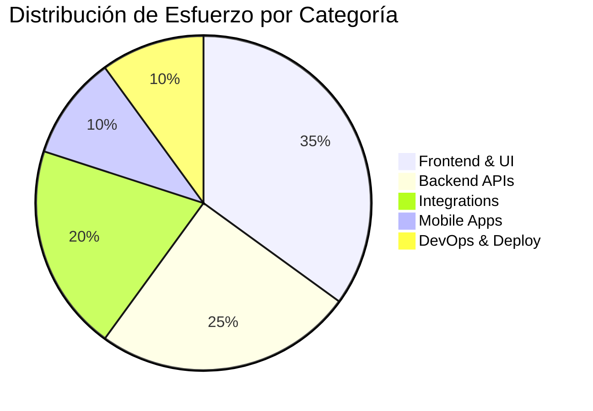

# 📋 PLAN DE DESARROLLO - SISTEMA SKYN3T ACCESS CONTROL


---

## 📊 RESUMEN EJECUTIVO

**Estado Actual**: Etapa 3 (25% completado)  
**Tiempo Estimado Restante**: 12-16 semanas  
**Equipo**: 1 desarrollador full-stack  
**Prioridad**: MVP completo para Q2 2025

### 🎯 Objetivos por Trimestre

| Trimestre | Objetivo Principal | Etapas | % Progreso |
|-----------|-------------------|---------|------------|
| **Q1 2025** | Fundación Técnica | 1-3 | ✅ 25% |
| **Q2 2025** | MVP Funcional | 4-7 | 🎯 Target |
| **Q3 2025** | Features Avanzadas | 8-10 | 📋 Planned |
| **Q4 2025** | Escalabilidad | 11-14 | 🔮 Future |

---

## ✅ ETAPAS COMPLETADAS

### 📦 ETAPA 1: INFRAESTRUCTURA Y BASE (COMPLETADA)
**Duración**: 3 semanas | **Estado**: ✅ 100% | **Calidad**: A+

#### ✅ Infraestructura Docker Completa
```yaml
Servicios Implementados: 27 containers
├── Core Services: 7 microservicios
├── Databases: PostgreSQL + Redis + InfluxDB
├── Message Queue: RabbitMQ
├── Storage: MinIO S3-compatible
├── Monitoring: Grafana + Prometheus + Jaeger
├── Search: Elasticsearch + Kibana
├── Proxy: Nginx + Kong API Gateway
└── MQTT: Mosquitto broker
```

#### ✅ Base de Datos Completa
- **Esquema**: 150+ tablas con relaciones complejas
- **Multi-tenant**: Row-Level Security implementado
- **Migraciones**: Sistema completo de versionado
- **Seeds**: Datos iniciales para desarrollo
- **Indices**: Optimizados para performance

#### ✅ Sistema de Autenticación
- **JWT**: Access + Refresh tokens
- **2FA**: TOTP, SMS, Email
- **Rate Limiting**: Por usuario e IP
- **Session Management**: Múltiples dispositivos
- **Security**: Password policies, lockout

### 🔐 ETAPA 2: PERMISOS Y SEGURIDAD (COMPLETADA)
**Duración**: 4 semanas | **Estado**: ✅ 100% | **Calidad**: A+

#### ✅ Sistema de Permisos Avanzado
```typescript
Jerarquía de Roles: 22 niveles
├── Sistema: 11 roles (SUPER_ADMIN → REPORT_VIEWER)
├── Comunidad: 11 roles (COMMUNITY_ADMIN → AUTHORIZED_PERSON)
├── Granularidad: Módulo.Acción.Recurso
├── Herencia: Configurable por rol
├── Contexto: Comunidad, edificio, unidad
└── Temporal: Permisos con expiración
```

#### ✅ Middleware de Seguridad
- **Authentication**: JWT validation completo
- **Authorization**: RBAC + ABAC implementado
- **Validation**: Express-validator integrado
- **Rate Limiting**: Redis-based distribuido
- **CORS**: Configurado por entorno

#### ✅ WebSocket Real-time
- **Socket.io**: Implementado y funcional
- **Rooms**: Por comunidad, edificio, usuario
- **Events**: Access, device, permission changes
- **Authentication**: JWT over WebSocket
- **Scaling**: Redis adapter para clusters

---

## 🚧 ETAPA ACTUAL: 3 - MODELOS Y CONTROLADORES BASE

**Estado**: 🔄 60% Completado | **ETA**: 2 semanas | **Prioridad**: Alta

### 🎯 Objetivos de la Etapa 3

#### 🔄 Modelos Sequelize (80% completado)
```typescript
Modelos Implementados: ✅
├── User, Role, Permission, Community
├── Device, AccessPoint, AccessLog
├── Building, Floor, Unit, CommunityMember
├── Invitation, Vehicle, Staff
└── Notification, Document

Modelos Pendientes: 🔄
├── PaymentTransaction, BankAccount
├── MaintenanceRequest, Incident
├── SuggestionComplaint, Announcement
└── AnalyticsKPI, Report
```

#### 🔄 Controladores CRUD (60% completado)
```typescript
Controladores Completados: ✅
├── authController.ts          # Login, 2FA, sessions
├── userController.ts          # CRUD usuarios completo
├── permissionController.ts    # Gestión permisos
├── communityController.ts     # CRUD comunidades
└── deviceController.ts        # Control dispositivos

Controladores Pendientes: 🔄
├── accessController.ts        # Control de accesos
├── financialController.ts     # Gestión financiera
├── paymentController.ts       # Procesamiento pagos
├── notificationController.ts  # Comunicaciones
└── reportController.ts        # Generación reportes
```

#### 📋 Servicios Especializados (70% completado)
```typescript
Servicios Implementados: ✅
├── authService.ts            # Autenticación completa
├── permissionService.ts      # Motor permisos
├── cacheService.ts           # Gestión Redis
├── auditService.ts           # Logging cambios
└── validationService.ts      # Validaciones

Servicios Pendientes: 🔄
├── paymentService.ts         # Integración bancos
├── deviceService.ts          # Control IoT MQTT
├── emailService.ts           # SMTP + templates
├── smsService.ts             # Twilio integration
└── uploadService.ts          # MinIO + S3
```

### 📅 Plan Detallado Etapa 3

#### Semana 1: Completar Controladores Core
- [ ] **Lunes-Martes**: accessController.ts + tests
- [ ] **Miércoles**: financialController.ts básico
- [ ] **Jueves**: paymentController.ts estructura
- [ ] **Viernes**: notificationController.ts + cleanup

#### Semana 2: Servicios y Testing
- [ ] **Lunes**: paymentService.ts (bancos Chile)
- [ ] **Martes**: deviceService.ts (MQTT)
- [ ] **Miércoles**: emailService.ts + smsService.ts
- [ ] **Jueves**: Integration testing
- [ ] **Viernes**: Documentation + QA

---

## 📋 PRÓXIMAS ETAPAS

### 🎨 ETAPA 4: FRONTEND REACT COMPLETO
**Duración**: 4-5 semanas | **Prioridad**: Crítica para MVP

#### 🎯 Objetivos Principales
- **React 18**: TypeScript + Material-UI v5
- **Tema Glassmorphism**: Diseño moderno consistente
- **Redux Toolkit**: Estado global optimizado
- **Real-time**: Socket.io client integrado

#### 📋 Componentes a Desarrollar
```typescript
Layout System:
├── MainLayout.tsx             # Layout principal con menú flotante
├── Navigation.tsx             # Menú jerárquico por permisos
├── Header.tsx                 # Logo SKYN3T centrado
└── Footer.tsx                 # Footer siempre visible

Core Pages:
├── Login.tsx                  # ✅ Implementado (glassmorphism)
├── Dashboard.tsx              # Vista general con métricas
├── Users/                     # Gestión usuarios con DataGrid
├── Permissions/               # TreeView con checkboxes
├── Communities/               # CRUD comunidades
├── Devices/                   # Control IoT en tiempo real
├── Access/                    # Logs y control acceso
├── Financial/                 # Gestión financiera
├── Invitations/               # Sistema invitaciones
└── Reports/                   # Dashboard de reportes

Advanced Components:
├── DataGrid/                  # Material-UI X-Data-Grid
├── PermissionTree/            # TreeView con herencia
├── RealTimeChart/             # Gráficos en tiempo real
├── DeviceControl/             # Control remoto dispositivos
├── QRGenerator/               # Generación QR dinámicos
└── FileUpload/                # Upload con preview
```

#### 🎨 Design System
```scss
Glassmorphism Theme:
├── Background: Imagen tierra + gradientes
├── Cards: backdrop-filter + border-radius
├── Colors: Azul primary + verde accent
├── Typography: Roboto + Inter
├── Animations: Framer Motion
└── Responsive: Mobile-first design
```

### 🏢 ETAPA 5: GESTIÓN DE COMUNIDADES AVANZADA
**Duración**: 3 semanas | **Features**: Dashboard administrativo

#### 📊 Dashboard de Comunidades
- **Vista General**: Métricas por comunidad
- **Mapa Interactivo**: Ubicaciones y estado
- **Comparativas**: Benchmarking entre comunidades
- **Alertas**: Monitoreo proactivo

#### ⚙️ Configuración de Features
- **Toggle Switches**: Activar/desactivar funcionalidades
- **Límites y Cuotas**: Por plan de suscripción
- **Precios Dinámicos**: Configuración por región
- **Preview Changes**: Vista previa antes de aplicar

#### 🏗️ Gestión Edificios/Unidades
- **Estructura Jerárquica**: Drag & drop visual
- **Planos Interactivos**: Upload y marcado
- **Asignación Residentes**: Workflow completo
- **Estado Ocupación**: Dashboard en tiempo real

### 🔌 ETAPA 6: SISTEMA IoT Y DISPOSITIVOS
**Duración**: 3-4 semanas | **Features**: Control total dispositivos

#### 🗺️ Dashboard de Dispositivos
```typescript
Features:
├── Real-time Map: Estado de todos los dispositivos
├── Health Monitoring: CPU, memoria, conectividad
├── Command Queue: Cola de comandos pendientes
├── Performance Metrics: Gráficos históricos
└── Alerts System: Notificaciones automáticas
```

#### 🎮 Control Remoto Avanzado
- **Comandos Instantáneos**: Open/close, restart, config
- **Batch Operations**: Comandos masivos
- **Scheduling**: Programación de comandos
- **Rollback**: Deshacer comandos

#### 📡 Integración MQTT Completa
- **Topics Jerárquicos**: Por comunidad/edificio/dispositivo
- **QoS Management**: Garantía de entrega
- **Security**: TLS + certificates
- **Load Balancing**: Múltiples brokers

### 💰 ETAPA 7: SISTEMA FINANCIERO INTEGRAL
**Duración**: 4 semanas | **Features**: Gestión financiera completa

#### 💳 Integración Bancaria Chile
```typescript
Bancos Implementados:
├── Banco Estado: API nativa + webhooks
├── Santander: Open Banking + OAuth2
├── BCI: Transbank integration
├── Banco de Chile: API corporativa
└── Scotiabank: API comercial

Features por Banco:
├── Balance Inquiry: Consulta saldos
├── Transaction History: Movimientos
├── Payment Processing: Pagos automáticos
├── Reconciliation: Conciliación automática
└── Webhook Notifications: Eventos en tiempo real
```

#### 🧾 Emisión Gastos Comunes
- **Wizard Creación**: Paso a paso intuitivo
- **Cálculo Automático**: Prorrateo por unidad
- **Vista Previa**: Validación antes de emitir
- **PDF Generation**: Documentos legales

#### 🏪 Portal de Pagos
- **Multi-gateway**: PayPal, MercadoPago, tarjetas
- **QR Codes**: Pagos móviles instantáneos
- **Planes de Pago**: Cuotas y diferidos
- **Comprobantes**: Download automático

### 📱 ETAPA 8: INVITACIONES Y ACCESOS
**Duración**: 3 semanas | **Features**: Sistema completo invitaciones

#### 🎫 Portal de Invitaciones
- **QR Dinámicos**: Códigos únicos con expiración
- **Validación GPS**: Verificación de ubicación
- **Reconocimiento Placas**: OCR automático
- **Multi-método**: QR, facial, PIN, biometría

#### 📲 App de Invitados
- **Progressive Web App**: Instalable móvil
- **Formulario Inteligente**: Auto-completado
- **Upload Fotos**: Validación automática
- **Notificaciones**: Push en tiempo real

#### 🛡️ Control de Acceso Avanzado
- **Dashboard Real-time**: Accesos en vivo
- **Logs Completos**: Fotos + metadata
- **Blacklist Management**: Gestión automática
- **Emergency Override**: Procedimientos emergencia

### 📢 ETAPA 9: COMUNICACIONES OMNICANAL
**Duración**: 3 semanas | **Features**: Sistema completo comunicaciones

#### ✉️ Centro de Mensajes
- **WYSIWYG Editor**: Rich text + imágenes
- **Plantillas Dinámicas**: Variables personalizables
- **Programación**: Envíos automáticos
- **A/B Testing**: Optimización mensajes

#### 📡 Canales Múltiples
```typescript
Channels:
├── Email: SMTP + templates HTML
├── SMS: Twilio + local providers
├── WhatsApp: Business API oficial
├── Push: Firebase + APNs
├── In-app: Notificaciones internas
└── Voice: Llamadas automatizadas
```

#### 📊 Analytics Comunicación
- **Tasas Apertura**: Email + SMS + WhatsApp
- **Click-through**: Engagement metrics
- **Conversion**: ROI por canal
- **Segmentación**: Audiencias dinámicas

### 📊 ETAPA 10: ANALYTICS Y REPORTES
**Duración**: 4 semanas | **Features**: Business Intelligence

#### 📈 Dashboards Interactivos
- **KPIs Tiempo Real**: Métricas críticas
- **Drill-down**: Navegación jerárquica
- **Export**: PDF, Excel, CSV
- **Sharing**: Links públicos + privados

#### 🤖 Machine Learning
```python
ML Models:
├── Payment Prediction: Predicción morosidad
├── Anomaly Detection: Comportamientos extraños
├── Resource Optimization: Uso eficiente recursos
├── Maintenance Scheduling: Mantenimiento predictivo
└── User Behavior: Patrones de acceso
```

#### 📋 Reportes Automatizados
- **Scheduler**: Cron jobs configurables
- **Templates**: Reportes predefinidos
- **Distribution**: Email automático
- **Retention**: Política de archivos

### 🔧 ETAPA 11: CONFIGURACIÓN Y ADMINISTRACIÓN
**Duración**: 2 semanas | **Features**: Panel administración

#### ⚙️ Configuración Global
- **Parámetros Sistema**: Configuración centralizada
- **Multi-idioma**: Internacionalización
- **Temas**: Personalización visual
- **Regional Settings**: Formatos locales

#### 🔌 Gestión Integraciones
- **API Management**: Keys y rate limits
- **Webhooks**: Configuración endpoints
- **Health Monitoring**: Estado integraciones
- **Error Handling**: Manejo errores automatizado

### 🚀 ETAPA 12: OPTIMIZACIÓN Y DEPLOYMENT
**Duración**: 3 semanas | **Features**: Producción ready

#### ⚡ Performance
- **Code Splitting**: Carga bajo demanda
- **CDN Integration**: Assets distribuidos
- **Database Optimization**: Queries + indices
- **Caching Strategy**: Multi-nivel

#### 🔒 Seguridad
- **Penetration Testing**: Auditoría externa
- **OWASP Compliance**: Top 10 mitigated
- **Data Encryption**: End-to-end
- **Backup Strategy**: 3-2-1 rule

#### 🎯 DevOps
```yaml
CI/CD Pipeline:
├── GitHub Actions: Automated testing
├── Docker Registry: Image management
├── Kubernetes: Container orchestration
├── Monitoring: Grafana + Prometheus
└── Alerting: PagerDuty integration
```

### 📱 ETAPA 13: APLICACIONES MÓVILES
**Duración**: 6 semanas | **Features**: Apps nativas

#### 📲 App Residentes (React Native)
- **Biometría**: Touch/Face ID
- **Invitaciones**: Crear y gestionar
- **Pagos**: Gastos comunes
- **Comunicación**: Chat con administración

#### 👮 App Guardias (React Native)
- **Scanner QR**: Validación rápida
- **Reconocimiento Placas**: Cámara + ML
- **Rondas**: Tracking GPS
- **Panic Button**: Emergencias

#### 💼 App Administración (React Native)
- **Dashboard Móvil**: KPIs principales
- **Aprobaciones**: Workflow mobile
- **Alertas**: Push notifications
- **Reportes**: Vista rápida

### 🌍 ETAPA 14: INTERNACIONALIZACIÓN
**Duración**: 4 semanas | **Features**: Expansión global

#### 🗺️ Localización
- **Multi-idioma**: i18n completo
- **Formatos Regionales**: Fechas, monedas
- **Zonas Horarias**: Manejo automático
- **Monedas**: Conversion rates API

#### 📋 Compliance Regional
- **GDPR**: Europa compliance
- **LGPD**: Brasil compliance  
- **CCPA**: California compliance
- **Local Laws**: Por país

---

## 📈 MÉTRICAS DE PROGRESO

### 🎯 KPIs por Etapa

| Etapa | Duración | Complejidad | Prioridad | Dependencias |
|-------|----------|-------------|-----------|--------------|
| 3 - Modelos/Controllers | 2 sem | Media | Alta | Etapas 1-2 |
| 4 - Frontend React | 5 sem | Alta | Crítica | Etapa 3 |
| 5 - Gestión Comunidades | 3 sem | Media | Alta | Etapa 4 |
| 6 - Sistema IoT | 4 sem | Alta | Media | Etapa 5 |
| 7 - Sistema Financiero | 4 sem | Alta | Alta | Etapa 6 |
| 8 - Invitaciones | 3 sem | Media | Media | Etapa 7 |
| 9 - Comunicaciones | 3 sem | Media | Baja | Etapa 8 |
| 10 - Analytics | 4 sem | Alta | Media | Etapa 9 |
| 11 - Configuración | 2 sem | Baja | Baja | Etapa 10 |
| 12 - Optimización | 3 sem | Media | Alta | Etapa 11 |
| 13 - Apps Móviles | 6 sem | Alta | Media | Etapa 12 |
| 14 - Internacionalización | 4 sem | Media | Baja | Etapa 13 |

### 📊 Distribución de Esfuerzo



### 🎯 Criterios de Éxito

#### MVP (Etapas 1-7)
- [ ] Sistema multi-tenant funcional
- [ ] Frontend React completo
- [ ] Control de acceso básico
- [ ] Gestión financiera Chile
- [ ] APIs documentadas
- [ ] Monitoreo implementado

#### Producto Completo (Etapas 1-11)
- [ ] Todas las features core
- [ ] Performance optimizado
- [ ] Seguridad auditada
- [ ] Documentación completa
- [ ] Training materials

#### Escalabilidad (Etapas 12-14)
- [ ] Apps móviles publicadas
- [ ] Multi-región soportado
- [ ] Compliance internacional
- [ ] 99.9% uptime SLA

---

## 🚨 RIESGOS Y MITIGACIONES

### 🔴 Riesgos Altos

#### Frontend Complexity
- **Riesgo**: Material-UI + Real-time complejo
- **Mitigación**: POCs tempranos, iteración incremental
- **Contingencia**: Simplificar UI si necesario

#### Banking Integration
- **Riesgo**: APIs bancarias inconsistentes
- **Mitigación**: Sandbox testing extensivo
- **Contingencia**: Gateway agregador terceros

#### Performance at Scale
- **Riesgo**: 10K+ usuarios concurrentes
- **Mitigación**: Load testing desde etapa temprana
- **Contingencia**: Microservices adicionales

### 🟡 Riesgos Medios

#### Third-party Dependencies
- **Riesgo**: Breaking changes en librerías
- **Mitigación**: Version pinning + automated testing
- **Contingencia**: Fork libraries si necesario

#### Mobile App Store Approval
- **Riesgo**: Rechazos App Store/Play Store
- **Mitigación**: Guidelines compliance desde diseño
- **Contingencia**: PWA como fallback

### 🟢 Riesgos Bajos

#### Team Scaling
- **Riesgo**: Necesidad más desarrolladores
- **Mitigación**: Documentación detallada
- **Contingencia**: Consultores externos

---

## 🎯 CRITERIOS DE ACEPTACIÓN

### 📋 Definition of Done (DoD)

#### Por Feature
- [ ] Código implementado y testeado (>80% coverage)
- [ ] Documentación API actualizada
- [ ] UI/UX review completado
- [ ] Security review aprobado
- [ ] Performance testing passed
- [ ] Browser compatibility verified

#### Por Etapa
- [ ] Todos los features de la etapa completados
- [ ] Integration tests passing
- [ ] User acceptance testing completado
- [ ] Documentation actualizada
- [ ] Deployment scripts tested
- [ ] Rollback plan verificado

#### Por Milestone
- [ ] Demo funcional preparado
- [ ] Stakeholder approval obtenido
- [ ] Metrics baseline establecido
- [ ] Support documentation creado
- [ ] Training materials preparados
- [ ] Go-live checklist completado

---

## 📞 SIGUIENTES PASOS

### 📅 Próximas 2 Semanas (Etapa 3)

#### Semana 1
- **Lunes**: Finalizar accessController.ts
- **Martes**: Implementar financialController.ts básico
- **Miércoles**: Estructura paymentController.ts
- **Jueves**: notificationController.ts + validaciones
- **Viernes**: Code review + cleanup

#### Semana 2  
- **Lunes**: paymentService.ts (integración bancos)
- **Martes**: deviceService.ts (MQTT + commands)
- **Miércoles**: emailService.ts + smsService.ts
- **Jueves**: Integration testing completo
- **Viernes**: Documentation + handoff Etapa 4

### 🎯 Preparación Etapa 4

#### Pre-requisitos
- [ ] Todas las APIs core funcionales
- [ ] WebSocket events definidos
- [ ] Permission system estable
- [ ] Database seeded con data demo
- [ ] Docker environment optimizado

#### Design System
- [ ] Material-UI v5 theme configurado
- [ ] Glassmorphism components library
- [ ] Animation library selected
- [ ] Icon system establecido
- [ ] Typography scale definido

---

**Última actualización**: 2025-06-26  
**Próxima revisión**: Al completar Etapa 3  
**Responsable**: PETERH4CK  
**Estado documento**: ✅ Actualizado y sincronizado
