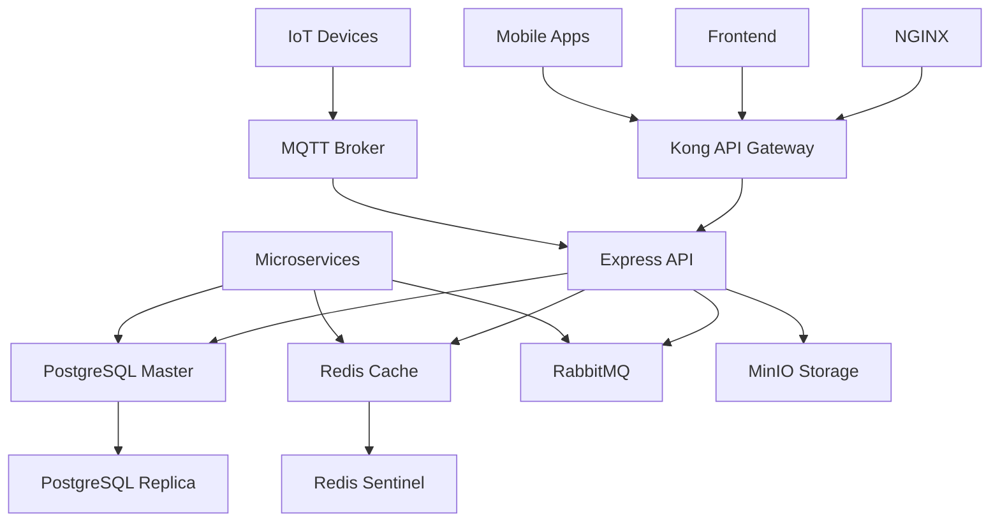

# 🏢 SKYN3T ACCESS CONTROL SYSTEM


[](LICENSE)
[](https://nodejs.org/)
[](https://www.typescriptlang.org/)
[](https://www.postgresql.org/)
[](https://www.docker.com/)
[](#desarrollo)

## 📋 Descripción

**SKYN3T Access Control System** es una plataforma integral de gestión de accesos y seguridad para comunidades residenciales, condominios y edificios comerciales. Ofrece un sistema completo de control de acceso multi-tenant con características avanzadas de IoT, gestión financiera, comunicaciones y análisis predictivo.

### 🎯 Características Principales

- **🔐 Control de Acceso Multi-método**: QR, facial, biométrico, RFID, placas vehiculares
- **🏢 Multi-tenant**: Gestión independiente por comunidades
- **👥 Sistema de Permisos Jerárquico**: 11 niveles con herencia granular
- **💰 Gestión Financiera**: Integración con bancos chilenos y pasarelas de pago
- **📱 Invitaciones Inteligentes**: QR dinámicos, validación GPS, reconocimiento vehicular
- **🔌 IoT & Dispositivos**: Control en tiempo real de dispositivos de acceso
- **📊 Analytics & ML**: Predicción de comportamientos y anomalías
- **💬 Comunicaciones**: Email, SMS, WhatsApp, notificaciones push
- **🌍 Multi-región**: Soporte inicial para Chile, expansible

## 🚀 Estado Actual del Proyecto

### ✅ Completado (25%)
- **Backend Core**: Arquitectura base, autenticación, permisos
- **Base de Datos**: Esquema completo (150+ tablas)
- **Infraestructura**: Docker Compose con 25+ servicios
- **Sistema Multi-tenant**: Comunidades independientes
- **WebSocket**: Comunicación tiempo real

### 🚧 En Desarrollo (Etapa 3)
- **Controladores CRUD**: 40% completado
- **Modelos adicionales**: Floor, Unit, DeviceStatus
- **Servicios especializados**: Payment, Device, OCR

### 📋 Próximas Etapas
- **Etapa 4**: Frontend React con Material-UI
- **Etapa 5**: Gestión de comunidades completa
- **Etapa 6**: Sistema IoT y dispositivos
- **Etapa 7**: Sistema financiero integral

## 🛠️ Tecnologías

### Backend
- **Runtime**: Node.js 20.x + TypeScript 5.x
- **Framework**: Express.js con arquitectura modular
- **Base de Datos**: PostgreSQL 15+ con Sequelize ORM
- **Cache**: Redis con clustering
- **Queue**: RabbitMQ para procesamiento asíncrono
- **WebSocket**: Socket.io para tiempo real
- **Autenticación**: JWT + 2FA + OAuth2

### Frontend (Planificado)
- **Framework**: React 18 + TypeScript
- **UI Library**: Material-UI v5 con tema glassmorphism
- **Estado**: Redux Toolkit + RTK Query
- **Routing**: React Router v6
- **Charts**: Recharts + D3.js
- **Real-time**: Socket.io Client

### Infraestructura
- **Contenedores**: Docker + Docker Compose
- **Proxy**: Nginx + Kong API Gateway
- **Monitoreo**: Grafana + Prometheus + InfluxDB
- **Logs**: ELK Stack (Elasticsearch + Kibana)
- **Storage**: MinIO (S3 compatible)
- **MQTT**: Eclipse Mosquitto

### Microservicios (Futuros)
- **Payment Service**: Node.js + Integración bancaria
- **OCR Service**: Python + Tesseract + YOLO
- **ML Service**: Python + TensorFlow + Scikit-learn
- **Notification Service**: Node.js + Multi-canal
- **Analytics Service**: Node.js + Data processing

## 📦 Instalación

### Prerrequisitos
- Docker Engine 24.0+
- Docker Compose 2.20+
- Git
- Make (opcional)

### Instalación Rápida

```bash
# 1. Clonar repositorio
git clone https://github.com/your-org/skyn3t-access-control.git
cd skyn3t-access-control

# 2. Configurar variables de entorno
cp .env.example .env
# Editar .env con tu configuración

# 3. Instalación automática
make install

# O instalación manual:
docker-compose build
docker-compose up -d
```

### Acceso al Sistema

Una vez instalado:

- **API**: http://localhost:8000
- **Frontend**: http://localhost:3000 (en desarrollo)
- **Grafana**: http://localhost:3000/grafana (admin/grafana123)
- **Kibana**: http://localhost:3000/kibana
- **RabbitMQ**: http://localhost:15672 (admin/rabbitmq123)
- **MinIO**: http://localhost:9001 (minioadmin/minioadmin123)

## 🏗️ Arquitectura

### Estructura del Proyecto

```
skyn3t-access-control/
├── 📁 backend/                    # API Principal (Node.js/TypeScript)
│   ├── src/
│   │   ├── controllers/           # Controladores REST
│   │   ├── models/               # Modelos Sequelize
│   │   ├── middleware/           # Middleware (auth, permisos)
│   │   ├── services/             # Lógica de negocio
│   │   ├── routes/               # Rutas API
│   │   └── utils/                # Utilidades
│   └── database/
│       ├── schema.sql            # Esquema completo BD
│       └── seeds/                # Datos iniciales
│
├── 📁 frontend/                   # React App (En desarrollo)
│   ├── src/
│   │   ├── components/           # Componentes React
│   │   ├── pages/                # Páginas principales
│   │   ├── services/             # API clients
│   │   └── store/                # Redux store
│
├── 📁 permission-service/         # Microservicio permisos
├── 📁 payment-service/           # Microservicio pagos
├── 📁 notification-service/      # Microservicio notificaciones
├── 📁 analytics-service/         # Microservicio analytics
├── 📁 ocr-service/              # Microservicio OCR (Python)
├── 📁 ml-service/               # Microservicio ML (Python)
│
├── 📁 nginx/                     # Configuración proxy
├── 📁 config/                    # Configuraciones servicios
├── 📁 scripts/                   # Scripts utilidad
│
├── 📄 docker-compose.yml         # Orquestación servicios
├── 📄 Makefile                   # Comandos automatización
└── 📄 INSTALLATION.md            # Guía instalación detallada
```

### Arquitectura de Datos



## 🔐 Sistema de Permisos

### Jerarquía de Roles

**Roles del Sistema (11 niveles)**
1. **SUPER_ADMIN** - Administrador supremo
2. **SYSTEM_ADMIN** - Administrador del sistema
3. **FINANCIAL_ADMIN** - Administrador financiero
4. **HARDWARE_ADMIN** - Administrador de hardware
5. **SECURITY_ADMIN** - Administrador de seguridad
6. **AUDIT_ADMIN** - Administrador de auditoría
7. **OPERATIONS_MANAGER** - Gerente de operaciones
8. **COMMUNITY_MANAGER** - Gerente de comunidad
9. **SUPPORT_SUPERVISOR** - Supervisor de soporte
10. **SUPPORT_AGENT** - Agente de soporte
11. **REPORT_VIEWER** - Visualizador de reportes

**Roles de Comunidad (11 niveles)**
1. **COMMUNITY_ADMIN** - Administrador de comunidad
2. **BOARD_PRESIDENT** - Presidente del directorio
3. **TREASURER** - Tesorero
4. **BOARD_MEMBER** - Miembro del directorio
5. **SECURITY_CHIEF** - Jefe de seguridad
6. **SECURITY_GUARD** - Guardia de seguridad
7. **MAINTENANCE_CHIEF** - Jefe de mantenimiento
8. **STAFF** - Personal
9. **OWNER** - Propietario
10. **TENANT** - Arrendatario
11. **AUTHORIZED_PERSON** - Persona autorizada

### Permisos Granulares

Los permisos se organizan por módulos y acciones:

```typescript
// Ejemplos de permisos
access.doors.open          // Abrir puertas
access.doors.emergency     // Anulación de emergencia
users.create              // Crear usuarios
users.permissions.manage  // Gestionar permisos
financial.approve         // Aprobar transacciones
devices.control           // Controlar dispositivos
```

## 🌐 API Reference

### Autenticación

```http
POST /api/v1/auth/login
Content-Type: application/json

{
  "username": "admin",
  "password": "password",
  "remember": true
}
```

### Usuarios

```http
GET /api/v1/users
Authorization: Bearer {token}
X-Community-ID: {community_id}
```

### Permisos

```http
GET /api/v1/permissions/user/{user_id}
Authorization: Bearer {token}
```

### WebSocket Events

```javascript
// Conectar
socket.emit('join:community', 'community-id');

// Escuchar eventos
socket.on('access.new', (data) => {
  console.log('Nuevo acceso:', data);
});

socket.on('device.alert', (data) => {
  console.log('Alerta dispositivo:', data);
});
```

## 🧪 Testing

```bash
# Backend tests
cd backend
npm test

# Frontend tests (cuando esté disponible)
cd frontend
npm test

# Tests de integración
make test-integration

# Tests E2E
make test-e2e
```

## 📊 Monitoreo

### Dashboards Disponibles

- **Sistema**: CPU, memoria, disco, red
- **Base de Datos**: Conexiones, queries, performance
- **API**: Response time, error rate, throughput
- **Dispositivos**: Estado, conectividad, comandos

### Métricas Clave

- **Uptime**: >99.9%
- **API Response Time**: <200ms promedio
- **Error Rate**: <1%
- **Database Connections**: Pool no saturado

## 🔧 Comandos Útiles

```bash
# Desarrollo
make dev                 # Iniciar en modo desarrollo
make logs               # Ver logs de todos los servicios
make restart            # Reiniciar todos los servicios

# Base de datos
make db-backup          # Backup de la base de datos
make db-restore         # Restaurar backup
make db-migrate         # Ejecutar migraciones
make db-seed            # Cargar datos iniciales

# Mantenimiento
make update             # Actualizar sistema
make clean              # Limpiar containers y volúmenes
make status             # Estado de todos los servicios
```

## 🌍 Internacionalización

### Regiones Soportadas

- **🇨🇱 Chile**: Implementación completa
  - Bancos: Banco Estado, Santander, BCI, Banco de Chile
  - Moneda: CLP
  - Zona horaria: America/Santiago
  - Idioma: Español (es_CL)

### Regiones Planificadas

- **🇲🇽 México**: Q2 2024
- **🇦🇷 Argentina**: Q3 2024
- **🇨🇴 Colombia**: Q4 2024
- **🇺🇸 Estados Unidos**: 2025

## 🤝 Contribución

### Flujo de Desarrollo

1. Fork el repositorio
2. Crear branch feature: `git checkout -b feature/nueva-funcionalidad`
3. Commit cambios: `git commit -am 'Agregar nueva funcionalidad'`
4. Push al branch: `git push origin feature/nueva-funcionalidad`
5. Crear Pull Request

### Estándares de Código

- **TypeScript**: Strict mode habilitado
- **ESLint**: Configuración estricta
- **Prettier**: Formateo automático
- **Husky**: Pre-commit hooks
- **Tests**: Cobertura mínima 80%

### Estructura de Commits

```
tipo(alcance): descripción corta

- feat: nueva funcionalidad
- fix: corrección de bug
- docs: cambios en documentación
- style: formateo, punto y coma faltante, etc.
- refactor: refactoring de código
- test: agregar tests faltantes
- chore: cambios en build, dependencies, etc.
```

## 📈 Roadmap

### 2024 Q1 - Foundation ✅
- [x] Arquitectura base
- [x] Sistema de permisos
- [x] Multi-tenant
- [x] Infraestructura Docker

### 2024 Q2 - Core Features 🚧
- [ ] Frontend completo
- [ ] Sistema IoT básico
- [ ] Gestión financiera
- [ ] APIs REST completas

### 2024 Q3 - Advanced Features
- [ ] Apps móviles
- [ ] Machine Learning
- [ ] OCR avanzado
- [ ] Integraciones bancarias

### 2024 Q4 - Scale & Expansion
- [ ] Multi-región
- [ ] Performance optimization
- [ ] Enterprise features
- [ ] Marketplace integraciones

## 🐛 Issues Conocidos

- Frontend no implementado (0%)
- Controladores CRUD incompletos (60%)
- Microservicios pendientes
- Apps móviles no iniciadas

RUTAS y LINKS:

skyn3t-access-control/
│
├── 📄 Makefile                                    ✅ CREADO	<----	https://github.com/PeterH4ck/SKYN3T-Control_/tree/main
├── 📄 docker-compose.yml                          ✅ CREADO	<----	https://raw.githubusercontent.com/PeterH4ck/SKYN3T-Control_/refs/heads/main/docker-compose.yml
├── 📄 .env.example                                ✅ CREADO	<----	https://raw.githubusercontent.com/PeterH4ck/SKYN3T-Control_/refs/heads/main/.env.example
├── 📄 .env                                        ❌ CREAR
├── 📄 INSTALLATION.md                             ✅ CREADO	<----	https://raw.githubusercontent.com/PeterH4ck/SKYN3T-Control_/refs/heads/main/INSTALLATION.md
├── 📄 README.md                                   ❌ FALTA
├── 📄 .gitignore                                  ❌ FALTA
├── 📄 .dockerignore                               ❌ FALTA
│
├── 📁 backend/
│   ├── 📄 package.json                            ✅ CREADO	<----	https://raw.githubusercontent.com/PeterH4ck/SKYN3T-Control_/refs/heads/main/backend/package.json
│   ├── 📄 package-lock.json                       ❌ FALTA
│   ├── 📄 tsconfig.json                           ✅ CREADO	<----	https://raw.githubusercontent.com/PeterH4ck/SKYN3T-Control_/refs/heads/main/backend/tsconfig.ts
│   ├── 📄 .env.example                            ❌ FALTA
│   ├── 📄 Dockerfile                              ❌ FALTA
│   ├── 📄 Dockerfile.auth                         ❌ FALTA
│   ├── 📄 Dockerfile.users                        ❌ FALTA
│   ├── 📄 Dockerfile.devices                      ❌ FALTA
│   │
│   └── 📁 src/
│       ├── 📄 server.ts                           ✅ EXISTE	<----	https://raw.githubusercontent.com/PeterH4ck/SKYN3T-Control_/refs/heads/main/backend/src/server.ts
│       ├── 📄 app.ts                              ✅ EXISTE	<----	https://raw.githubusercontent.com/PeterH4ck/SKYN3T-Control_/refs/heads/main/backend/src/app.ts
│       │
│       ├── 📁 config/
│       │   ├── 📄 database.ts                     ✅ EXISTE	<----	https://raw.githubusercontent.com/PeterH4ck/SKYN3T-Control_/refs/heads/main/backend/src/config/database.ts
│       │   ├── 📄 redis.ts                        ✅ EXISTE	<----	https://raw.githubusercontent.com/PeterH4ck/SKYN3T-Control_/refs/heads/main/backend/src/config/redis.ts
│       │   └── 📄 constants.ts                    ✅ EXISTE	<----	https://raw.githubusercontent.com/PeterH4ck/SKYN3T-Control_/refs/heads/main/backend/src/config/constants.ts
│       │
│       ├── 📁 models/
│       │   ├── 📄 index.ts                        ❌ FALTA
│       │   ├── 📄 User.ts                         ✅ EXISTE	<----	https://raw.githubusercontent.com/PeterH4ck/SKYN3T-Control_/refs/heads/main/backend/src/models/User.ts
│       │   ├── 📄 Building.ts                     ✅ EXISTE	<----	https://raw.githubusercontent.com/PeterH4ck/SKYN3T-Control_/refs/heads/main/backend/src/models/Building.ts
│       │   ├── 📄 Permission.ts                   ✅ EXISTE	<----	https://raw.githubusercontent.com/PeterH4ck/SKYN3T-Control_/refs/heads/main/backend/src/models/Permission.ts
│       │   ├── 📄 Community.ts                    ✅ EXISTE	<----	https://raw.githubusercontent.com/PeterH4ck/SKYN3T-Control_/refs/heads/main/backend/src/models/Community.ts
│       │   ├── 📄 AccessLog.ts                    ✅ EXISTE	<----	https://raw.githubusercontent.com/PeterH4ck/SKYN3T-Control_/refs/heads/main/backend/src/models/AccessLog.ts
│       │   ├── 📄 UserRole.ts                     ✅ EXISTE	<----	https://raw.githubusercontent.com/PeterH4ck/SKYN3T-Control_/refs/heads/main/backend/src/models/UserRole.ts
│       │   ├── 📄 Vehicle.ts                      ✅ EXISTE	<----	https://raw.githubusercontent.com/PeterH4ck/SKYN3T-Control_/refs/heads/main/backend/src/models/Vehicle.ts
│       │   ├── 📄 Role.ts                         ✅ EXISTE	<----	https://raw.githubusercontent.com/PeterH4ck/SKYN3T-Control_/refs/heads/main/backend/src/models/Role.ts
│       │   ├── 📄 Invitation.ts                   ✅ EXISTE	<----	https://raw.githubusercontent.com/PeterH4ck/SKYN3T-Control_/refs/heads/main/backend/src/models/Invitation.ts
│       │   ├── 📄 Feature.ts                      ✅ EXISTE	<----	https://raw.githubusercontent.com/PeterH4ck/SKYN3T-Control_/refs/heads/main/backend/src/models/Feature.ts
│       │   ├── 📄 Device.ts                       ✅ EXISTE	<----	https://raw.githubusercontent.com/PeterH4ck/SKYN3T-Control_/refs/heads/main/backend/src/models/Device.ts
│       │   └── 📁 relations/
│       │       └── 📄 index.ts                    ❌ FALTA
│       │
│       ├── 📁 controllers/
│       │   ├── 📄 authController.ts               ✅ EXISTE	<----	https://raw.githubusercontent.com/PeterH4ck/SKYN3T-Control_/refs/heads/main/backend/src/controllers/authController.ts
│       │   ├── 📄 userController.ts               ✅ EXISTE	<----	https://raw.githubusercontent.com/PeterH4ck/SKYN3T-Control_/refs/heads/main/backend/src/controllers/userController.ts
│       │   ├── 📄 permissionController.ts         ✅ EXISTE	<----	https://raw.githubusercontent.com/PeterH4ck/SKYN3T-Control_/refs/heads/main/backend/src/controllers/permissionController.ts
│       │   ├── 📄 communityController.ts          ✅ EXISTE	<----	https://raw.githubusercontent.com/PeterH4ck/SKYN3T-Control_/refs/heads/main/backend/src/controllers/communityController.ts
│       │   ├── 📄 deviceController.ts             ❌ FALTA
│       │   ├── 📄 paymentController.ts            ❌ FALTA
│       │   └── 📄 notificationController.ts       ❌ FALTA
│       │
│       ├── 📁 middleware/
│       │   ├── 📄 auth.ts                         ✅ EXISTE	<----	https://raw.githubusercontent.com/PeterH4ck/SKYN3T-Control_/refs/heads/main/backend/src/middleware/auth.ts
│       │   ├── 📄 permissions.ts                  ❌ FALTA
│       │   ├── 📄 validate.ts                     ✅ EXISTE	<----	https://raw.githubusercontent.com/PeterH4ck/SKYN3T-Control_/refs/heads/main/backend/src/middleware/validate.ts
│       │   ├── 📄 errorHandler.ts                 ✅ EXISTE	<----	https://raw.githubusercontent.com/PeterH4ck/SKYN3T-Control_/refs/heads/main/backend/src/middleware/errorHandler.ts
│       │   └── 📄 rateLimiter.ts                  ❌ FALTA
│       │
│       ├── 📁 routes/
│       │   ├── 📄 index.ts                        ✅ EXISTE	<----	https://raw.githubusercontent.com/PeterH4ck/SKYN3T-Control_/refs/heads/main/backend/src/routes/index.ts
│       │   ├── 📄 auth.ts                         ✅ EXISTE	<----	https://raw.githubusercontent.com/PeterH4ck/SKYN3T-Control_/refs/heads/main/backend/src/routes/auth.ts
│       │   ├── 📄 users.ts                        ✅ EXISTE	<----	https://raw.githubusercontent.com/PeterH4ck/SKYN3T-Control_/refs/heads/main/backend/src/routes/users.ts
│       │   ├── 📄 permissions.ts                  ✅ EXISTE	<----	https://raw.githubusercontent.com/PeterH4ck/SKYN3T-Control_/refs/heads/main/backend/src/routes/permissions.ts
│       │   ├── 📄 communities.ts                  ✅ EXISTE	<----	https://raw.githubusercontent.com/PeterH4ck/SKYN3T-Control_/refs/heads/main/backend/src/routes/communities.ts
│       │   ├── 📄 devices.ts                      ❌ FALTA
│       │   ├── 📄 payments.ts                     ❌ FALTA
│       │   └── 📄 notifications.ts                ❌ FALTA
│       │
│       ├── 📁 services/
│       │   ├── 📄 authService.ts                  ❌ FALTA
│       │   ├── 📄 emailService.ts                 ✅ EXISTE	<----	https://raw.githubusercontent.com/PeterH4ck/SKYN3T-Control_/refs/heads/main/backend/src/services/emailService.ts
│       │   ├── 📄 uploadService.ts                ✅ EXISTE	<----	https://raw.githubusercontent.com/PeterH4ck/SKYN3T-Control_/refs/heads/main/backend/src/services/uploadService.ts
│       │   ├── 📄 permissionService.ts            ❌ FALTA
│       │   ├── 📄 websocketService.ts             ✅ EXISTE	<----	https://raw.githubusercontent.com/PeterH4ck/SKYN3T-Control_/refs/heads/main/backend/src/services/websocketService.ts
│       │   ├── 📄 paymentService.ts               ❌ FALTA
│       │   ├── 📄 notificationService.ts          ❌ FALTA
│       │   └── 📄 deviceService.ts                ❌ FALTA
│       │
│       ├── 📁 utils/
│       │   ├── 📄 logger.ts                       ✅ EXISTE	<----	https://raw.githubusercontent.com/PeterH4ck/SKYN3T-Control_/refs/heads/main/backend/src/utils/logger.ts
│       │   ├── 📄 index.ts                        ✅ EXISTE	<----	https://raw.githubusercontent.com/PeterH4ck/SKYN3T-Control_/refs/heads/main/backend/src/utils/index.ts
│       │   ├── 📄 validators.ts                   ✅ EXISTE	<----	https://raw.githubusercontent.com/PeterH4ck/SKYN3T-Control_/refs/heads/main/backend/src/utils/validators.ts
│       │   ├── 📄 AppError.ts						 ✅ EXISTE	<----	https://raw.githubusercontent.com/PeterH4ck/SKYN3T-Control_/refs/heads/main/backend/src/utils/AppError.ts
│       │   └── 📄 crypto.ts                       ❌ FALTA
│       │
│       └── 📁 database/
│           ├── 📄 schema.sql                      ✅ CREADO	<----	https://raw.githubusercontent.com/PeterH4ck/SKYN3T-Control_/refs/heads/main/backend/src/database/schema.sql
│           ├── 📁 migrations/
│           │   └── 📄 001_initial_schema.sql      ❌ FALTA
│           └── 📁 seeds/
│               ├── 📄 01_countries.sql            ❌ FALTA
│               ├── 📄 02_roles.sql                ❌ FALTA
│               ├── 📄 03_permissions.sql          ❌ FALTA
│               └── 📄 04_demo_data.sql            ❌ FALTA
│
├── 📁 permission-service/
│   ├── 📄 package.json                            ❌ FALTA (crear manualmente)
│   ├── 📄 package-lock.json                       ❌ FALTA
│   ├── 📄 Dockerfile                              ❌ FALTA (crear manualmente)
│   ├── 📄 .env.example                            ❌ FALTA
│   ├── 📄 README.md                               ❌ FALTA
│   │
│   └── 📁 src/
│       ├── 📄 index.js                            ❌ FALTA
│       ├── 📄 permissionEngine.js                 ❌ FALTA (extraer de index.js)
│       ├── 📄 permissionPropagator.js             ❌ FALTA (extraer de index.js)
│       └── 📁 tests/
│           └── 📄 permissions.test.js             ❌ FALTA
│
├── 📁 payment-service/
│   ├── 📄 package.json                            ❌ FALTA
│   ├── 📄 Dockerfile                              ❌ FALTA
│   │
│   └── 📁 src/
│       ├── 📄 index.js                            ❌ FALTA
│       ├── 📁 banks/
│       │   ├── 📄 bancoEstado.adapter.js          ❌ FALTA
│       │   ├── 📄 santander.adapter.js            ❌ FALTA
│       │   ├── 📄 bci.adapter.js                  ❌ FALTA
│       │   └── 📄 bancoChile.adapter.js           ❌ FALTA
│       └── 📁 gateways/
│           ├── 📄 paypal.gateway.js               ❌ FALTA
│           └── 📄 mercadopago.gateway.js          ❌ FALTA
│
├── 📁 notification-service/
│   ├── 📄 package.json                            ❌ FALTA
│   ├── 📄 Dockerfile                              ❌ FALTA
│   │
│   └── 📁 src/
│       ├── 📄 index.js                            ❌ FALTA
│       ├── 📁 channels/
│       │   ├── 📄 email.channel.js                ❌ FALTA
│       │   ├── 📄 sms.channel.js                  ❌ FALTA
│       │   ├── 📄 whatsapp.channel.js             ❌ FALTA
│       │   └── 📄 push.channel.js                 ❌ FALTA
│       └── 📁 templates/
│           └── 📄 index.js                        ❌ FALTA
│
├── 📁 analytics-service/
│   ├── 📄 package.json                            ❌ FALTA
│   ├── 📄 Dockerfile                              ❌ FALTA
│   │
│   └── 📁 src/
│       └── 📄 index.js                            ❌ FALTA
│
├── 📁 ocr-service/
│   ├── 📄 requirements.txt                        ❌ FALTA
│   ├── 📄 Dockerfile                              ❌ FALTA
│   │
│   ├── 📁 src/
│   │   ├── 📄 main.py                             ❌ FALTA
│   │   ├── 📄 receipt_ocr.py                      ❌ FALTA
│   │   └── 📄 plate_ocr.py                        ❌ FALTA
│   │
│   └── 📁 models/
│       └── 📄 chilean_plates.pkl                  ❌ FALTA
│
├── 📁 ml-service/
│   ├── 📄 requirements.txt                        ❌ FALTA
│   ├── 📄 Dockerfile                              ❌ FALTA
│   │
│   ├── 📁 src/
│   │   ├── 📄 main.py                             ❌ FALTA
│   │   ├── 📄 payment_predictor.py                ❌ FALTA
│   │   └── 📄 anomaly_detector.py                 ❌ FALTA
│   │
│   └── 📁 models/
│       └── 📄 payment_model.pkl                   ❌ FALTA
│
├── 📁 scheduler/
│   ├── 📄 package.json                            ❌ FALTA
│   ├── 📄 Dockerfile                              ❌ FALTA
│   │
│   └── 📁 src/
│       └── 📄 index.js                            ❌ FALTA
│
├── 📁 backup/
│   ├── 📄 Dockerfile                              ❌ FALTA
│   │
│   └── 📁 scripts/
│       └── 📄 backup.sh                           ❌ FALTA
│
├── 📁 nginx/
│   ├── 📄 nginx.conf                              ✅ CREADO	<----	https://raw.githubusercontent.com/PeterH4ck/SKYN3T-Control_/refs/heads/main/nginx/nginx.conf
│   ├── 📄 frontend.conf                           ❌ FALTA
│   │
│   ├── 📁 conf.d/
│   │   ├── 📄 api.conf                            ❌ FALTA
│   │   ├── 📄 monitoring.conf                     ❌ FALTA
│   │   └── 📄 security.conf                       ❌ FALTA
│   │
│   └── 📁 ssl/
│       ├── 📄 cert.pem                            ❌ FALTA (generar)
│       └── 📄 key.pem                             ❌ FALTA (generar)
│
├── 📁 config/
│   ├── 📄 prometheus.yml                          ❌ FALTA
│   ├── 📄 kong.yml                                ❌ FALTA
│   ├── 📄 mosquitto.conf                          ❌ FALTA
│   ├── 📄 redis-sentinel.conf                     ❌ FALTA
│   │
│   └── 📁 grafana/
│       ├── 📁 dashboards/
│       │   ├── 📄 system-dashboard.json           ❌ FALTA
│       │   ├── 📄 access-dashboard.json           ❌ FALTA
│       │   └── 📄 financial-dashboard.json        ❌ FALTA
│       │
│       └── 📁 datasources/
│           └── 📄 datasources.yml                 ❌ FALTA
│
├── 📁 scripts/
│   ├── 📄 init-db.sh                              ❌ FALTA
│   ├── 📄 backup.sh                               ❌ FALTA
│   ├── 📄 restore.sh                              ❌ FALTA
│   ├── 📄 support-bundle.sh                       ❌ FALTA
│   └── 📄 install.sh                              ❌ FALTA
│
├── 📁 frontend/                                   ❌ TODO FALTA (Fase 4)
│   ├── 📄 package.json                            ❌ FALTA
│   ├── 📄 tsconfig.json                           ✅ CREADO	<----	https://raw.githubusercontent.com/PeterH4ck/SKYN3T-Control_/refs/heads/main/frontend/tsconfig.json
│   ├── 📄 .env.example                            ❌ FALTA
│   │
│   ├── 📁 public/
│   │   ├── 📄 index.html                          ❌ FALTA
│   │   └── 📁 images/
│   │       ├── 📄 logo.png                        ❌ FALTA
│   │       └── 📄 login-background.jpeg           ❌ FALTA
│   │
│   ├── 📁 src/
│   │   ├── 📄 index.tsx                           ❌ FALTA
│   │   ├── 📄 App.tsx                             ❌ FALTA
│   │   │
│   │   ├── 📁 components/
│   │   │   ├── 📁 Layout/
│   │   │   ├── 📁 Auth/
│   │   │   ├── 📁 Dashboard/
│   │   │   ├── 📁 Permissions/
│   │   │   └── 📁 Common/
│   │   │
│   │   ├── 📁 pages/
│   │   │   ├── 📄 Login.tsx                       ❌ FALTA
│   │   │   ├── 📄 Dashboard.tsx                   ❌ FALTA
│   │   │   ├── 📄 Users.tsx                       ❌ FALTA
│   │   │   ├── 📄 Permissions.tsx                 ❌ FALTA
│   │   │   └── 📄 Communities.tsx                 ❌ FALTA
│   │   │
│   │   ├── 📁 services/
│   │   │   ├── 📄 api.ts                          ❌ FALTA
│   │   │   ├── 📄 auth.ts                         ❌ FALTA
│   │   │   └── 📄 websocket.ts                    ❌ FALTA
│   │   │
│   │   ├── 📁 store/
│   │   │   └── 📄 index.ts                        ❌ FALTA
│   │   │
│   │   ├── 📁 hooks/
│   │   │   └── 📄 useAuth.ts                      ❌ FALTA
│   │   │
│   │   ├── 📁 utils/
│   │   │   └── 📄 index.ts                        ❌ FALTA
│   │   │
│   │   └── 📁 styles/
│   │       └── 📄 globals.css                     ❌ FALTA
│   │
│   └── 📁 build/                                  ❌ (generado al compilar)
│
└── 📁 docs/
    ├── 📄 API.md                                  ✅ CREADO	<----	https://raw.githubusercontent.com/PeterH4ck/SKYN3T-Control_/refs/heads/main/docs/API.md
    ├── 📄 ARCHITECTURE.md                         ✅ CREADO	<----	https://raw.githubusercontent.com/PeterH4ck/SKYN3T-Control_/refs/heads/main/docs/ARCHITECTURE.md
    └── 📄 DEPLOYMENT.md                           ✅ CREADO	<----	https://raw.githubusercontent.com/PeterH4ck/SKYN3T-Control_/refs/heads/main/docs/DEPLOYMENT.md


Ver [Issues](https://github.com/your-org/skyn3t-access-control/issues) para lista completa.

## 📄 Licencia

Este proyecto está licenciado bajo la Licencia MIT - ver [LICENSE](LICENSE) para detalles.

## 👥 Equipo

- **Arquitecto Lead**: PETERH4CK
- **Backend Developer**: PETERH4CK
- **Frontend Developer**: PETERH4CK
- **DevOps Engineer**: PETERH4CK

## 📞 Soporte

- **Documentación**: [Wiki del proyecto]
- **Issues**: [GitHub Issues](https://github.com/your-org/skyn3t-access-control/issues)
- **Discussions**: [GitHub Discussions](https://github.com/your-org/skyn3t-access-control/discussions)
- **Email**: support@skyn3t.com

## 🙏 Agradecimientos

- **ClaudeAI** por las capacidades de IA
- **Sequelize** por el excelente ORM
- **Material-UI** por los componentes
- **Docker** por la containerización
- **PostgreSQL** por la robustez

---

<div align="center">

**[🏠 Homepage](https://skyn3t.com) • [📚 Documentation](https://docs.skyn3t.com) • [🎯 Demo](https://demo.skyn3t.com)**

Made with ❤️ for the future of access control

</div>
