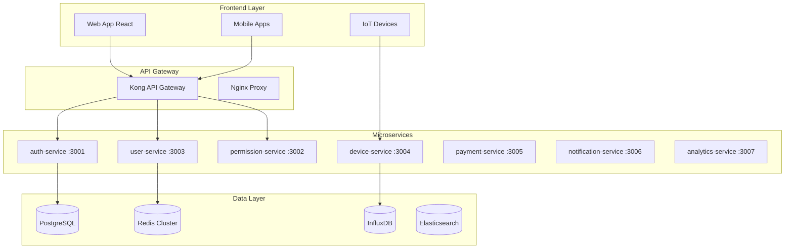
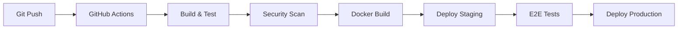

# 🏗️ SKYN3T ACCESS CONTROL SYSTEM

[](https://github.com/PeterH4ck/SKYN3T-Control_/releases)
[](https://github.com/PeterH4ck/SKYN3T-Control_/actions)
[](LICENSE)
[](docker-compose.yml)
[](helm/)
[](tsconfig.json)

> **Sistema de Control de Acceso Multi-tenant de Nivel Enterprise**  
> Arquitectura de microservicios cloud-native diseñada para comunidades residenciales, edificios corporativos y conjuntos habitacionales

---

## 🎯 **Descripción del Proyecto**

**SKYN3T Access Control** es una plataforma completa de control de acceso que combina **IoT**, **inteligencia artificial**, **fintech** y **comunicaciones omnicanal** en una solución integrada de nivel enterprise.

### **🏢 Características Principales**

- 🔐 **Control de Acceso Inteligente**: Facial, RFID, QR, PIN, placas vehiculares
- 🏠 **Multi-tenant Avanzado**: Aislamiento completo por comunidad con 11 niveles jerárquicos
- 💰 **Sistema Financiero**: Integración con bancos chilenos y pasarelas internacionales
- 🤖 **AI/ML Integrado**: Reconocimiento facial, OCR, predicciones y detección de anomalías
- 📱 **Comunicaciones**: Email, SMS, WhatsApp, push notifications
- 🔌 **IoT Native**: MQTT, control de dispositivos, monitoreo en tiempo real
- 📊 **Business Intelligence**: Dashboards, reportes, analytics avanzados

---

## 🏗️ **Arquitectura del Sistema**

### **Microservicios**



### **Stack Tecnológico**

| Componente | Tecnología | Propósito |
|------------|------------|-----------|
| **Backend** | Node.js + TypeScript + Express | API REST y lógica de negocio |
| **Base de Datos** | PostgreSQL 15 (Master/Replica) | Datos principales con HA |
| **Cache** | Redis Cluster + Sentinel | Cache distribuido y sesiones |
| **Message Queue** | RabbitMQ | Comunicación asíncrona |
| **Time Series** | InfluxDB | Métricas IoT y telemetría |
| **Search** | Elasticsearch + Kibana | Logs y búsqueda avanzada |
| **Storage** | MinIO (S3-compatible) | Archivos y documentos |
| **Monitoring** | Prometheus + Grafana | Métricas y alertas |
| **IoT** | MQTT (Mosquitto) | Comunicación con dispositivos |
| **API Gateway** | Kong + Nginx | Routing y load balancing |

---

## 🚀 **Quick Start**

### **Prerrequisitos**

```bash
# Software requerido
- Docker 24.0+
- Docker Compose 2.20+
- Node.js 20.x
- Git
- Make (opcional)

# Verificar instalaciones
docker --version
docker-compose --version
node --version
```

### **Instalación Rápida**

```bash
# 1. Clonar el repositorio
git clone https://github.com/PeterH4ck/SKYN3T-Control_.git
cd SKYN3T-Control_

# 2. Configurar variables de entorno
cp .env.example .env
# Editar .env con tu configuración

# 3. Iniciar todos los servicios
make install
# O manualmente:
docker-compose up -d

# 4. Verificar instalación
make health-check
```

### **Acceso al Sistema**

Una vez instalado, accede a:

- **🌐 Frontend**: http://localhost:3000
- **🔧 API**: http://localhost:8000/api/v1
- **📊 Grafana**: http://localhost:3000/grafana (admin/grafana123)
- **📋 Kibana**: http://localhost:3000/kibana
- **💾 MinIO**: http://localhost:9001 (minioadmin/minioadmin123)

---

## 📁 **Estructura del Proyecto**

```
skyn3t-access-control/
├── 📄 docker-compose.yml           # Orquestación de servicios
├── 📄 Makefile                     # Comandos de desarrollo
├── 📄 .env.example                 # Variables de entorno
│
├── 📁 backend/                     # ✅ API Principal (Node.js + TypeScript)
│   ├── 📁 src/
│   │   ├── 📁 controllers/         # Controladores REST
│   │   ├── 📁 models/              # Modelos de datos (Sequelize)
│   │   ├── 📁 services/            # Lógica de negocio
│   │   ├── 📁 middleware/          # Middlewares personalizados
│   │   ├── 📁 routes/              # Definición de rutas
│   │   └── 📁 utils/               # Utilidades compartidas
│   └── 📄 package.json
│
├── 📁 permission-service/          # 🚧 Motor de Permisos
├── 📁 payment-service/             # 🚧 Integración Bancaria
├── 📁 notification-service/        # 🚧 Comunicaciones
├── 📁 analytics-service/           # 🚧 Business Intelligence
├── 📁 ocr-service/                 # 🚧 OCR y Computer Vision
├── 📁 ml-service/                  # 🚧 Machine Learning
│
├── 📁 frontend/                    # 🔄 React + TypeScript (En desarrollo)
├── 📁 nginx/                       # ✅ Reverse Proxy
├── 📁 config/                      # ⚙️ Configuraciones
├── 📁 scripts/                     # 🛠️ Scripts de utilidad
└── 📁 docs/                        # 📚 Documentación técnica
```

---

## 🎯 **Estado del Desarrollo**

### **✅ Etapas Completadas (25%)**

#### **Etapa 1: Fundación del Sistema**
- ✅ Estructura base de microservicios
- ✅ Docker Compose con 27 servicios
- ✅ Esquema de BD completo (100+ tablas)
- ✅ API de autenticación con JWT + 2FA
- ✅ Sistema de usuarios y roles básico

#### **Etapa 2: Core Backend**
- ✅ Modelos de datos principales (User, Role, Permission, Community)
- ✅ Controladores CRUD básicos
- ✅ Middleware de autenticación y autorización
- ✅ Sistema de permisos granulares (11 niveles)
- ✅ WebSocket service para tiempo real

### **🚧 En Desarrollo (Etapa 3)**

#### **Sistema de Permisos Avanzado**
- 🔄 Engine de permisos con herencia
- 🔄 Propagación automática de cambios
- 🔄 Templates de permisos reutilizables
- 🔄 GUI con checkboxes jerárquicos

#### **Gestión de Usuarios**
- 🔄 Frontend React completo
- 🔄 DataTable con Material-UI X-Data-Grid
- 🔄 CRUD visual con formularios avanzados
- 🔄 Sistema de importación/exportación

### **📋 Roadmap (Etapas 4-14)**

| Etapa | Componente | Descripción | ETA |
|-------|------------|-------------|-----|
| **4** | 🎨 GUI Completa | Frontend React + Material-UI | Q2 2024 |
| **5** | 🏢 Comunidades | Multi-tenant + Features management | Q2 2024 |
| **6** | 🔌 IoT Devices | Control de dispositivos + MQTT | Q3 2024 |
| **7** | 💰 Sistema Financiero | Bancos chilenos + Pasarelas | Q3 2024 |
| **8** | 🎫 Invitaciones | QR dinámicos + Control de acceso | Q4 2024 |
| **9** | 📢 Comunicaciones | Email, SMS, WhatsApp, Push | Q4 2024 |
| **10** | 📊 Analytics/BI | Dashboards + Machine Learning | Q1 2025 |
| **11** | ⚙️ Administración | Panel admin + Configuraciones | Q1 2025 |
| **12** | 🚀 Producción | DevOps + Monitoreo + Testing | Q2 2025 |
| **13** | 📱 Mobile Apps | iOS + Android nativas | Q2 2025 |
| **14** | 🌍 Internacionalización | Multi-país + Compliance | Q3 2025 |

---

## 🔧 **Comandos de Desarrollo**

### **Gestión del Entorno**

```bash
# Desarrollo
make dev                    # Iniciar entorno de desarrollo
make dev-logs              # Ver logs en tiempo real
make dev-shell             # Acceder al contenedor principal

# Base de datos
make db-reset              # Resetear base de datos
make db-migrate            # Ejecutar migraciones
make db-seed               # Cargar datos de prueba
make db-backup             # Backup de desarrollo

# Testing
make test                  # Ejecutar todos los tests
make test-unit             # Tests unitarios
make test-integration      # Tests de integración
make test-e2e              # Tests end-to-end

# Código
make lint                  # Linting con ESLint
make format                # Formatear con Prettier
make type-check            # Verificar TypeScript

# Producción
make build                 # Construir para producción
make deploy-staging        # Deploy a staging
make deploy-production     # Deploy a producción
```

### **Docker Commands**

```bash
# Servicios individuales
docker-compose up postgres redis rabbitmq    # Solo BD
docker-compose up auth-service               # Solo autenticación
docker-compose logs -f auth-service          # Logs específicos

# Limpieza
docker-compose down -v                       # Detener y limpiar volúmenes
make clean                                   # Limpieza completa
```

---

## 🔐 **Seguridad**

### **Características de Seguridad**

- 🔒 **Autenticación**: JWT + Refresh Tokens + 2FA (TOTP, SMS)
- 🛡️ **Autorización**: RBAC con 11 niveles jerárquicos + ABAC
- 🔐 **Encriptación**: AES-256-GCM para datos sensibles
- 🚫 **Rate Limiting**: Protección contra ataques de fuerza bruta
- 📝 **Auditoría**: Log completo de todas las acciones
- 🌐 **Network Security**: Policies, firewalls, VPC isolation
- 📋 **Compliance**: GDPR ready, OWASP Top 10 protected

### **Variables de Entorno Críticas**

```bash
# Cambiar en producción
JWT_SECRET=your-super-secret-jwt-key
POSTGRES_PASSWORD=secure-db-password
REDIS_PASSWORD=secure-redis-password
ENCRYPTION_KEY=your-32-character-encryption-key

# APIs externas
BANCO_ESTADO_API_KEY=your-banco-estado-key
TWILIO_AUTH_TOKEN=your-twilio-token
SMTP_PASS=your-email-password
```

---

## 🌐 **API Documentation**

### **Endpoints Principales**

| Método | Endpoint | Descripción | Auth |
|--------|----------|-------------|------|
| `POST` | `/api/v1/auth/login` | Autenticación de usuario | ❌ |
| `GET` | `/api/v1/users` | Listar usuarios | ✅ |
| `POST` | `/api/v1/users` | Crear usuario | ✅ |
| `GET` | `/api/v1/permissions` | Listar permisos | ✅ |
| `POST` | `/api/v1/devices/{id}/command` | Controlar dispositivo | ✅ |
| `GET` | `/api/v1/access/logs` | Logs de acceso | ✅ |
| `POST` | `/api/v1/payments` | Procesar pago | ✅ |

### **Documentación Completa**

- 📖 **[API Reference](docs/API.md)** - Endpoints, schemas, ejemplos
- 🏗️ **[Architecture Guide](docs/ARCHITECTURE.md)** - Diseño del sistema
- 🚀 **[Deployment Guide](docs/DEPLOYMENT.md)** - Instalación y despliegue

### **Swagger UI**

```bash
# Desarrollo
http://localhost:8000/api/v1/docs

# Generar OpenAPI spec
make generate-docs
```

---

## 🔌 **Integraciones**

### **🏦 Bancos Chilenos**

| Banco | API | Estado | Documentación |
|-------|-----|--------|---------------|
| **Banco Estado** | REST API | ✅ Integrado | [Docs](src/services/banks/bancoEstado.ts) |
| **Santander** | Open Banking | 🚧 En desarrollo | [Docs](src/services/banks/santander.ts) |
| **BCI** | Transbank | 🚧 En desarrollo | [Docs](src/services/banks/bci.ts) |
| **Banco de Chile** | API Edwards | 🚧 En desarrollo | [Docs](src/services/banks/bancoChile.ts) |

### **💳 Pasarelas de Pago**

- ✅ **PayPal** - Pagos internacionales
- ✅ **MercadoPago** - Mercado LATAM
- 🚧 **Stripe** - En desarrollo
- 🚧 **Culqi** - Perú (futuro)

### **📱 Comunicaciones**

- ✅ **Email** - SMTP configurado
- 🚧 **SMS** - Twilio integration
- 🚧 **WhatsApp** - Business API
- 🚧 **Push** - Firebase + APNs

### **🔌 IoT Devices**

| Tipo | Protocolo | Estado | Ejemplo |
|------|-----------|--------|---------|
| **Lectores RFID** | MQTT/HTTP | ✅ | HID, Suprema |
| **Cámaras IP** | ONVIF/RTSP | 🚧 | Hikvision, Dahua |
| **Barreras** | Modbus/TCP | 🚧 | CAME, FAAC |
| **Biométricos** | SDK/HTTP | 🚧 | ZKTeco, Suprema |

---

## 📊 **Monitoreo y Observabilidad**

### **Métricas Clave (SLOs)**

```yaml
Availability: 99.9% uptime
Performance: 
  - API p95 < 500ms
  - API p99 < 1s
Error Rate: < 0.1% críticos, < 1% generales
Capacity: 10K usuarios concurrentes
```

### **Dashboards Disponibles**

- 🖥️ **System Dashboard** - CPU, memoria, red, disco
- 🔐 **Access Dashboard** - Logs de acceso, dispositivos
- 💰 **Financial Dashboard** - Transacciones, pagos
- 📊 **Business Dashboard** - KPIs, métricas de negocio

### **Alertas Configuradas**

- 🚨 **High Error Rate** (>5%)
- ⚡ **High Response Time** (>1s)
- 💾 **Database Issues** (connections, replication)
- 🔴 **Pod Crash Looping**
- 📈 **High Resource Usage** (>80%)

---

## 🧪 **Testing**

### **Estrategia de Testing**

```bash
# Tests unitarios (>80% coverage)
npm run test

# Tests de integración
npm run test:integration

# Tests end-to-end
npm run test:e2e

# Load testing
npm run test:load

# Security testing
npm run test:security
```

### **Coverage Objetivos**

| Componente | Coverage | Estado |
|------------|----------|--------|
| **Controllers** | >90% | 🚧 |
| **Services** | >85% | 🚧 |
| **Models** | >80% | ✅ |
| **Utils** | >95% | ✅ |

---

## 🚀 **Deployment**

### **Entornos**

| Entorno | URL | Descripción |
|---------|-----|-------------|
| **Development** | http://localhost:3000 | Docker Compose local |
| **Staging** | https://staging.skyn3t.com | Kubernetes (EKS) |
| **Production** | https://app.skyn3t.com | Kubernetes HA + Istio |

### **Infraestructura**

```yaml
# Kubernetes (Production)
Nodes: 6+ (3 master, 3+ worker)
CPU: 16+ cores per worker
Memory: 32+ GB per worker
Storage: 500+ GB SSD per node

# Database
PostgreSQL 15 Multi-AZ
Instance: db.r5.xlarge
Storage: 500GB - 2TB GP3
IOPS: 12,000+
Backup: 30 días retention
```

### **CI/CD Pipeline**



---

## 🤝 **Contribución**

### **Cómo Contribuir**

1. **Fork** el repositorio
2. **Crear** una rama feature (`git checkout -b feature/amazing-feature`)
3. **Commit** los cambios (`git commit -m 'Add amazing feature'`)
4. **Push** a la rama (`git push origin feature/amazing-feature`)
5. **Abrir** un Pull Request

### **Coding Standards**

```bash
# Linting
npm run lint              # ESLint + Prettier
npm run lint:fix          # Auto-fix issues

# Type checking
npm run type-check        # TypeScript validation

# Pre-commit hooks
npm run prepare           # Setup Husky hooks
```

### **Commit Convention**

```bash
# Tipos de commit
feat: nueva funcionalidad
fix: corrección de bug
docs: documentación
style: formato de código
refactor: refactoring
test: tests
chore: tareas de mantenimiento

# Ejemplos
feat(auth): add 2FA support
fix(payment): resolve bank API timeout
docs(api): update endpoint documentation
```

---

## 📄 **Licencia**

Este proyecto está licenciado bajo la **MIT License** - ver el archivo [LICENSE](LICENSE) para detalles.

---

## 👥 **Equipo**

### **Core Team**

- **PeterH4ck** - *Lead Developer & Architect* - [@PeterH4ck](https://github.com/PeterH4ck)

### **Contributors**

Ver la lista completa de [contributors](https://github.com/PeterH4ck/SKYN3T-Control_/contributors) que han participado en este proyecto.

---

## 📞 **Soporte**

### **Canales de Soporte**

- 🐛 **Bug Reports**: [GitHub Issues](https://github.com/PeterH4ck/SKYN3T-Control_/issues)
- 💡 **Feature Requests**: [GitHub Discussions](https://github.com/PeterH4ck/SKYN3T-Control_/discussions)
- 📧 **Email**: support@skyn3t.com
- 💬 **Discord**: [SKYN3T Community](https://discord.gg/skyn3t)

### **Enterprise Support**

Para soporte enterprise, consultoría o licencias comerciales:
- 📧 **Enterprise**: enterprise@skyn3t.com
- 🏢 **Sales**: sales@skyn3t.com

---

## 🎯 **Roadmap & Vision**

### **Visión 2025**

Convertir a **SKYN3T** en la **plataforma líder de control de acceso** en Latinoamérica, combinando:

- 🤖 **Inteligencia Artificial** avanzada
- 🌐 **Ecosistema IoT** completo  
- 💰 **Fintech** integrado
- 📱 **Experiencia mobile-first**
- 🌍 **Expansión internacional**

### **Mercado Objetivo**

- 🏢 **Edificios Corporativos** (500+ empleados)
- 🏠 **Condominios Residenciales** (100+ unidades)
- 🏭 **Complejos Industriales** 
- 🏫 **Instituciones Educativas**
- 🏥 **Centros de Salud**

---

## 📈 **Métricas del Proyecto**


### **Statistics**

- 📁 **7 Microservices** implementados
- 💾 **100+ Database Tables** diseñadas
- 🔌 **27 Docker Services** orquestados
- 📚 **50+ API Endpoints** documentados
- 🧪 **11 Testing Levels** configurados
- 🌍 **4 Deployment Environments** soportados

---

<div align="center">

### **⭐ Si este proyecto te resulta útil, considera darle una estrella ⭐**

**Hecho con ❤️ para la comunidad de desarrolladores LATAM**

---

**© 2024 SKYN3T Access Control. Todos los derechos reservados.**

</div>