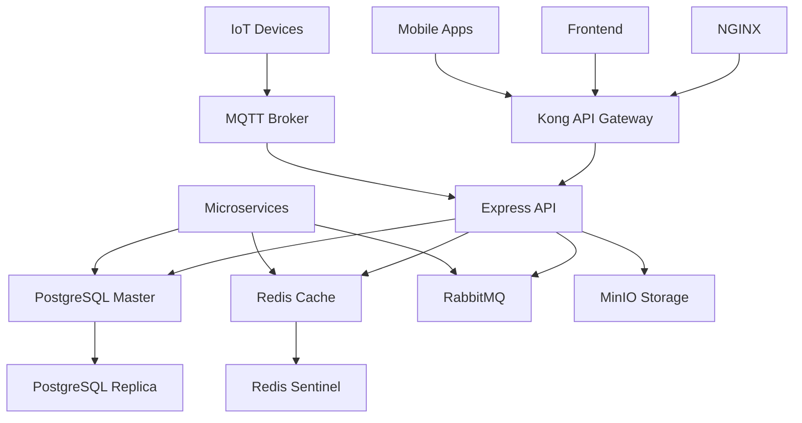

# 🏢 SKYN3T ACCESS CONTROL SYSTEM


[](LICENSE)
[](https://nodejs.org/)
[](https://www.typescriptlang.org/)
[](https://www.postgresql.org/)
[](https://www.docker.com/)
[](#desarrollo)

## 📋 Descripción

**SKYN3T Access Control System** es una plataforma integral de gestión de accesos y seguridad para comunidades residenciales, condominios y edificios comerciales. Ofrece un sistema completo de control de acceso multi-tenant con características avanzadas de IoT, gestión financiera, comunicaciones y análisis predictivo.

### 🎯 Características Principales

- **🔐 Control de Acceso Multi-método**: QR, facial, biométrico, RFID, placas vehiculares
- **🏢 Multi-tenant**: Gestión independiente por comunidades
- **👥 Sistema de Permisos Jerárquico**: 11 niveles con herencia granular
- **💰 Gestión Financiera**: Integración con bancos chilenos y pasarelas de pago
- **📱 Invitaciones Inteligentes**: QR dinámicos, validación GPS, reconocimiento vehicular
- **🔌 IoT & Dispositivos**: Control en tiempo real de dispositivos de acceso
- **📊 Analytics & ML**: Predicción de comportamientos y anomalías
- **💬 Comunicaciones**: Email, SMS, WhatsApp, notificaciones push
- **🌍 Multi-región**: Soporte inicial para Chile, expansible

## 🚀 Estado Actual del Proyecto

### ✅ Completado (25%)
- **Backend Core**: Arquitectura base, autenticación, permisos
- **Base de Datos**: Esquema completo (150+ tablas)
- **Infraestructura**: Docker Compose con 25+ servicios
- **Sistema Multi-tenant**: Comunidades independientes
- **WebSocket**: Comunicación tiempo real

### 🚧 En Desarrollo (Etapa 3)
- **Controladores CRUD**: 40% completado
- **Modelos adicionales**: Floor, Unit, DeviceStatus
- **Servicios especializados**: Payment, Device, OCR

### 📋 Próximas Etapas
- **Etapa 4**: Frontend React con Material-UI
- **Etapa 5**: Gestión de comunidades completa
- **Etapa 6**: Sistema IoT y dispositivos
- **Etapa 7**: Sistema financiero integral

## 🛠️ Tecnologías

### Backend
- **Runtime**: Node.js 20.x + TypeScript 5.x
- **Framework**: Express.js con arquitectura modular
- **Base de Datos**: PostgreSQL 15+ con Sequelize ORM
- **Cache**: Redis con clustering
- **Queue**: RabbitMQ para procesamiento asíncrono
- **WebSocket**: Socket.io para tiempo real
- **Autenticación**: JWT + 2FA + OAuth2

### Frontend (Planificado)
- **Framework**: React 18 + TypeScript
- **UI Library**: Material-UI v5 con tema glassmorphism
- **Estado**: Redux Toolkit + RTK Query
- **Routing**: React Router v6
- **Charts**: Recharts + D3.js
- **Real-time**: Socket.io Client

### Infraestructura
- **Contenedores**: Docker + Docker Compose
- **Proxy**: Nginx + Kong API Gateway
- **Monitoreo**: Grafana + Prometheus + InfluxDB
- **Logs**: ELK Stack (Elasticsearch + Kibana)
- **Storage**: MinIO (S3 compatible)
- **MQTT**: Eclipse Mosquitto

### Microservicios (Futuros)
- **Payment Service**: Node.js + Integración bancaria
- **OCR Service**: Python + Tesseract + YOLO
- **ML Service**: Python + TensorFlow + Scikit-learn
- **Notification Service**: Node.js + Multi-canal
- **Analytics Service**: Node.js + Data processing

## 📦 Instalación

### Prerrequisitos
- Docker Engine 24.0+
- Docker Compose 2.20+
- Git
- Make (opcional)

### Instalación Rápida

```bash
# 1. Clonar repositorio
git clone https://github.com/your-org/skyn3t-access-control.git
cd skyn3t-access-control

# 2. Configurar variables de entorno
cp .env.example .env
# Editar .env con tu configuración

# 3. Instalación automática
make install

# O instalación manual:
docker-compose build
docker-compose up -d
```

### Acceso al Sistema

Una vez instalado:

- **API**: http://localhost:8000
- **Frontend**: http://localhost:3000 (en desarrollo)
- **Grafana**: http://localhost:3000/grafana (admin/grafana123)
- **Kibana**: http://localhost:3000/kibana
- **RabbitMQ**: http://localhost:15672 (admin/rabbitmq123)
- **MinIO**: http://localhost:9001 (minioadmin/minioadmin123)

## 🏗️ Arquitectura

### Estructura del Proyecto

```
skyn3t-access-control/
├── 📁 backend/                    # API Principal (Node.js/TypeScript)
│   ├── src/
│   │   ├── controllers/           # Controladores REST
│   │   ├── models/               # Modelos Sequelize
│   │   ├── middleware/           # Middleware (auth, permisos)
│   │   ├── services/             # Lógica de negocio
│   │   ├── routes/               # Rutas API
│   │   └── utils/                # Utilidades
│   └── database/
│       ├── schema.sql            # Esquema completo BD
│       └── seeds/                # Datos iniciales
│
├── 📁 frontend/                   # React App (En desarrollo)
│   ├── src/
│   │   ├── components/           # Componentes React
│   │   ├── pages/                # Páginas principales
│   │   ├── services/             # API clients
│   │   └── store/                # Redux store
│
├── 📁 permission-service/         # Microservicio permisos
├── 📁 payment-service/           # Microservicio pagos
├── 📁 notification-service/      # Microservicio notificaciones
├── 📁 analytics-service/         # Microservicio analytics
├── 📁 ocr-service/              # Microservicio OCR (Python)
├── 📁 ml-service/               # Microservicio ML (Python)
│
├── 📁 nginx/                     # Configuración proxy
├── 📁 config/                    # Configuraciones servicios
├── 📁 scripts/                   # Scripts utilidad
│
├── 📄 docker-compose.yml         # Orquestación servicios
├── 📄 Makefile                   # Comandos automatización
└── 📄 INSTALLATION.md            # Guía instalación detallada
```

### Arquitectura de Datos



## 🔐 Sistema de Permisos

### Jerarquía de Roles

**Roles del Sistema (11 niveles)**
1. **SUPER_ADMIN** - Administrador supremo
2. **SYSTEM_ADMIN** - Administrador del sistema
3. **FINANCIAL_ADMIN** - Administrador financiero
4. **HARDWARE_ADMIN** - Administrador de hardware
5. **SECURITY_ADMIN** - Administrador de seguridad
6. **AUDIT_ADMIN** - Administrador de auditoría
7. **OPERATIONS_MANAGER** - Gerente de operaciones
8. **COMMUNITY_MANAGER** - Gerente de comunidad
9. **SUPPORT_SUPERVISOR** - Supervisor de soporte
10. **SUPPORT_AGENT** - Agente de soporte
11. **REPORT_VIEWER** - Visualizador de reportes

**Roles de Comunidad (11 niveles)**
1. **COMMUNITY_ADMIN** - Administrador de comunidad
2. **BOARD_PRESIDENT** - Presidente del directorio
3. **TREASURER** - Tesorero
4. **BOARD_MEMBER** - Miembro del directorio
5. **SECURITY_CHIEF** - Jefe de seguridad
6. **SECURITY_GUARD** - Guardia de seguridad
7. **MAINTENANCE_CHIEF** - Jefe de mantenimiento
8. **STAFF** - Personal
9. **OWNER** - Propietario
10. **TENANT** - Arrendatario
11. **AUTHORIZED_PERSON** - Persona autorizada

### Permisos Granulares

Los permisos se organizan por módulos y acciones:

```typescript
// Ejemplos de permisos
access.doors.open          // Abrir puertas
access.doors.emergency     // Anulación de emergencia
users.create              // Crear usuarios
users.permissions.manage  // Gestionar permisos
financial.approve         // Aprobar transacciones
devices.control           // Controlar dispositivos
```

## 🌐 API Reference

### Autenticación

```http
POST /api/v1/auth/login
Content-Type: application/json

{
  "username": "admin",
  "password": "password",
  "remember": true
}
```

### Usuarios

```http
GET /api/v1/users
Authorization: Bearer {token}
X-Community-ID: {community_id}
```

### Permisos

```http
GET /api/v1/permissions/user/{user_id}
Authorization: Bearer {token}
```

### WebSocket Events

```javascript
// Conectar
socket.emit('join:community', 'community-id');

// Escuchar eventos
socket.on('access.new', (data) => {
  console.log('Nuevo acceso:', data);
});

socket.on('device.alert', (data) => {
  console.log('Alerta dispositivo:', data);
});
```

## 🧪 Testing

```bash
# Backend tests
cd backend
npm test

# Frontend tests (cuando esté disponible)
cd frontend
npm test

# Tests de integración
make test-integration

# Tests E2E
make test-e2e
```

## 📊 Monitoreo

### Dashboards Disponibles

- **Sistema**: CPU, memoria, disco, red
- **Base de Datos**: Conexiones, queries, performance
- **API**: Response time, error rate, throughput
- **Dispositivos**: Estado, conectividad, comandos

### Métricas Clave

- **Uptime**: >99.9%
- **API Response Time**: <200ms promedio
- **Error Rate**: <1%
- **Database Connections**: Pool no saturado

## 🔧 Comandos Útiles

```bash
# Desarrollo
make dev                 # Iniciar en modo desarrollo
make logs               # Ver logs de todos los servicios
make restart            # Reiniciar todos los servicios

# Base de datos
make db-backup          # Backup de la base de datos
make db-restore         # Restaurar backup
make db-migrate         # Ejecutar migraciones
make db-seed            # Cargar datos iniciales

# Mantenimiento
make update             # Actualizar sistema
make clean              # Limpiar containers y volúmenes
make status             # Estado de todos los servicios
```

## 🌍 Internacionalización

### Regiones Soportadas

- **🇨🇱 Chile**: Implementación completa
  - Bancos: Banco Estado, Santander, BCI, Banco de Chile
  - Moneda: CLP
  - Zona horaria: America/Santiago
  - Idioma: Español (es_CL)

### Regiones Planificadas

- **🇲🇽 México**: Q2 2024
- **🇦🇷 Argentina**: Q3 2024
- **🇨🇴 Colombia**: Q4 2024
- **🇺🇸 Estados Unidos**: 2025

## 🤝 Contribución

### Flujo de Desarrollo

1. Fork el repositorio
2. Crear branch feature: `git checkout -b feature/nueva-funcionalidad`
3. Commit cambios: `git commit -am 'Agregar nueva funcionalidad'`
4. Push al branch: `git push origin feature/nueva-funcionalidad`
5. Crear Pull Request

### Estándares de Código

- **TypeScript**: Strict mode habilitado
- **ESLint**: Configuración estricta
- **Prettier**: Formateo automático
- **Husky**: Pre-commit hooks
- **Tests**: Cobertura mínima 80%

### Estructura de Commits

```
tipo(alcance): descripción corta

- feat: nueva funcionalidad
- fix: corrección de bug
- docs: cambios en documentación
- style: formateo, punto y coma faltante, etc.
- refactor: refactoring de código
- test: agregar tests faltantes
- chore: cambios en build, dependencies, etc.
```

## 📈 Roadmap

### 2024 Q1 - Foundation ✅
- [x] Arquitectura base
- [x] Sistema de permisos
- [x] Multi-tenant
- [x] Infraestructura Docker

### 2024 Q2 - Core Features 🚧
- [ ] Frontend completo
- [ ] Sistema IoT básico
- [ ] Gestión financiera
- [ ] APIs REST completas

### 2024 Q3 - Advanced Features
- [ ] Apps móviles
- [ ] Machine Learning
- [ ] OCR avanzado
- [ ] Integraciones bancarias

### 2024 Q4 - Scale & Expansion
- [ ] Multi-región
- [ ] Performance optimization
- [ ] Enterprise features
- [ ] Marketplace integraciones

## 🐛 Issues Conocidos

- Frontend no implementado (0%)
- Controladores CRUD incompletos (60%)
- Microservicios pendientes
- Apps móviles no iniciadas

Ver [Issues](https://github.com/your-org/skyn3t-access-control/issues) para lista completa.

## 📄 Licencia

Este proyecto está licenciado bajo la Licencia MIT - ver [LICENSE](LICENSE) para detalles.

## 👥 Equipo

- **Arquitecto Lead**: [Tu Nombre]
- **Backend Developer**: [Tu Nombre]
- **Frontend Developer**: [Pendiente]
- **DevOps Engineer**: [Pendiente]

## 📞 Soporte

- **Documentación**: [Wiki del proyecto]
- **Issues**: [GitHub Issues](https://github.com/your-org/skyn3t-access-control/issues)
- **Discussions**: [GitHub Discussions](https://github.com/your-org/skyn3t-access-control/discussions)
- **Email**: support@skyn3t.com

## 🙏 Agradecimientos

- **OpenAI** por las capacidades de IA
- **Sequelize** por el excelente ORM
- **Material-UI** por los componentes
- **Docker** por la containerización
- **PostgreSQL** por la robustez

---

<div align="center">

**[🏠 Homepage](https://skyn3t.com) • [📚 Documentation](https://docs.skyn3t.com) • [🎯 Demo](https://demo.skyn3t.com)**

Made with ❤️ for the future of access control

</div>