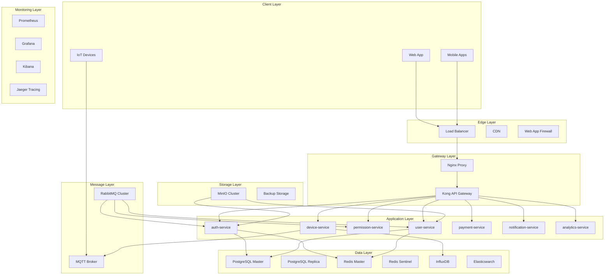
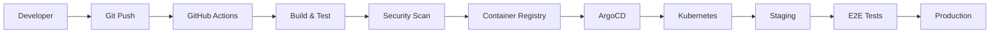
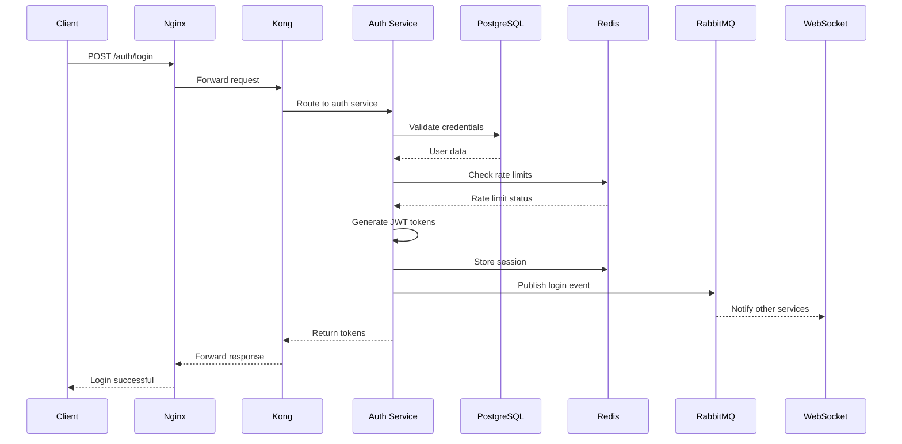
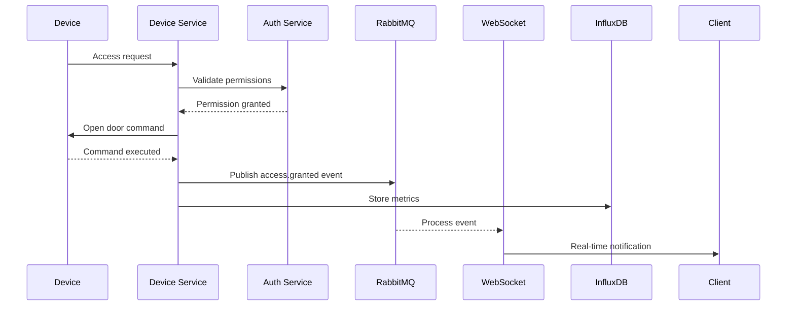

# 🏗️ ARCHITECTURE DOCUMENTATION - SKYN3T ACCESS CONTROL


## 📋 Visión General

SKYN3T Access Control implementa una arquitectura de microservicios distribuida, diseñada para escalar horizontalmente y soportar múltiples comunidades (multi-tenant) con aislamiento completo de datos y configuraciones.

### Principios Arquitectónicos

- **🔧 Microservicios**: Servicios independientes con responsabilidades específicas
- **🏢 Multi-tenant**: Aislamiento por comunidades con configuraciones independientes
- **📡 Event-Driven**: Comunicación asíncrona mediante eventos
- **🔌 API-First**: Diseño orientado a APIs RESTful
- **🚀 Cloud-Native**: Contenedorización y orquestación con Docker
- **🔐 Security-by-Design**: Seguridad integrada en cada capa
- **📊 Observability**: Monitoreo, logging y métricas integradas

---

## 🏛️ Arquitectura de Alto Nivel



---

## 🔄 Patrón de Arquitectura

### Arquitectura Hexagonal (Ports & Adapters)

Cada microservicio implementa el patrón hexagonal para mantener la lógica de negocio aislada de las dependencias externas.

```
┌─────────────────────────────────────────┐
│              MICROSERVICE               │
├─────────────────────────────────────────┤
│ ┌─────────────────────────────────────┐ │
│ │          DOMAIN LAYER               │ │
│ │  ┌─────────────────────────────┐    │ │
│ │  │      BUSINESS LOGIC         │    │ │
│ │  │    (Pure Functions)         │    │ │
│ │  └─────────────────────────────┘    │ │
│ └─────────────────────────────────────┘ │
│                                         │
│ ┌─────────────────────────────────────┐ │
│ │        APPLICATION LAYER            │ │
│ │  ┌─────────────┐ ┌─────────────┐    │ │
│ │  │  Use Cases  │ │  Services   │    │ │
│ │  └─────────────┘ └─────────────┘    │ │
│ └─────────────────────────────────────┘ │
│                                         │
│ ┌─────────────────────────────────────┐ │
│ │       INFRASTRUCTURE LAYER          │ │
│ │  ┌─────┐ ┌─────┐ ┌─────┐ ┌─────┐    │ │
│ │  │ API │ │ DB  │ │Cache│ │Queue│    │ │
│ │  └─────┘ └─────┘ └─────┘ └─────┘    │ │
│ └─────────────────────────────────────┘ │
└─────────────────────────────────────────┘
```

---

## 🎯 Microservicios

### 1. Auth Service (Node.js/TypeScript)
**Puerto**: 3001  
**Responsabilidades**:
- Autenticación JWT con refresh tokens
- Autorización basada en roles y permisos
- 2FA (TOTP, SMS, Email)
- Gestión de sesiones
- Password policies y recovery

**Tecnologías**:
- Express.js + TypeScript
- JWT + bcrypt
- Speakeasy (2FA)
- Rate limiting

**Endpoints Principales**:
```typescript
POST /auth/login
POST /auth/logout
POST /auth/refresh
GET /auth/session
POST /auth/2fa/enable
POST /auth/password/reset
```

### 2. User Service (Node.js/TypeScript) 
**Puerto**: 3003  
**Responsabilidades**:
- Gestión CRUD de usuarios
- Perfiles y avatares
- Relaciones familiares
- Importación/exportación masiva
- Integración con LDAP/AD

**Base de Datos**:
- PostgreSQL (usuarios, perfiles)
- Redis (cache de usuarios)
- MinIO (avatares, documentos)

### 3. Permission Service (Node.js/TypeScript)
**Puerto**: 3002  
**Responsabilidades**:
- Motor de permisos granulares
- Jerarquía de roles (11 niveles)
- Herencia y sobrescritura
- Cache distribuido de permisos
- Propagación de cambios

**Patrones Implementados**:
- RBAC (Role-Based Access Control)
- ABAC (Attribute-Based Access Control)
- Policy Engine
- Permission Templates

### 4. Device Service (Node.js/TypeScript)
**Puerto**: 3004  
**Responsabilidades**:
- Control de dispositivos IoT
- Comunicación MQTT
- Cola de comandos
- Monitoreo y métricas
- Firmware updates

**Protocolos Soportados**:
- MQTT (bidireccional)
- HTTP/REST (comandos)
- WebSocket (tiempo real)
- Modbus TCP/RTU
- Wiegand

### 5. Payment Service (Node.js/TypeScript)
**Puerto**: 3005  
**Responsabilidades**:
- Integración multi-banco Chile
- Pasarelas de pago internacionales
- Procesamiento de transacciones
- Reconciliación automática
- Reportes financieros

**Integraciones**:
- Banco Estado API
- Santander Open Banking
- BCI Transbank
- PayPal
- MercadoPago

### 6. Notification Service (Node.js/TypeScript)
**Puerto**: 3006  
**Responsabilidades**:
- Comunicaciones omnicanal
- Plantillas dinámicas
- Programación de envíos
- Analytics de entrega
- Preferencias de usuario

**Canales Soportados**:
- Email (SMTP)
- SMS (Twilio)
- WhatsApp Business
- Push Notifications
- In-app notifications

### 7. Analytics Service (Node.js/TypeScript)
**Puerto**: 3007  
**Responsabilidades**:
- Business Intelligence
- Reportes automatizados
- Machine Learning
- Predicciones
- Data mining

**Stack ML/AI**:
- TensorFlow.js
- Scikit-learn (Python bridge)
- Time series analysis
- Anomaly detection
- Predictive analytics

---

## 🗄️ Arquitectura de Datos

### Estrategia Multi-tenant

#### Tenant Isolation Strategy
Utilizamos **Database-per-Tenant** con **Shared Infrastructure**:

```sql
-- Estructura de aislamiento por comunidad
┌─────────────────────────────────────────┐
│         SHARED INFRASTRUCTURE           │
├─────────────────────────────────────────┤
│ ┌─────────────┐ ┌─────────────────────┐ │
│ │   TENANT A  │ │      TENANT B       │ │
│ │             │ │                     │ │
│ │ Community:  │ │  Community:         │ │
│ │ Torres Sol  │ │  Vista Hermosa      │ │
│ │             │ │                     │ │
│ │ Schema: A   │ │  Schema: B          │ │
│ │ Users: 150  │ │  Users: 80          │ │
│ │ Devices: 12 │ │  Devices: 8         │ │
│ └─────────────┘ └─────────────────────┘ │
└─────────────────────────────────────────┘
```

#### Row-Level Security (RLS)
```sql
-- Ejemplo de política RLS
CREATE POLICY community_isolation ON users
    FOR ALL TO application_role
    USING (community_id = current_setting('app.current_community_id'));

-- Activar RLS en tablas sensibles
ALTER TABLE users ENABLE ROW LEVEL SECURITY;
ALTER TABLE access_logs ENABLE ROW LEVEL SECURITY;
ALTER TABLE financial_transactions ENABLE ROW LEVEL SECURITY;
```

### Base de Datos Principal (PostgreSQL)

#### Master-Replica Configuration
```yaml
PostgreSQL Cluster:
  Master:
    - Escrituras
    - Lecturas críticas
    - Backups principales
  
  Replica:
    - Lecturas no críticas
    - Reportes y analytics
    - Failover automático
    
  Backup Strategy:
    - WAL-E continuous archiving
    - Point-in-time recovery
    - Cross-region replication
```

#### Partitioning Strategy
```sql
-- Particionado de logs de acceso por fecha
CREATE TABLE access_logs (
    id UUID DEFAULT uuid_generate_v4(),
    access_time TIMESTAMP NOT NULL,
    -- otros campos...
) PARTITION BY RANGE (access_time);

-- Particiones mensuales
CREATE TABLE access_logs_2024_01 
    PARTITION OF access_logs
    FOR VALUES FROM ('2024-01-01') TO ('2024-02-01');
```

### Cache Distribuido (Redis)

#### Redis Cluster Architecture
```
┌─────────────────────────────────────────┐
│            REDIS CLUSTER                │
├─────────────────────────────────────────┤
│  Master 1     Master 2     Master 3    │
│  (0-5460)     (5461-10922) (10923-16383)│
│     │            │            │         │
│  Replica 1    Replica 2    Replica 3    │
├─────────────────────────────────────────┤
│           REDIS SENTINEL                │
│  ┌─────────┐ ┌─────────┐ ┌─────────┐   │
│  │Sentinel1│ │Sentinel2│ │Sentinel3│   │
│  └─────────┘ └─────────┘ └─────────┘   │
└─────────────────────────────────────────┘
```

#### Cache Patterns
```typescript
// Cache-Aside Pattern para permisos
async getUserPermissions(userId: string, communityId: string) {
  const cacheKey = `permissions:${userId}:${communityId}`;
  
  // 1. Buscar en cache
  let permissions = await redis.get(cacheKey);
  
  if (!permissions) {
    // 2. Cache miss - buscar en BD
    permissions = await this.calculateUserPermissions(userId, communityId);
    
    // 3. Guardar en cache (TTL: 5 minutos)
    await redis.setex(cacheKey, 300, JSON.stringify(permissions));
  }
  
  return JSON.parse(permissions);
}
```

### Time Series Database (InfluxDB)

#### Schema para IoT Metrics
```sql
-- Métricas de dispositivos
measurement: device_metrics
tags:
  - device_id
  - community_id
  - device_type
  - location
fields:
  - cpu_usage (float)
  - memory_usage (float)
  - temperature (float)
  - command_count (integer)
time: timestamp

-- Métricas de acceso
measurement: access_metrics
tags:
  - access_point_id
  - method
  - granted
fields:
  - response_time (float)
  - success_rate (float)
time: timestamp
```

### Search Engine (Elasticsearch)

#### Index Strategy
```json
{
  "mappings": {
    "properties": {
      "timestamp": {"type": "date"},
      "level": {"type": "keyword"},
      "service": {"type": "keyword"},
      "community_id": {"type": "keyword"},
      "user_id": {"type": "keyword"},
      "message": {
        "type": "text",
        "analyzer": "standard"
      },
      "metadata": {"type": "object"}
    }
  }
}
```

---

## 🔄 Comunicación Entre Servicios

### Event-Driven Architecture

#### Event Bus (RabbitMQ)
```
┌─────────────────────────────────────────┐
│              EVENT BUS                  │
├─────────────────────────────────────────┤
│  Exchange: auth.events                  │
│  ├─ user.login                          │
│  ├─ user.logout                         │
│  ├─ password.changed                    │
│  └─ 2fa.enabled                         │
│                                         │
│  Exchange: access.events                │
│  ├─ access.granted                      │
│  ├─ access.denied                       │
│  ├─ device.offline                      │
│  └─ emergency.triggered                 │
│                                         │
│  Exchange: financial.events             │
│  ├─ payment.processed                   │
│  ├─ expense.created                     │
│  └─ payment.failed                      │
└─────────────────────────────────────────┘
```

#### Event Schema
```typescript
interface BaseEvent {
  id: string;
  type: string;
  source: string;
  timestamp: Date;
  communityId?: string;
  userId?: string;
  correlationId?: string;
}

interface AccessGrantedEvent extends BaseEvent {
  type: 'access.granted';
  data: {
    accessPointId: string;
    method: 'card' | 'facial' | 'qr' | 'pin';
    responseTime: number;
    photoUrl?: string;
  };
}
```

### Synchronous Communication

#### Service-to-Service API Calls
```typescript
// Circuit Breaker Pattern
import CircuitBreaker from 'opossum';

const options = {
  timeout: 3000,
  errorThresholdPercentage: 50,
  resetTimeout: 30000
};

const breaker = new CircuitBreaker(callUserService, options);

breaker.fallback(() => {
  return { error: 'User service unavailable' };
});
```

### WebSocket Real-time Updates

#### Real-time Event Distribution
```typescript
// WebSocket service distribuye eventos en tiempo real
class WebSocketService {
  // Emitir a usuario específico
  emitToUser(userId: string, event: string, data: any) {
    this.io.to(`user:${userId}`).emit(event, data);
  }
  
  // Emitir a comunidad
  emitToCommunity(communityId: string, event: string, data: any) {
    this.io.to(`community:${communityId}`).emit(event, data);
  }
  
  // Emitir a rol específico
  emitToRole(roleId: string, event: string, data: any) {
    this.io.to(`role:${roleId}`).emit(event, data);
  }
}
```

---

## 🔐 Arquitectura de Seguridad

### Defense in Depth Strategy

```
┌─────────────────────────────────────────┐
│         SECURITY LAYERS                 │
├─────────────────────────────────────────┤
│ Layer 7: Application Security           │
│  ├─ Input Validation                    │
│  ├─ Output Encoding                     │
│  ├─ OWASP Top 10 Protection             │
│  └─ Business Logic Security             │
│                                         │
│ Layer 6: Authentication & Authorization │
│  ├─ JWT + Refresh Tokens                │
│  ├─ 2FA (TOTP, SMS)                     │
│  ├─ Role-based Access Control           │
│  └─ Permission Engine                   │
│                                         │
│ Layer 5: API Security                   │
│  ├─ Rate Limiting                       │
│  ├─ API Key Management                  │
│  ├─ CORS Configuration                  │
│  └─ Request Size Limits                 │
│                                         │
│ Layer 4: Transport Security             │
│  ├─ TLS 1.3 Encryption                  │
│  ├─ Certificate Pinning                 │
│  ├─ HSTS Headers                        │
│  └─ Secure WebSocket (WSS)              │
│                                         │
│ Layer 3: Network Security               │
│  ├─ Firewall Rules                      │
│  ├─ VPC/Subnet Isolation                │
│  ├─ DDoS Protection                     │
│  └─ IP Whitelisting                     │
│                                         │
│ Layer 2: Infrastructure Security        │
│  ├─ Container Security                  │
│  ├─ Secret Management                   │
│  ├─ Vulnerability Scanning              │
│  └─ Image Signing                       │
│                                         │
│ Layer 1: Physical Security              │
│  ├─ Data Center Security                │
│  ├─ Hardware Security                   │
│  └─ Access Controls                     │
└─────────────────────────────────────────┘
```

### Secret Management

#### HashiCorp Vault Integration
```yaml
Vault Configuration:
  Auth Methods:
    - Kubernetes
    - AppRole
    - JWT
  
  Secret Engines:
    - KV v2 (application secrets)
    - Database (dynamic credentials)
    - PKI (certificate management)
  
  Policies:
    - service-specific access
    - environment-based isolation
    - principle of least privilege
```

### Encryption Strategy

#### Data at Rest
```typescript
// AES-256-GCM encryption for sensitive data
const crypto = require('crypto');

class EncryptionService {
  private key: Buffer;
  
  encrypt(plaintext: string): EncryptedData {
    const iv = crypto.randomBytes(16);
    const cipher = crypto.createCipher('aes-256-gcm', this.key);
    cipher.setAAD(Buffer.from('SKYN3T'));
    
    let encrypted = cipher.update(plaintext, 'utf8', 'hex');
    encrypted += cipher.final('hex');
    
    const authTag = cipher.getAuthTag();
    
    return {
      iv: iv.toString('hex'),
      encrypted,
      authTag: authTag.toString('hex')
    };
  }
}
```

#### Data in Transit
- TLS 1.3 para todas las comunicaciones HTTP
- WSS (WebSocket Secure) para tiempo real
- mTLS para comunicación service-to-service
- Certificate rotation automática

---

## 📊 Monitoring & Observability

### The Three Pillars of Observability

#### 1. Metrics (Prometheus + Grafana)
```yaml
Metrics Collection:
  Application Metrics:
    - Request rate, duration, errors (RED)
    - Business metrics (logins, transactions)
    - Custom application metrics
  
  Infrastructure Metrics:
    - CPU, Memory, Disk, Network (USE)
    - Container metrics
    - Database performance
  
  Business Metrics:
    - Active users per community
    - Access success rate
    - Payment conversion rate
```

#### 2. Logging (ELK Stack)
```yaml
Log Aggregation:
  Sources:
    - Application logs (JSON structured)
    - Access logs (Nginx)
    - Database logs (PostgreSQL)
    - Container logs (Docker)
  
  Processing:
    - Logstash pipelines
    - Log parsing and enrichment
    - Sensitive data masking
  
  Storage:
    - Elasticsearch indices
    - Hot/warm/cold architecture
    - Index lifecycle management
```

#### 3. Tracing (Jaeger)
```typescript
// OpenTelemetry distributed tracing
import { trace } from '@opentelemetry/api';

const tracer = trace.getTracer('auth-service', '1.0.0');

async function authenticateUser(credentials: LoginCredentials) {
  const span = tracer.startSpan('authenticate_user');
  
  try {
    span.setAttributes({
      'user.email': credentials.email,
      'auth.method': '2fa'
    });
    
    // Authentication logic
    const result = await this.validateCredentials(credentials);
    
    span.setStatus({ code: SpanStatusCode.OK });
    return result;
  } catch (error) {
    span.recordException(error);
    span.setStatus({ 
      code: SpanStatusCode.ERROR, 
      message: error.message 
    });
    throw error;
  } finally {
    span.end();
  }
}
```

### SLA/SLO Definition

```yaml
Service Level Objectives:
  Availability:
    - 99.9% uptime (8.76 hours downtime/year)
    - Maximum 5 minutes planned downtime/month
  
  Performance:
    - API response time p95 < 500ms
    - Authentication response time p99 < 1s
    - Real-time updates < 100ms latency
  
  Error Rate:
    - Error rate < 0.1% for critical endpoints
    - Error rate < 1% for non-critical endpoints
  
  Capacity:
    - Support 10,000 concurrent users
    - Handle 1M API requests/hour
    - Store 100GB data/community
```

---

## 🚀 Deployment Architecture

### Container Orchestration (Kubernetes)

#### Cluster Architecture
```yaml
Kubernetes Cluster:
  Master Nodes: 3 (HA)
  Worker Nodes: 6+ (auto-scaling)
  
  Namespaces:
    - production
    - staging
    - development
    - monitoring
    - istio-system
  
  Storage:
    - Persistent Volumes (SSD)
    - StatefulSets for databases
    - ConfigMaps for configuration
    - Secrets for sensitive data
```

#### Service Mesh (Istio)
```yaml
Istio Configuration:
  Traffic Management:
    - Load balancing
    - Circuit breaker
    - Retry policies
    - Canary deployments
  
  Security:
    - mTLS between services
    - Authorization policies
    - Rate limiting
  
  Observability:
    - Distributed tracing
    - Metrics collection
    - Access logging
```

### CI/CD Pipeline

#### GitOps Workflow


#### Pipeline Stages
```yaml
CI Pipeline:
  1. Code Quality:
     - ESLint, Prettier
     - TypeScript compilation
     - Unit tests (>80% coverage)
  
  2. Security:
     - Dependency vulnerability scan
     - SAST (static analysis)
     - Secret detection
  
  3. Build:
     - Docker multi-stage build
     - Image optimization
     - Distroless base images
  
  4. Deploy:
     - Helm chart deployment
     - Rolling updates
     - Health checks
     - Rollback capability
```

---

## 📈 Scalability & Performance

### Horizontal Scaling Strategy

#### Auto-scaling Configuration
```yaml
HPA (Horizontal Pod Autoscaler):
  Auth Service:
    min: 3 replicas
    max: 20 replicas
    metrics:
      - CPU: 70%
      - Memory: 80%
      - Custom: requests/sec > 1000
  
  Device Service:
    min: 2 replicas  
    max: 10 replicas
    metrics:
      - MQTT connections
      - Command queue length
```

#### Database Scaling
```yaml
PostgreSQL Scaling:
  Read Replicas:
    - Regional replicas for low latency
    - Load balancing for read queries
    - Automatic failover
  
  Connection Pooling:
    - PgBouncer for connection management
    - Connection limits per service
    - Query routing (read/write split)
  
  Partitioning:
    - Time-based partitioning for logs
    - Hash partitioning for user data
    - Automatic partition management
```

### Caching Strategy

#### Multi-level Caching
```
┌─────────────────────────────────────────┐
│             CACHING LAYERS              │
├─────────────────────────────────────────┤
│ L1: Application Cache (in-memory)       │
│  ├─ Node.js process cache               │
│  ├─ Hot data (permissions, sessions)    │
│  └─ TTL: 1-5 minutes                    │
│                                         │
│ L2: Distributed Cache (Redis)           │
│  ├─ Shared across service instances     │
│  ├─ User data, computed results         │
│  └─ TTL: 5-60 minutes                   │
│                                         │
│ L3: CDN Cache (CloudFront)              │
│  ├─ Static assets, images, files        │
│  ├─ API responses (cacheable)           │
│  └─ TTL: 1-24 hours                     │
└─────────────────────────────────────────┘
```

---

## 🔧 Development Architecture

### Development Environment

#### Local Development Setup
```yaml
Docker Compose Services:
  Core:
    - PostgreSQL 15
    - Redis 7
    - RabbitMQ 3
    - MinIO
  
  Monitoring:
    - Prometheus
    - Grafana
    - Jaeger
  
  Development Tools:
    - Mailhog (email testing)
    - Redis Commander
    - pgAdmin
```

#### Code Organization
```
microservice/
├── src/
│   ├── domain/           # Business logic
│   │   ├── entities/     # Domain entities
│   │   ├── services/     # Domain services
│   │   └── repositories/ # Repository interfaces
│   │
│   ├── application/      # Use cases
│   │   ├── usecases/     # Application use cases
│   │   ├── services/     # Application services
│   │   └── dto/          # Data transfer objects
│   │
│   ├── infrastructure/   # External adapters
│   │   ├── api/          # HTTP controllers
│   │   ├── database/     # Database adapters
│   │   ├── messaging/    # Event handlers
│   │   └── external/     # External service clients
│   │
│   └── shared/           # Shared utilities
│       ├── config/       # Configuration
│       ├── middleware/   # Common middleware
│       └── utils/        # Utility functions
│
├── tests/
│   ├── unit/            # Unit tests
│   ├── integration/     # Integration tests
│   └── e2e/            # End-to-end tests
│
├── docs/               # Service documentation
├── k8s/               # Kubernetes manifests
└── docker/            # Docker configurations
```

### API Design Patterns

#### RESTful API Design
```typescript
// Resource-based URLs
GET    /api/v1/users              # List users
POST   /api/v1/users              # Create user
GET    /api/v1/users/{id}         # Get user
PUT    /api/v1/users/{id}         # Update user
DELETE /api/v1/users/{id}         # Delete user

// Nested resources
GET    /api/v1/users/{id}/permissions
POST   /api/v1/users/{id}/roles

// Complex operations
POST   /api/v1/users/{id}/actions/reset-password
POST   /api/v1/devices/{id}/commands/open-door
```

#### Error Handling Strategy
```typescript
// Standardized error response
interface ErrorResponse {
  success: false;
  error: {
    code: string;
    message: string;
    details?: any;
  };
  timestamp: string;
  request_id: string;
}

// HTTP status codes mapping
const statusCodes = {
  ValidationError: 400,
  UnauthorizedError: 401,
  ForbiddenError: 403,
  NotFoundError: 404,
  ConflictError: 409,
  RateLimitError: 429,
  InternalError: 500
};
```

---

## 🔄 Data Flow Architecture

### Request Flow Example: User Login



### Event Flow Example: Access Granted



---

## 🎯 Architecture Decisions Records (ADRs)

### ADR-001: Microservices vs Monolith
**Status**: Accepted  
**Decision**: Adopt microservices architecture  
**Rationale**: 
- Independent scaling requirements
- Multi-tenant isolation needs
- Technology diversity (Node.js, Python)
- Team autonomy and ownership

### ADR-002: Database Strategy
**Status**: Accepted  
**Decision**: PostgreSQL with service-specific schemas  
**Rationale**:
- ACID compliance for financial data
- JSON support for flexible schemas
- Mature ecosystem and tooling
- Row-level security for multi-tenancy

### ADR-003: Event-Driven Communication
**Status**: Accepted  
**Decision**: RabbitMQ for async communication  
**Rationale**:
- Reliability and durability
- Rich routing capabilities
- Management interface
- Battle-tested in production

### ADR-004: API Gateway
**Status**: Accepted  
**Decision**: Kong for API management  
**Rationale**:
- Plugin ecosystem
- Rate limiting and authentication
- Monitoring and analytics
- Load balancing capabilities

---

## 🔮 Future Architecture Considerations

### Planned Enhancements

#### 1. Event Sourcing
```typescript
// Event store for audit and replay
interface Event {
  id: string;
  streamId: string;
  eventType: string;
  eventData: any;
  metadata: any;
  timestamp: Date;
  version: number;
}

// Aggregate reconstruction from events
class UserAggregate {
  static fromEvents(events: Event[]): UserAggregate {
    const user = new UserAggregate();
    events.forEach(event => user.apply(event));
    return user;
  }
}
```

#### 2. CQRS (Command Query Responsibility Segregation)
```typescript
// Separate read and write models
interface UserCommand {
  createUser(command: CreateUserCommand): Promise<void>;
  updateUser(command: UpdateUserCommand): Promise<void>;
}

interface UserQuery {
  getUserById(id: string): Promise<UserView>;
  searchUsers(criteria: SearchCriteria): Promise<UserView[]>;
}
```

#### 3. Multi-Region Deployment
```yaml
Global Architecture:
  Regions:
    - us-east-1 (primary)
    - eu-west-1 (secondary)
    - ap-southeast-1 (tertiary)
  
  Data Strategy:
    - Regional data residency
    - Cross-region replication
    - Conflict resolution
  
  Traffic Routing:
    - GeoDNS routing
    - Health-based failover
    - Latency-based routing
```

---

## 📚 Referencias y Recursos

### Documentación Técnica
- [Microservices Patterns](https://microservices.io/patterns/)
- [Twelve-Factor App](https://12factor.net/)
- [Domain-Driven Design](https://domainlanguage.com/ddd/)
- [Event Sourcing](https://martinfowler.com/eaaDev/EventSourcing.html)

### Herramientas y Frameworks
- [Node.js](https://nodejs.org/)
- [TypeScript](https://www.typescriptlang.org/)
- [PostgreSQL](https://www.postgresql.org/)
- [Redis](https://redis.io/)
- [RabbitMQ](https://www.rabbitmq.com/)
- [Kubernetes](https://kubernetes.io/)

---

**Architecture Version**: 1.0.0  
**Last Updated**: 2024-01-01  
**Next Review**: 2024-04-01